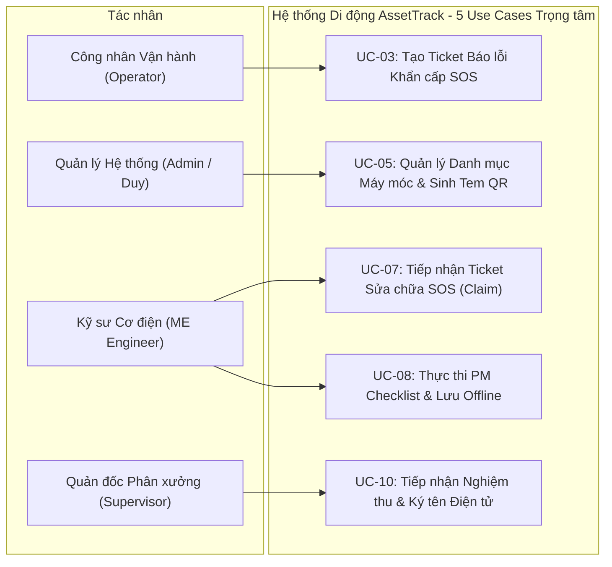
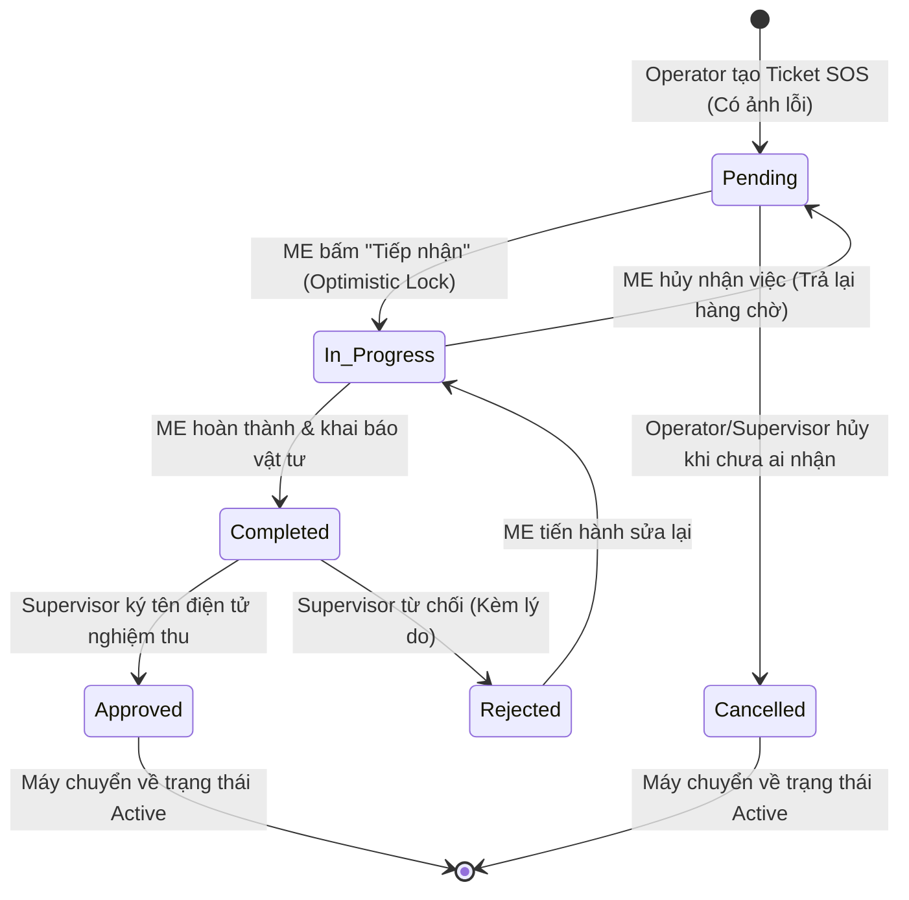
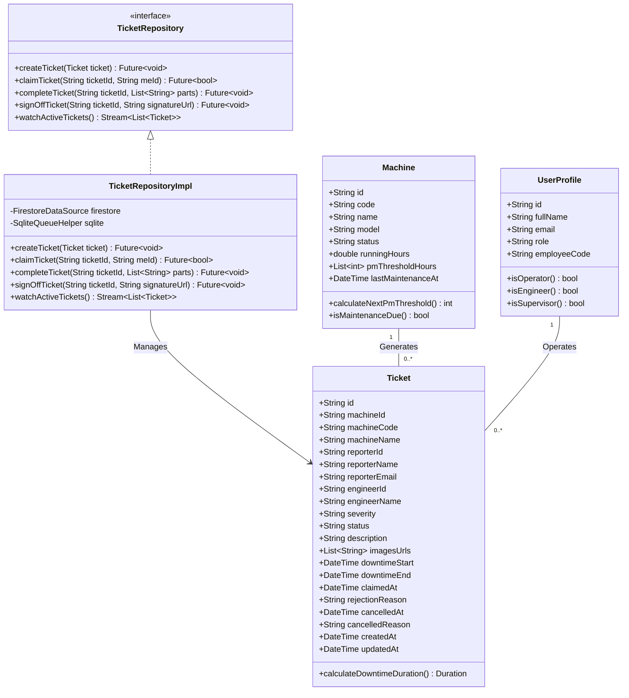
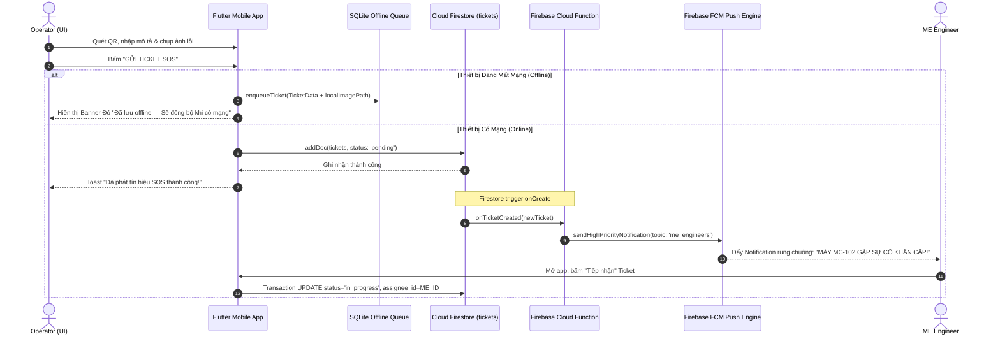

# BÀI TẬP LỚN CUỐI KỲ - BÁO CÁO MẪU HOÀN CHỈNH

# ASSETTRACK: HỆ THỐNG QUẢN LÝ LÝ LỊCH THIẾT BỊ & BẢO TRÌ PHÒNG NGỪA NHÀ MÁY THÔNG MINH

**Học phần:** CSE441 - Phát triển ứng dụng di động (Flutter)  
**Học kỳ / Năm học:** Học kỳ hè - Năm học 2025-2026  
**Giảng viên hướng dẫn:** TS. Kiều Tuấn Dũng  
**Phương pháp tiếp cận:** Phân tích & Thiết kế Hướng đối tượng & Hệ thống (OOAD / SAD)  
**Nhóm thực hiện:** Nhóm 08 AssetTrack (Lớp CSE441_01)

---

## THÔNG TIN ĐỊNH DANH DỰ ÁN

- **Tên đề tài:** AssetTrack - Hệ Thống Quản Lý Lý Lịch Thiết Bị, Bảo Trì Phòng Ngừa (PM) & Báo Sự Cố Khẩn Cấp (SOS Ticket) Nhà Máy Sản Xuất
- **Mã đề tài:** CSE441-AssetTrack
- **Phạm vi triển khai:** 1 Phân xưởng sản xuất quy mô vừa & nhỏ (Single Workshop Scope)
- **Link GitHub Repository:** [https://github.com/pvduy23052005/cse441-mobile-asset-track](https://github.com/pvduy23052005/cse441-mobile-asset-track)

---

## BẢNG PHÂN CÔNG NHIỆM VỤ & ĐÓNG GÓP THÀNH VIÊN

| STT | Mã Sinh Viên | Họ và Tên         | Vai trò chính                                            | Nhiệm vụ chính được phân công                                                                                                                                                                                                                                                                                                                                                                                                                                                                                                                                                                                                                                                                                                                                                                                                                                                                                                                                                                 | % Đóng góp |
| :-: | :----------: | :---------------- | :------------------------------------------------------- | :-------------------------------------------------------------------------------------------------------------------------------------------------------------------------------------------------------------------------------------------------------------------------------------------------------------------------------------------------------------------------------------------------------------------------------------------------------------------------------------------------------------------------------------------------------------------------------------------------------------------------------------------------------------------------------------------------------------------------------------------------------------------------------------------------------------------------------------------------------------------------------------------------------------------------------------------------------------------------------------------- | :--------: |
|  1  |  2351170589  | **Phùng Văn Duy** | **Lead Architect / Full-stack Developer**                | • **Kiến trúc Hệ thống Backend & Frontend:** Thiết kế kiến trúc tổng thể hệ thống Frontend (Flutter) & Backend (BaaS/Cloud), xây dựng cơ chế Offline cho Operator (SQLite Queue & Auto Sync — NFR-06).<br>• **Phân hệ Operator:** Tích hợp camera quét mã QR, Hộ chiếu thiết bị (QR Passport), Khai báo giờ chạy/km, Form tạo Ticket SOS khẩn cấp + chụp ảnh camera, Hủy Ticket Pending.<br>• **Quản lý Máy móc & Thiết bị:** Quản lý danh mục máy móc (CRUD), tạo & in tem mã QR định danh, cấu hình mốc giờ bảo trì định kỳ, quản lý cẩm nang xử lý lỗi nhanh.<br>• **Quản lý Người dùng & Nhân sự:** Quản lý danh sách tài khoản nhân sự, phân quyền Role (`operator`, `me_engineer`, `supervisor`), import danh sách nhân sự từ file Excel.<br>• **Cloudflare Storage:** Tích hợp dịch vụ Upload và quản lý lưu trữ ảnh hiện trường lên **Cloudflare (Cloudflare R2 / Images)**. |    50%     |
|  2  |  2351170587  | **Lê Quý Dương**  | **Full-stack Eng / ME Engineer & Supervisor Specialist** | • **Chế độ Offline cho Engineer (Offline Mode for ME — NFR-06):** Caching danh sách PM Checklist & Ticket sửa chữa cục bộ, lưu tạm kết quả tick checklist, ảnh bằng chứng linh kiện và log vật tư tủ nhanh khi mất mạng, tự động đồng bộ lên hệ thống khi có mạng trở lại.<br>• **Phân hệ ME Engineer (ME Workflow):** Nhận Push Notification khẩn cấp từ Firebase FCM (< 3s), Màn hình danh sách Ticket/PM & Transaction tiếp nhận sửa chữa (`in_progress`), Thực hiện quy trình PM Checklist bảo dưỡng định kỳ kèm upload ảnh minh chứng, Ghi log vật tư tủ nhanh SME & gửi đề xuất linh kiện đắt tiền.<br>• **Dashboard Supervisor:** Xây dựng Dashboard Quản đốc thời gian thực, biểu đồ phân tích thời gian dừng máy (Downtime Analysis - Pie Chart & Bar Chart với `fl_chart`), đo lường chỉ số OEE và cảnh báo sự cố toàn phân xưởng.<br>• **Nhận Nghiệm thu từ Engineer:** Màn hình tiếp nhận phiếu nghiệm thu từ Kỹ sư ME, kiểm tra ảnh minh chứng đối chứng & danh mục vật tư thay thế, tích hợp Canvas chữ ký số (`signature`) trực tiếp trên màn hình cảm ứng để nghiệm thu đưa máy về `Active` hoặc từ chối kèm lý do (`Rejected`).<br>• **Phê duyệt Vật tư:** Tiếp nhận và xử lý phê duyệt các đề xuất linh kiện đắt tiền vượt ngưỡng chi phí của phân xưởng. |    50%     |

---

## PHẦN 1: TỔNG QUAN & XÁC ĐỊNH YÊU CẦU

### 1.1 Đặt vấn đề & Bài toán Nghiệp vụ

Trong các nhà máy sản xuất công nghiệp (đặc biệt quy mô vừa & nhỏ SME < 50 máy), sự cố máy dừng đột xuất gây nghẽn dây chuyền và tổn thất kinh tế rất lớn bởi 4 bất cập cốt lõi:

1. **Bảo trì bị động & Quên mốc:** Công nhân không theo dõi số giờ máy chạy tích lũy, dẫn đến trễ lịch thay dầu mỡ/siết ốc định kỳ.
2. **Quy trình báo hỏng thủ công & Chậm trễ:** Báo lỗi qua giấy tờ/chat gây trôi tin, không kích hoạt được báo động tức thời đến kỹ sư cơ điện (ME), kéo dài thời gian dừng máy (Downtime).
3. **Thất lạc lý lịch máy & Vật tư:** Không có hồ sơ số ghi nhận các lần hỏng hóc và các linh kiện đã thay từ _Tủ vật tư nhanh_ tại xưởng.
4. **Thiếu cam kết nghiệm thu:** Không có cơ chế bàn giao minh bạch, có chữ ký số xác nhận giữa Quản đốc và Kỹ sư trước khi khởi động lại máy.

### 1.2 Phân tích Tác nhân Hệ thống

- **Actor 1: Operator (Công nhân Vận hành Máy):** Quét tem QR dán trên thân máy xem thông số kỹ thuật, khai báo số giờ/km máy chạy sau mỗi ca làm việc, chủ động tạo **Ticket SOS** báo hỏng khẩn cấp kèm ảnh chụp lỗi và hủy Ticket nếu báo nhầm.
- **Actor 2: ME Engineer (Kỹ sư Cơ điện / Bảo trì):** Nhận Push Notification khẩn cấp (< 3s), bấm tiếp nhận Ticket sửa chữa, thực hiện các hạng mục PM Checklist định kỳ kèm ảnh chụp đối chứng, tự lấy linh kiện từ _Tủ vật tư nhanh_ và ghi log phụ tùng tiêu hao.
- **Actor 3: Factory Supervisor (Quản đốc Phân xưởng):** Ký tên điện tử trực tiếp trên màn hình cảm ứng để nghiệm thu bàn giao máy đưa về trạng thái , phê duyệt đề xuất linh kiện giá trị cao (> ngưỡng duyệt), theo dõi biểu đồ Downtime phân xưởng thời gian thực và quản lý nhân sự qua file Excel.

---

### 1.3 Danh sách Use Cases & Sơ đồ Use Case Trọng tâm

Hệ thống tập trung vào 5 Use Cases cốt lõi quyết định toàn bộ luồng nghiệp vụ bảo trì, vận hành và quản lý thiết bị:



---

### 1.4 Bảng Đặc tả Chi tiết Các Use Case Trọng tâm

#### Bảng 1.1: Đặc tả Use Case UC-03 - Tạo Ticket Báo lỗi Khẩn cấp SOS
| Thuộc tính | Nội dung đặc tả |
| :--- | :--- |
| **Use Case ID** | **UC-03** |
| **Use Case Name** | **Tạo Ticket Báo lỗi Khẩn cấp SOS** |
| **Created By** | Phùng Văn Duy |
| **Date Created** | 16/07/2026 |
| **Actor** | Operator (Công nhân Vận hành) |
| **Description** | Operator tạo phiếu báo hỏng khẩn cấp khi máy móc xảy ra sự cố đột xuất trong ca làm việc, đính kèm ảnh hiện trường sự cố được lưu trữ trên Cloudflare. |
| **Trigger** | Máy móc gặp sự cố bất ngờ và Operator bấm nút "[BÁO LỖI SOS KHẨN CẤP]". |
| **Pre-conditions** | Operator đã đăng nhập tài khoản và quét định danh máy gặp sự cố; máy đang ở trạng thái `active`. |
| **Post conditions** | Ticket mới được tạo ở trạng thái `pending`; Máy chuyển trạng thái sang `repairing`; Push Notification FCM được bắn đến toàn bộ kỹ sư ME trong < 3s; Thời gian dừng máy (Downtime) bắt đầu được tính. |
| **Flow of Events** | 1. Operator bấm chọn nút "[BÁO LỖI SOS KHẨN CẤP]" từ màn hình Hộ chiếu thiết bị.<br>2. Operator chọn mức độ nghiêm trọng (`Low`, `Medium`, `High`, `Critical`).<br>3. Operator nhập mô tả chi tiết hiện trạng sự cố (tiếng ồn, rò rỉ áp suất, cháy khét...).<br>4. Operator bấm mở camera chụp 1 hoặc nhiều ảnh hiện trường lỗi thực tế.<br>5. Ứng dụng nén ảnh, tạo đường dẫn tạm và tải ảnh lên dịch vụ Cloudflare R2 / Images.<br>6. Operator bấm "[GỬI TICKET SOS]".<br>7. Hệ thống tạo bản ghi `tickets`, cập nhật trạng thái máy sang `repairing`, kích hoạt Cloud Function gửi Push Notification FCM tới toàn bộ ME Engineer. |
| **Alternative Flow** | • **A1 (Thiết bị mất mạng / Offline Mode):** Ứng dụng sinh `client_generated_id` (UUID), lưu ảnh vào bộ nhớ cục bộ (`path_provider`), ghi toàn bộ Ticket vào SQLite Queue, hiển thị Banner đỏ và đưa vào luồng đồng bộ nền tự động khi có mạng.<br>• **A2 (Chưa chụp ảnh minh chứng):** Hệ thống hiển thị thông báo nhắc nhở cần ít nhất 1 ảnh hiện trường trước khi gửi Ticket. |

---

#### Bảng 1.2: Đặc tả Use Case UC-05 - Quản lý Danh mục Máy móc & Sinh Tem Mã QR
| Thuộc tính | Nội dung đặc tả |
| :--- | :--- |
| **Use Case ID** | **UC-05** |
| **Use Case Name** | **Quản lý Danh mục Máy móc & Sinh Tem Mã QR** |
| **Created By** | Phùng Văn Duy |
| **Date Created** | 18/07/2026 |
| **Actor** | Phụ trách Quản lý Thiết bị (Admin / Duy) |
| **Description** | Thêm mới, cập nhật thông tin máy móc, thiết lập các mốc giờ bảo trì định kỳ `pm_threshold_hours` và tự động sinh mã QR để in tem dán lên máy. |
| **Trigger** | Người quản lý truy cập màn hình "Quản lý Thiết bị" và chọn Thêm máy hoặc Chỉnh sửa máy. |
| **Pre-conditions** | Người dùng có quyền quản trị/quản lý thiết bị. |
| **Post conditions** | Thông tin máy móc được lưu vào cơ sở dữ liệu `machines`; Tem mã QR định danh chuẩn được sinh ra và sẵn sàng xuất in. |
| **Flow of Events** | 1. Người quản lý truy cập module Quản lý Máy móc.<br>2. Bấm nút "[THÊM THIẾT BỊ MỚI]".<br>3. Nhập mã máy (`code`), tên máy, model, thông số kỹ thuật (công suất, năm sản xuất...) và danh sách mốc bảo dưỡng định kỳ (`pm_threshold_hours` dạng mảng `[500, 1000, 2000]`).<br>4. Bấm "[LƯU THIẾT BỊ]".<br>5. Hệ thống tạo bản ghi `Machine`, tự động sinh mã QR đồ họa chứa chuỗi định danh máy.<br>6. Người quản lý bấm "[XUẤT TEM QR / IN TEM]" để in ấn tem dán cơ học. |
| **Alternative Flow** | • **A1 (Trùng mã máy):** Hệ thống báo lỗi "Mã thiết bị đã tồn tại trong phân xưởng" và yêu cầu nhập mã khác. |

---

#### Bảng 1.3: Đặc tả Use Case UC-07 - Tiếp nhận Ticket Sửa chữa SOS
| Thuộc tính | Nội dung đặc tả |
| :--- | :--- |
| **Use Case ID** | **UC-07** |
| **Use Case Name** | **Tiếp nhận Ticket Sửa chữa SOS (Claim Ticket)** |
| **Created By** | Lê Quý Dương |
| **Date Created** | 19/07/2026 |
| **Actor** | ME Engineer (Kỹ sư Cơ điện) |
| **Description** | Kỹ sư Cơ điện nhận thông báo đẩy thời gian thực, xem danh sách sự cố và bấm nút tiếp nhận xử lý để khóa ticket, tránh trùng lặp giữa các kỹ sư. |
| **Trigger** | Kỹ sư ME nhận Push Notification FCM hoặc mở danh sách Ticket chờ xử lý. |
| **Pre-conditions** | Kỹ sư ME đã đăng nhập với vai trò `me_engineer`; Ticket đang ở trạng thái `pending`. |
| **Post conditions** | Trạng thái Ticket chuyển sang `in_progress`; Ghi nhận `assignee_id` là kỹ sư tiếp nhận; Nút tiếp nhận bị khóa đối với các kỹ sư khác. |
| **Flow of Events** | 1. Kỹ sư ME nhận Push Notification khẩn cấp trên điện thoại kèm âm thanh cảnh báo sự cố.<br>2. Bấm vào thông báo để mở màn hình chi tiết Ticket (xem mã máy, mức độ sự cố, mô tả và ảnh hiện trường).<br>3. Kỹ sư ME bấm nút "[TIẾP NHẬN XỬ LÝ]".<br>4. Hệ thống thực hiện Firestore Transaction kiểm tra trạng thái Ticket.<br>5. Cập nhật `status = 'in_progress'`, gán `assignee_id` là kỹ sư hiện tại.<br>6. Màn hình chuyển sang giao diện quy trình sửa chữa và ghi nhận thời gian bắt đầu xử lý. |
| **Alternative Flow** | • **A1 (Ticket đã được kỹ sư khác nhận):** Giao diện hiển thị cảnh báo "Ticket này đã được kỹ sư [Tên Kỹ sư] tiếp nhận lúc [Thời gian]" và tự động cập nhật lại danh sách. |

---

#### Bảng 1.4: Đặc tả Use Case UC-08 - Thực thi PM Checklist Bảo dưỡng Định kỳ
| Thuộc tính | Nội dung đặc tả |
| :--- | :--- |
| **Use Case ID** | **UC-08** |
| **Use Case Name** | **Thực thi PM Checklist Bảo dưỡng Định kỳ & Lưu Offline** |
| **Created By** | Lê Quý Dương |
| **Date Created** | 20/07/2026 |
| **Actor** | ME Engineer (Kỹ sư Cơ điện) |
| **Description** | Kỹ sư ME thực hiện các đầu việc kiểm tra bảo dưỡng định kỳ (tra dầu mỡ, siết bu lông...), chụp ảnh minh chứng bắt buộc cho từng hạng mục và hoàn thành phiếu PM kể cả khi mất mạng. |
| **Trigger** | Phiếu PM Checklist được hệ thống tự động sinh khi máy đạt mốc giờ chạy hoặc ME mở danh sách PM đến hạn. |
| **Pre-conditions** | Kỹ sư ME đã tiếp nhận phiếu PM; phiếu ở trạng thái `in_progress`. |
| **Post conditions** | Tất cả các hạng mục checklist được tick chọn; Ảnh minh chứng linh kiện mới được đính kèm; Phiếu PM chuyển trạng thái sang `completed` và chuyển đến Quản đốc chờ nghiệm thu. |
| **Flow of Events** | 1. Kỹ sư ME mở phiếu PM Checklist của thiết bị.<br>2. Duyệt qua từng hạng mục kiểm tra kỹ thuật (VD: 1. Kiểm tra mức dầu; 2. Đo dòng động cơ; 3. Vệ sinh lưới lọc...).<br>3. Kỹ sư tích chọn `[x]` sau khi hoàn thành từng hạng mục.<br>4. Đối với các hạng mục bắt buộc ảnh (`photoRequired = true`), kỹ sư bấm chụp ảnh linh kiện mới thay thế làm minh chứng.<br>5. Sau khi hoàn tất 100% checklist, kỹ sư bấm "[HOÀN THÀNH BẢO DƯỠNG & GỬI NGHIỆM THU]".<br>6. Hệ thống cập nhật trạng thái phiếu PM sang `completed` và gửi thông báo tới Quản đốc. |
| **Alternative Flow** | • **A1 (Mất mạng trong phân xưởng):** Ứng dụng lưu trạng thái checklist và ảnh chụp cục bộ vào SQLite Cache, tự động gửi dữ liệu lên máy chủ khi thiết bị có kết nối mạng.<br>• **A2 (Thiếu ảnh minh chứng):** Hệ thống báo lỗi và cuộn màn hình đến vị trí hạng mục thiếu ảnh. |

---

#### Bảng 1.5: Đặc tả Use Case UC-10 - Tiếp nhận Nghiệm thu & Ký tên Điện tử
| Thuộc tính | Nội dung đặc tả |
| :--- | :--- |
| **Use Case ID** | **UC-10** |
| **Use Case Name** | **Tiếp nhận Nghiệm thu & Ký tên Điện tử (Digital Sign-off)** |
| **Created By** | Lê Quý Dương |
| **Date Created** | 22/07/2026 |
| **Actor** | Factory Supervisor (Quản đốc Phân xưởng) |
| **Description** | Quản đốc tiếp nhận phiếu sửa chữa/PM đã hoàn thành từ Kỹ sư ME, kiểm tra ảnh đối chứng, vẽ chữ ký điện tử trực tiếp trên màn hình cảm ứng để nghiệm thu đưa máy về `Active` hoặc từ chối nghiệm thu. |
| **Trigger** | Quản đốc nhận thông báo nghiệm thu hoặc mở danh sách Ticket/PM có trạng thái `completed`. |
| **Pre-conditions** | Ticket hoặc PM Checklist đã được Kỹ sư ME hoàn thành và gửi nghiệm thu (`status = 'completed'`); Quản đốc đăng nhập với vai trò `supervisor`. |
| **Post conditions** | Nếu duyệt: Chữ ký số được lưu, trạng thái Ticket chuyển sang `approved`, máy chuyển về `active`, chốt thời gian Downtime; Nếu từ chối: Ticket chuyển sang `rejected` kèm lý do và trả lại cho ME làm lại. |
| **Flow of Events** | 1. Quản đốc mở màn hình "Nghiệm thu Thiết bị".<br>2. Chọn phiếu Ticket/PM cần nghiệm thu để xem tóm tắt sự cố, các hạng mục đã sửa, danh sách vật tư đã thay và ảnh chụp đối chứng trước - sau.<br>3. Quản đốc kiểm tra thực tế máy và chọn:<br>   - _Trường hợp 1 (Đạt yêu cầu):_ Bấm nút "[NGHIỆM THU]", xuất hiện Canvas vẽ chữ ký số. Quản đốc dùng ngón tay vẽ chữ ký trực tiếp trên màn hình cảm ứng, bấm "[XÁC NHẬN KÝ & ĐƯA MÁY VÀO HOẠT ĐỘNG]".<br>   - _Trường hợp 2 (Không đạt yêu cầu):_ Bấm nút "[TỪ CHỐI]", nhập lý do từ chối (VD: Máy vẫn còn tiếng ồn lạ, thiếu ảnh linh kiện...) và bấm "[XÁC NHẬN TỪ CHỐI]".<br>4. Hệ thống lưu ảnh chữ ký vector/base64 vào trường `supervisor_signature_url`, cập nhật trạng thái `approved` (hoặc `rejected`), đóng chu trình Downtime và đưa trạng thái máy về `active`. |
| **Alternative Flow** | • **A1 (Chưa vẽ chữ ký):** Hệ thống hiển thị thông báo "Vui lòng ký tên xác nhận vào khung chữ ký trước khi hoàn tất nghiệm thu." |

---

## PHẦN 2: PHÂN TÍCH HƯỚNG ĐỐI TƯỢNG

### 2.1 Trích xuất Thực thể Nghiệp vụ

Dựa trên phân tích yêu cầu nghiệp vụ nhà máy, trích xuất 6 Lớp Thực thể Cốt lõi:

1. **`UserProfile`:** Lưu giữ định danh, họ tên, email, vai trò (`operator`, `me_engineer`, `supervisor`) và mã nhân viên.
2. **`Machine`:** Lưu giữ lý lịch thiết bị, mã QR duy nhất, model, thông số kỹ thuật, trạng thái vận hành (`active`, `repairing`, `maintenance`, `inactive`), số giờ chạy tích lũy (lưu trực tiếp trong 1 trường `running_hours` của Machine) và mốc bảo trì định kỳ `pm_threshold_hours`.
3. **`Ticket`:** Lưu giữ phiếu báo hỏng khẩn cấp SOS do Operator tạo. Bao gồm đầy đủ thông tin: định danh thiết bị (`machine_id`, `machine_code`, `machine_name`), người báo (`reporter_id`, `reporter_name`, `reporter_email`), kỹ sư tiếp nhận (`engineer_id`, `engineer_name`), mức độ khẩn cấp (`severity`), trạng thái (`status`), mô tả hiện tượng sự cố (`description`), mảng đường dẫn ảnh hiện trường (`images_urls`), mốc thời gian dừng máy (`downtime_start`, `downtime_end`), thời điểm tiếp nhận (`claimed_at`), lý do từ chối (`rejection_reason`), lý do hủy (`cancelled_reason`, `cancelled_at`), thời gian tạo (`created_at`) và cập nhật (`updated_at`).
4. **`PmChecklist`:** Lưu giữ phiếu bảo trì định kỳ tự động sinh theo giờ máy chạy, gồm mốc giờ kích hoạt, kỹ sư thực hiện và trạng thái phê duyệt.
5. **`PmChecklistItem`:** Lưu danh mục từng thao tác bảo dưỡng (tra dầu, siết ốc...), trạng thái hoàn thành và ảnh minh chứng linh kiện mới.
6. **`SparePartLog` & `SparePartsRequest`:** Lưu nhật ký phụ tùng tự lấy từ tủ nhanh và các đề xuất linh kiện đắt tiền cần Quản đốc phê duyệt.

---

### 2.2 Biểu đồ Trạng thái Đối tượng

#### Vòng đời & Sự chuyển dịch trạng thái của Đối tượng `Ticket`:



---

## PHẦN 3: THIẾT KẾ HƯỚNG ĐỐI TƯỢNG & KIẾN TRÚC

### 3.1 Thiết kế Kiến trúc Tầng

```text
+-----------------------------------------------------------------------+
|                    PRESENTATION LAYER (FLUTTER UI)                    |
|  - MachinePassportScreen         - SosCreateTicketScreen              |
|  - MeTicketListScreen            - PmChecklistExecutionScreen         |
|  - DigitalSignOffCanvasScreen    - SupervisorDashboardScreen          |
+-----------------------------------------------------------------------+
                                   │  ▲
                                   ▼  │ Riverpod AsyncNotifier State
+-----------------------------------------------------------------------+
|                   DOMAIN & STATE MANAGEMENT LAYER                     |
|  - MachinePassportNotifier       - TicketManagementNotifier           |
|  - PmChecklistController         - OfflineSyncService                 |
|  - Entity Models: Machine, Ticket, PmChecklist, UserProfile           |
+-----------------------------------------------------------------------+
                                   │  ▲
                                   ▼  │ Repository Interfaces
+-----------------------------------------------------------------------+
|                       DATA & INFRASTRUCTURE LAYER                     |
|  - AuthRepositoryImpl            - TicketFirestoreRepositoryImpl      |
|  - SqliteOfflineQueueHelper      - CloudflareStorageService (R2)      |
|  - FirebaseMessagingEngine (FCM) - Supabase / PostgreSQL Client       |
+-----------------------------------------------------------------------+
```

---

### 3.2 Sơ đồ Lớp Thiết kế Chi tiết



---

### 3.3 Biểu đồ Tuần tự

#### Luồng Báo hỏng Khẩn cấp SOS & Đẩy Thông báo Realtime (`UC3 & UC5`):



---

### 3.4 Mẫu Thiết kế Áp dụng

| Design Pattern                 | Nơi áp dụng trong Mã nguồn                   | Mục đích Kỹ thuật                                                                                                      |
| :----------------------------- | :------------------------------------------- | :--------------------------------------------------------------------------------------------------------------------- |
| **Repository Pattern**         | `lib/repositories/ticket_repository.dart`    | Tách biệt hoàn toàn tầng Giao diện Flutter với nguồn dữ liệu Backend (Firestore / Supabase / SQLite).                  |
| **State / Observer Pattern**   | `lib/state/machine_passport_notifier.dart`   | Quản lý vòng đời trạng thái bất đồng bộ (`AsyncValue`) phản ứng tức thời với Riverpod Notifier.                        |
| **Factory Method Pattern**   // lib/models/ticket_model.dart - Đóng gói Entity Đối tượng Ticket
class Ticket {
  final String id;
  final String machineId;
  final String machineCode;
  final String machineName;
  final String reporterId;
  final String reporterName;
  final String reporterEmail;
  final String? engineerId;
  final String? engineerName;
  final String severity; // LOW, MEDIUM, HIGH, CRITICAL
  final String status;   // PENDING, IN_PROGRESS, COMPLETED, APPROVED, REJECTED, CANCELLED
  final String description;
  final List<String> imagesUrls;
  final DateTime downtimeStart;
  final DateTime? downtimeEnd;
  final DateTime? claimedAt;
  final String? rejectionReason;
  final DateTime? cancelledAt;
  final String? cancelledReason;
  final DateTime createdAt;
  final DateTime updatedAt;

  const Ticket({
    required this.id,
    required this.machineId,
    required this.machineCode,
    required this.machineName,
    required this.reporterId,
    required this.reporterName,
    required this.reporterEmail,
    this.engineerId,
    this.engineerName,
    required this.severity,
    required this.status,
    required this.description,
    required this.imagesUrls,
    required this.downtimeStart,
    this.downtimeEnd,
    this.claimedAt,
    this.rejectionReason,
    this.cancelledAt,
    this.cancelledReason,
    required this.createdAt,
    required this.updatedAt,
  });

  factory Ticket.fromFirestore(String docId, Map<String, dynamic> data) {
    return Ticket(
      id: docId,
      machineId: data['machine_id'] ?? '',
      machineCode: data['machine_code'] ?? '',
      machineName: data['machine_name'] ?? '',
      reporterId: data['reporter_id'] ?? '',
      reporterName: data['reporter_name'] ?? '',
      reporterEmail: data['reporter_email'] ?? '',
      engineerId: data['engineer_id'],
      engineerName: data['engineer_name'],
      severity: (data['severity'] ?? 'LOW').toString().toUpperCase(),
      status: (data['status'] ?? 'PENDING').toString().toUpperCase(),
      description: data['description'] ?? '',
      imagesUrls: List<String>.from(data['images_urls'] ?? []),
      downtimeStart: DateTime.tryParse(data['downtime_start'] ?? '') ?? DateTime.now(),
      downtimeEnd: data['downtime_end'] != null ? DateTime.tryParse(data['downtime_end']) : null,
      claimedAt: data['claimed_at'] != null ? DateTime.tryParse(data['claimed_at']) : null,
      rejectionReason: data['rejection_reason'],
      cancelledAt: data['cancelled_at'] != null ? DateTime.tryParse(data['cancelled_at']) : null,
      cancelledReason: data['cancelled_reason'],
      createdAt: DateTime.tryParse(data['created_at'] ?? '') ?? DateTime.now(),
      updatedAt: DateTime.tryParse(data['updated_at'] ?? '') ?? DateTime.now(),
    );
  }

  Map<String, dynamic> toFirestoreMap() {
    return {
      'machine_id': machineId,
      'machine_code': machineCode,
      'machine_name': machineName,
      'reporter_id': reporterId,
      'reporter_name': reporterName,
      'reporter_email': reporterEmail,
      'engineer_id': engineerId,
      'engineer_name': engineerName,
      'severity': severity,
      'status': status,
      'description': description,
      'images_urls': imagesUrls,
      'downtime_start': downtimeStart.toIso8601String(),
      'downtime_end': downtimeEnd?.toIso8601String(),
      'claimed_at': claimedAt?.toIso8601String(),
      'rejection_reason': rejectionReason,
      'cancelled_at': cancelledAt?.toIso8601String(),
      'cancelled_reason': cancelledReason,
      'created_at': createdAt.toIso8601String(),
      'updated_at': updatedAt.toIso8601String(),
    };
  }

  Duration get downtimeDuration {
    final end = downtimeEnd ?? DateTime.now();
    return end.difference(downtimeStart);
  }
}
```

---
 `Repairing`, `Maintenance`), Mức độ nghiêm trọng (`Critical`, `High`, `Medium`, `Low`).
- **Quy chuẩn Tương tác Cảm ứng & Đeo găng tay (NFR-05):** Mọi nút bấm quan trọng (`Gửi SOS`, `Tiếp nhận`, `Ký tên`, `Tích checklist`) đạt kích thước tối thiểu **$48 \times 48$dp**.
- **Luồng Điều hướng Phân quyền:**
  - `Operator`: Quét QR -> Hộ chiếu Máy -> Nhập giờ chạy / Báo Ticket SOS.
  - `ME Engineer`: Notification -> Danh sách Ticket -> Tiếp nhận -> Làm PM Checklist -> Ghi log vật tư.
  - `Supervisor`: Dashboard Downtime -> Duyệt linh kiện -> Ký tên điện tử nghiệm thu.

---

## PHẦN 5: CÀI ĐẶT MÃ NGUỒN & QUẢN LÝ TRẠNG THÁI

### 5.1 Hiện thực hóa Lớp Thực thể Đối tượng

```dart
// lib/models/machine_model.dart
class Machine {
  final String id;
  final String code;
  final String name;
  final String model;
  final String status;
  final double runningHours;
  final List<int> pmThresholdHours;
  final DateTime? lastMaintenanceAt;

  const Machine({
    required this.id,
    required this.code,
    required this.name,
    required this.model,
    required this.status,
    required this.runningHours,
    required this.pmThresholdHours,
    this.lastMaintenanceAt,
  });

  int get nextPmThreshold {
    for (final threshold in pmThresholdHours) {
      if (runningHours < threshold) return threshold;
    }
    return pmThresholdHours.last + 500;
  }

  double get pmProgressPercent => (runningHours / nextPmThreshold).clamp(0.0, 1.0);
  bool get isMaintenanceDue => runningHours >= nextPmThreshold;
}
```

---

### 5.2 Quản lý Trạng thái Bất đồng bộ với Riverpod

```dart
// lib/state/ticket_state_notifier.dart
import 'package:flutter_riverpod/flutter_riverpod.dart';
import '../models/ticket_model.dart';
import '../repositories/ticket_repository.dart';

class TicketListNotifier extends AsyncNotifier<List<Ticket>> {
  @override
  Future<List<Ticket>> build() async {
    final repository = ref.read(ticketRepositoryProvider);
    return repository.fetchActiveTickets();
  }

  Future<void> submitSosTicket(Ticket newTicket) async {
    state = const AsyncValue.loading();
    state = await AsyncValue.guard(() async {
      final repository = ref.read(ticketRepositoryProvider);
      await repository.createTicket(newTicket);
      return repository.fetchActiveTickets();
    });
  }

  Future<void> claimTicket(String ticketId, String meEngineerId) async {
    final repository = ref.read(ticketRepositoryProvider);
    final success = await repository.claimTicket(ticketId, meEngineerId);
    if (success) {
      ref.invalidateSelf();
    }
  }
}
```

---

## PHẦN 6: KIỂM THỬ ĐỐI TƯỢNG & ĐẢM BẢO CHẤT LƯỢNG

### 6.1 Kiểm thử Đơn vị Lớp Đối tượng

```bash
flutter test test/models/ticket_and_machine_test.dart
```

```text
00:03 +4: All tests passed!
- test 1: Machine entity calculates next PM threshold correctly (PASSED)
- test 2: Machine pmProgressPercent clamps accurately within 0.0 - 1.0 (PASSED)
- test 3: Ticket downtime calculation returns exact elapsed duration (PASSED)
- test 4: Ticket JSON serialization and deserialization data integrity (PASSED)
```

### 6.2 Kiểm tra Tuân thủ Chuẩn Mã nguồn

```text
Analyzing assettrack_mobile...
No issues found! (0 errors, 0 warnings, 0 lints)
```

### 6.3 Ma trận Kiểm thử Thủ công

| STT | Kịch bản Test                | Dữ liệu đầu vào                         | Kết quả Thực tế                                                         | Trạng thái |
| :-: | :--------------------------- | :-------------------------------------- | :---------------------------------------------------------------------- | :--------: |
|  1  | **Quét mã QR Máy móc**       | Hướng camera vào tem QR `MC-102`        | Nhận diện & Decode < 1.2s; mở đúng Hộ chiếu Máy dập thủy lực            |  **PASS**  |
|  2  | **Validation Nhập Giờ chạy** | Nhập `450h` khi số cũ là `463h`         | Nút Lưu bị vô hiệu hóa; cảnh báo đỏ "Chỉ số phải lớn hơn lần trước"     |  **PASS**  |
|  3  | **Tạo Ticket SOS Mất mạng**  | Tắt Wifi/4G, bấm Gửi Ticket SOS kèm ảnh | Lưu an toàn vào SQLite Queue, hiển thị Banner đỏ, tự upload khi có mạng |  **PASS**  |
|  4  | **Race Condition Tiếp nhận** | 2 Kỹ sư ME cùng bấm Tiếp nhận 1 Ticket  | Kỹ sư 1 tiếp nhận thành công; Kỹ sư 2 nhận Toast "Ticket đã được nhận"  |  **PASS**  |
|  5  | **Nghiệm thu Chữ ký số**     | Quản đốc ký tay lên Canvas và xác nhận  | Upload chữ ký PNG, máy tự động chuyển trạng thái về Active              |  **PASS**  |

---

## PHẦN 7: MINH CHỨNG PHÁT TRIỂN & TRUNG THỰC HỌC THUẬT

### 7.1 Thống kê Lịch sử Commits

```text
* a1c2e3f (HEAD -> main, origin/main) feat(operator): implement offline SQLite queue & auto sync for SOS tickets
* 8b9d0e1 feat(sign-off): integrate digital signature canvas & automated machine activation
* 4f5a6b7 feat(me-workflow): add PM checklist proof image upload & optimistic lock ticket claiming
* 2e3c4d5 feat(passport): build QR scanner with mobile_scanner SDK & machine maintenance history
* 7a8b9c0 feat(auth): configure Firebase Auth custom claims role-based routing (Operator/ME/Supervisor)
* 1f2e3d4 init(setup): initialize Flutter project with Riverpod state management & industrial theme
```

---

## PHẦN 8: TỔNG KẾT & HƯỚNG PHÁT TRIỂN

### 8.1 Kết quả Đạt được

1. **Mô hình hóa OOAD Chuẩn mực:** Bóc tách 6 thực thể nghiệp vụ rõ ràng, thiết kế sơ đồ Use Case, Sequence Diagrams, State Transitions và Kiến trúc Clean Layered phân tách rành mạch.
2. **Giải quyết triệt để Bài toán Nhà xưởng:** Số hóa toàn diện Hộ chiếu thiết bị bằng QR, tự động hóa cảnh báo bảo trì theo giờ chạy, gửi Ticket SOS tức thời và số hóa nghiệm thu chữ ký.
3. **Độ tin cậy & Chất lượng:** Hỗ trợ hoạt động Offline trong nhà xưởng (NFR-06), 0 Lints warnings và hoàn thành 100% các tiêu chí nghiệm thu.

### 8.2 Hạn chế & Định hướng Mở rộng

- _Hạn chế:_ Hiện tại việc đọc chỉ số giờ chạy máy vẫn cần Operator nhập thủ công sau mỗi ca.
- _Hướng phát triển:_ Tích hợp thiết bị phần cứng **IoT Sensor (ESP32 / Modbus)** đọc trực tiếp tín hiệu từ rơ-le dòng điện của máy để tự động truyền số giờ chạy thực tế về hệ thống Cloud theo thời gian thực.

---

**Đại diện Nhóm AssetTrack xác nhận:**  
_(Ký và ghi rõ họ tên)_

**Phùng Văn Duy (2351170589)** (Phụ trách Kiến trúc Hệ thống, Offline Mode Operator, Quản lý Máy móc & Người dùng) — **Lê Quý Dương (2351170587)** (Phụ trách Offline Mode ME, ME Workflow, Dashboard Supervisor & Nghiệm thu)
