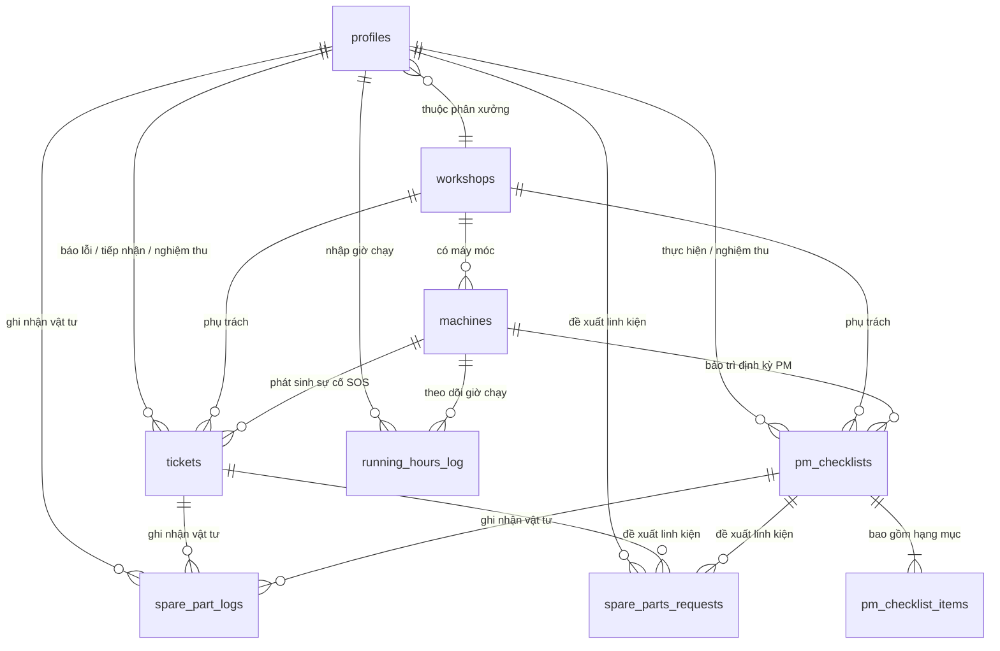

# AssetTrack - Thiết Kế Cơ Sở Dữ Liệu Quan Hệ (Database Schema & DDL)

Tài liệu này tổng hợp toàn bộ thông tin liên quan đến **Cơ sở Dữ liệu (Database)** của dự án AssetTrack trên nền tảng **Supabase / PostgreSQL**, bao gồm Mô hình ERD, Đặc tả chi tiết các Bảng, Tập lệnh SQL DDL tạo Bảng, RLS Security Policies, Storage Buckets và Database Triggers.

---

## 1. Mô Hình Thực Thể Quan Hệ (ERD - Entity Relationship Diagram)



> **Lưu ý Phạm vi Đề tài (Scope Note):** Hệ thống AssetTrack được thiết kế tập trung tối ưu cho **phạm vi 1 Phân Xưởng Sản Xuất duy nhất (Single Workshop Scope)**. Toàn bộ người dùng (`operator`, `me_engineer`, `supervisor`), máy móc, Ticket sự cố và phiếu bảo trì đều thuộc về phân xưởng này. Cấu hình mốc bảo trì được lưu trực tiếp tại bảng `machines` và ngưỡng duyệt chi phí lưu tại bảng `workshops`.

---

## 2. Đặc Tả Chi Tiết Các Bảng Dữ Liệu (Table Specifications)

### 2.1. Bảng `profiles` — Hồ sơ người dùng
Lưu trữ thông tin tài khoản, phân quyền vai trò (`operator`, `me_engineer`, `supervisor`) và liên kết với Supabase Auth (`auth.users`).

* **Phân quyền người dùng trong Phân xưởng:**
  - **Tài khoản `supervisor` (Quản đốc):** Ký tên nghiệm thu, phê duyệt linh kiện đắt tiền, xem Dashboard Downtime và cài đặt ngưỡng hệ thống.
  - **Tài khoản `me_engineer` (Kỹ sư ME):** Tiếp nhận Ticket sự cố SOS, thực hiện PM checklist và khai báo linh kiện thay thế.
  - **Tài khoản `operator` (Công nhân):** Quét mã QR xem Hộ chiếu thiết bị, khai báo chỉ số hoạt động và tạo Ticket SOS khẩn cấp.

| Thuộc tính | Kiểu dữ liệu | Ràng buộc | Mô tả |
| :--- | :--- | :--- | :--- |
| `id` | `uuid` | PK, FK -> auth.users.id | ID người dùng Supabase Auth |
| `full_name` | `text` | NOT NULL | Họ và tên người dùng |
| `role` | `text` | NOT NULL, CHECK ('operator','me_engineer','supervisor') | Vai trò trong phân xưởng |
| `workshop_id` | `uuid` | FK -> workshops.id | Phân xưởng phụ trách |
| `created_at` | `timestamptz` | DEFAULT now() | Thời điểm tạo tài khoản |

---

### 2.2. Bảng `workshops` — Phân xưởng sản xuất
Lưu trữ thông tin của Phân xưởng đề tài và ngưỡng duyệt chi phí linh kiện chung của xưởng.

| Thuộc tính | Kiểu dữ liệu | Ràng buộc | Mô tả |
| :--- | :--- | :--- | :--- |
| `id` | `uuid` | PK, DEFAULT gen_random_uuid() | ID phân xưởng |
| `name` | `text` | NOT NULL | Tên phân xưởng (VD: Phân xưởng Cơ khí & Dập CNC) |
| `location` | `text` | | Vị trí nhà máy |
| `cost_approval_threshold` | `float8` | DEFAULT 2000000 | Ngưỡng duyệt chi phí linh kiện (VNĐ, mặc định: 2.000.000đ) |
| `created_at` | `timestamptz` | DEFAULT now() | Thời điểm tạo |

---

### 2.3. Bảng `machines` — Hộ chiếu & Lý lịch máy móc
Lưu trữ danh mục máy móc, thông số kỹ thuật, mã QR duy nhất, chỉ số giờ chạy máy tích lũy và cấu hình mốc bảo trì định kỳ của máy.

| Thuộc tính | Kiểu dữ liệu | Ràng buộc | Mô tả |
| :--- | :--- | :--- | :--- |
| `id` | `uuid` | PK, DEFAULT gen_random_uuid() | ID thiết bị |
| `code` | `text` | UNIQUE, NOT NULL | Mã máy in trên mã QR (VD: MC-101) |
| `name` | `text` | NOT NULL | Tên máy |
| `model` | `text` | NOT NULL | Model máy |
| `specifications` | `jsonb` | | Thông số kỹ thuật (công suất, áp suất...) |
| `status` | `text` | NOT NULL, CHECK ('active','repairing','maintenance','inactive') | Trạng thái máy |
| `running_hours` | `float8` | DEFAULT 0 | Tổng số giờ máy chạy tích lũy |
| `pm_threshold_hours` | `int4[]` | DEFAULT '{500, 1000, 2000}' | Các mốc số giờ chạy kích hoạt bảo trì định kỳ |
| `workshop_id` | `uuid` | FK -> workshops.id | Thuộc phân xưởng nào |
| `last_maintenance_at` | `timestamptz` | | Thời điểm bảo trì gần nhất |
| `created_at` | `timestamptz` | DEFAULT now() | Thời điểm khởi tạo |

---

### 2.4. Bảng `tickets` — Ticket báo sự cố khẩn cấp (SOS Breakdown Ticket)
Lưu trữ thông tin Ticket báo lỗi sự cố dừng chuyền do Operator tạo, tiến độ sửa chữa của ME Engineer và chữ ký nghiệm thu của Quản đốc.

| Thuộc tính | Kiểu dữ liệu | Ràng buộc | Mô tả |
| :--- | :--- | :--- | :--- |
| `id` | `uuid` | PK, DEFAULT gen_random_uuid() | ID Ticket sự cố |
| `client_generated_id` | `uuid` | UNIQUE, NOT NULL | UUID tạo từ app mobile chống trùng khi sync offline |
| `workshop_id` | `uuid` | FK -> workshops.id | Phân xưởng phụ trách |
| `machine_id` | `uuid` | FK -> machines.id | Máy bị sự cố |
| `reporter_id` | `uuid` | FK -> profiles.id | Operator báo lỗi |
| `assignee_id` | `uuid` | FK -> profiles.id, NULLABLE | Kỹ sư ME tiếp nhận |
| `supervisor_id` | `uuid` | FK -> profiles.id, NULLABLE | Quản đốc nghiệm thu |
| `severity` | `text` | NOT NULL, CHECK ('low','medium','high','critical') | Mức độ nghiêm trọng |
| `description` | `text` | NOT NULL | Mô tả sự cố |
| `image_urls` | `text[]` | DEFAULT '{}' | Mảng URL ảnh hiện trạng lỗi |
| `status` | `text` | NOT NULL, CHECK ('pending','in_progress','completed','approved','rejected','cancelled') | Trạng thái Ticket |
| `downtime_start` | `timestamptz` | | Thời điểm bắt đầu dừng máy |
| `downtime_end` | `timestamptz` | | Thời điểm máy chạy lại |
| `claimed_at` | `timestamptz` | | Thời điểm Kỹ sư ME tiếp nhận (tính MTTR) |
| `supervisor_signature_url` | `text` | | URL ảnh chữ ký tay PNG |
| `rejection_reason` | `text` | | Lý do từ chối nghiệm thu (nếu status = rejected) |
| `rejected_by` | `uuid` | FK -> profiles.id, NULLABLE | Quản đốc từ chối |
| `cancelled_at` | `timestamptz` | | Thời điểm hủy Ticket báo nhầm |
| `cancellation_reason` | `text` | | Lý do hủy Ticket |
| `cancelled_by` | `uuid` | FK -> profiles.id, NULLABLE | Người hủy Ticket |
| `created_at` | `timestamptz` | DEFAULT now() | Thời điểm tạo Ticket |

---

### 2.5. Bảng `pm_checklists` — Phiếu bảo trì định kỳ (Preventive Maintenance)
Phiếu bảo trì tự động sinh khi số giờ máy chạy đạt mốc cấu hình.

| Thuộc tính | Kiểu dữ liệu | Ràng buộc | Mô tả |
| :--- | :--- | :--- | :--- |
| `id` | `uuid` | PK, DEFAULT gen_random_uuid() | ID phiếu PM |
| `workshop_id` | `uuid` | FK -> workshops.id | Phân xưởng quản lý |
| `machine_id` | `uuid` | FK -> machines.id | Máy bảo trì |
| `assignee_id` | `uuid` | FK -> profiles.id, NULLABLE | Kỹ sư ME thực hiện |
| `supervisor_id` | `uuid` | FK -> profiles.id, NULLABLE | Quản đốc nghiệm thu |
| `scheduled_hours` | `float8` | NOT NULL | Mốc số giờ chạy kích hoạt (VD: 500h) |
| `status` | `text` | NOT NULL, CHECK ('pending','in_progress','completed','approved','rejected','cancelled') | Trạng thái phiếu PM |
| `supervisor_signature_url` | `text` | | URL chữ ký nghiệm thu |
| `rejection_reason` | `text` | | Lý do từ chối nghiệm thu |
| `rejected_by` | `uuid` | FK -> profiles.id, NULLABLE | Quản đốc từ chối |
| `completed_at` | `timestamptz` | | Thời điểm ME hoàn thành |
| `created_at` | `timestamptz` | DEFAULT now() | Thời điểm tự động tạo |

---

### 2.6. Bảng `pm_checklist_items` — Hạng mục kiểm tra PM
Danh mục các thao tác bảo dưỡng (tra dầu, siết ốc, nén khí...) của từng đợt PM.

| Thuộc tính | Kiểu dữ liệu | Ràng buộc | Mô tả |
| :--- | :--- | :--- | :--- |
| `id` | `uuid` | PK, DEFAULT gen_random_uuid() | ID hạng mục |
| `pm_checklist_id` | `uuid` | FK -> pm_checklists.id, ON DELETE CASCADE | Thuộc phiếu PM nào |
| `task_description` | `text` | NOT NULL | Nội dung công việc bảo trì |
| `is_checked` | `boolean` | DEFAULT false | Đã tích hoàn thành chưa |
| `photo_required` | `boolean` | DEFAULT false | Có bắt buộc chụp ảnh minh chứng không |
| `photo_url` | `text` | | URL ảnh bằng chứng thực hiện |
| `checked_at` | `timestamptz` | | Thời điểm tích |

---

### 2.7. Bảng `spare_part_logs` — Nhật ký phụ tùng/vật tư tiêu hao đã thay
Ghi nhận danh sách phụ tùng đã dùng trong các ca sửa chữa/bảo trì.

| Thuộc tính | Kiểu dữ liệu | Ràng buộc | Mô tả |
| :--- | :--- | :--- | :--- |
| `id` | `uuid` | PK, DEFAULT gen_random_uuid() | ID nhật ký vật tư |
| `ticket_id` | `uuid` | FK -> tickets.id, NULLABLE | Thuộc Ticket SOS nào |
| `pm_checklist_id` | `uuid` | FK -> pm_checklists.id, NULLABLE | Thuộc phiếu PM nào |
| `part_name` | `text` | NOT NULL | Tên linh kiện / vật tư |
| `quantity` | `int4` | NOT NULL, CHECK (quantity > 0) | Số lượng |
| `unit` | `text` | NOT NULL | Đơn vị tính (cái, bộ, lít...) |
| `logged_by` | `uuid` | FK -> profiles.id | Kỹ sư ME ghi nhận |
| `logged_at` | `timestamptz` | DEFAULT now() | Thời điểm ghi nhận |

---

### 2.8. Bảng `spare_parts_requests` — Đề xuất thay linh kiện đắt tiền
Tạo khi linh kiện có tổng chi phí vượt Ngưỡng duyệt cấu hình (`cost_approval_threshold`).

| Thuộc tính | Kiểu dữ liệu | Ràng buộc | Mô tả |
| :--- | :--- | :--- | :--- |
| `id` | `uuid` | PK, DEFAULT gen_random_uuid() | ID đề xuất |
| `ticket_id` | `uuid` | FK -> tickets.id, NULLABLE | Thuộc Ticket SOS nào |
| `pm_checklist_id` | `uuid` | FK -> pm_checklists.id, NULLABLE | Thuộc phiếu PM nào |
| `requested_by` | `uuid` | FK -> profiles.id | Kỹ sư ME gửi đề xuất |
| `part_name` | `text` | NOT NULL | Tên linh kiện |
| `unit_price` | `float8` | NOT NULL, CHECK (unit_price > 0) | Đơn giá (VNĐ) |
| `reason` | `text` | NOT NULL | Lý do cần thay |
| `status` | `text` | NOT NULL, CHECK ('pending_approval','approved','rejected') | Trạng thái phê duyệt |
| `approved_by` | `uuid` | FK -> profiles.id, NULLABLE | Quản đốc phê duyệt |
| `rejection_reason` | `text` | | Lý do từ chối |
| `created_at` | `timestamptz` | DEFAULT now() | Thời điểm gửi |

---

### 2.9. Bảng `running_hours_log` — Nhật ký nhập chỉ số giờ máy chạy
Lưu vết từng lần nhập số giờ máy chạy ca của Operator.

| Thuộc tính | Kiểu dữ liệu | Ràng buộc | Mô tả |
| :--- | :--- | :--- | :--- |
| `id` | `uuid` | PK, DEFAULT gen_random_uuid() | ID bản ghi |
| `client_generated_id` | `uuid` | UNIQUE, NOT NULL | UUID tạo từ mobile chống trùng khi retry |
| `machine_id` | `uuid` | FK -> machines.id | Máy được nhập giờ |
| `hours_value` | `float8` | NOT NULL, CHECK (hours_value > 0) | Chỉ số giờ máy chạy |
| `shift` | `text` | CHECK ('start','end') | Nhập đầu ca hay cuối ca |
| `logged_by` | `uuid` | FK -> profiles.id | Operator nhập |
| `logged_at` | `timestamptz` | DEFAULT now() | Thời điểm nhập |

---

## 3. Tập Lệnh SQL DDL Khởi Tạo Cơ Sở Dữ Liệu (PostgreSQL / Supabase DDL Script)

```sql
-- =============================================================================
-- AssetTrack PostgreSQL / Supabase Schema Definition Script
-- =============================================================================

CREATE EXTENSION IF NOT EXISTS "uuid-ossp";
CREATE EXTENSION IF NOT EXISTS "pgcrypto";

-- 1. Workshops Table
CREATE TABLE public.workshops (
    id UUID PRIMARY KEY DEFAULT gen_random_uuid(),
    name TEXT NOT NULL,
    location TEXT,
    cost_approval_threshold FLOAT8 NOT NULL DEFAULT 2000000,
    created_at TIMESTAMPTZ DEFAULT now()
);

-- 2. Profiles Table (Linked to Supabase Auth)
CREATE TABLE public.profiles (
    id UUID PRIMARY KEY REFERENCES auth.users(id) ON DELETE CASCADE,
    full_name TEXT NOT NULL,
    role TEXT NOT NULL CHECK (role IN ('operator', 'me_engineer', 'supervisor')),
    workshop_id UUID REFERENCES public.workshops(id),
    created_at TIMESTAMPTZ DEFAULT now()
);

-- 3. Machines Table
CREATE TABLE public.machines (
    id UUID PRIMARY KEY DEFAULT gen_random_uuid(),
    code TEXT UNIQUE NOT NULL,
    name TEXT NOT NULL,
    model TEXT NOT NULL,
    specifications JSONB DEFAULT '{}'::jsonb,
    status TEXT NOT NULL CHECK (status IN ('active', 'repairing', 'maintenance', 'inactive')) DEFAULT 'active',
    running_hours FLOAT8 NOT NULL DEFAULT 0,
    pm_threshold_hours INT4[] NOT NULL DEFAULT '{500, 1000, 2000}',
    workshop_id UUID REFERENCES public.workshops(id) ON DELETE CASCADE,
    last_maintenance_at TIMESTAMPTZ,
    created_at TIMESTAMPTZ DEFAULT now()
);

-- 4. Tickets Table (SOS Breakdown)
CREATE TABLE public.tickets (
    id TEXT PRIMARY KEY, -- Firestore Document ID
    machine_id TEXT NOT NULL REFERENCES public.machines(id) ON DELETE CASCADE,
    machine_code TEXT NOT NULL,
    machine_name TEXT NOT NULL,
    reporter_id TEXT NOT NULL REFERENCES public.profiles(id),
    reporter_name TEXT NOT NULL,
    reporter_email TEXT NOT NULL,
    engineer_id TEXT REFERENCES public.profiles(id),
    engineer_name TEXT,
    severity TEXT NOT NULL CHECK (severity IN ('LOW', 'MEDIUM', 'HIGH', 'CRITICAL')),
    status TEXT NOT NULL CHECK (status IN ('PENDING', 'IN_PROGRESS', 'COMPLETED', 'APPROVED', 'REJECTED', 'CANCELLED')) DEFAULT 'PENDING',
    description TEXT NOT NULL,
    images_urls TEXT[] DEFAULT '{}',
    downtime_start TIMESTAMPTZ DEFAULT now(),
    downtime_end TIMESTAMPTZ,
    claimed_at TIMESTAMPTZ,
    rejection_reason TEXT,
    cancelled_at TIMESTAMPTZ,
    cancelled_reason TEXT,
    created_at TIMESTAMPTZ DEFAULT now(),
    updated_at TIMESTAMPTZ DEFAULT now()
);

-- 5. PM Checklists Table
CREATE TABLE public.pm_checklists (
    id UUID PRIMARY KEY DEFAULT gen_random_uuid(),
    workshop_id UUID NOT NULL REFERENCES public.workshops(id) ON DELETE CASCADE,
    machine_id UUID NOT NULL REFERENCES public.machines(id) ON DELETE CASCADE,
    assignee_id UUID REFERENCES public.profiles(id),
    supervisor_id UUID REFERENCES public.profiles(id),
    scheduled_hours FLOAT8 NOT NULL,
    status TEXT NOT NULL CHECK (status IN ('pending', 'in_progress', 'completed', 'approved', 'rejected', 'cancelled')) DEFAULT 'pending',
    supervisor_signature_url TEXT,
    rejection_reason TEXT,
    rejected_by UUID REFERENCES public.profiles(id),
    completed_at TIMESTAMPTZ,
    created_at TIMESTAMPTZ DEFAULT now()
);

-- 6. PM Checklist Items Table
CREATE TABLE public.pm_checklist_items (
    id UUID PRIMARY KEY DEFAULT gen_random_uuid(),
    pm_checklist_id UUID NOT NULL REFERENCES public.pm_checklists(id) ON DELETE CASCADE,
    task_description TEXT NOT NULL,
    is_checked BOOLEAN DEFAULT false,
    photo_required BOOLEAN DEFAULT false,
    photo_url TEXT,
    checked_at TIMESTAMPTZ
);

-- 7. Spare Part Logs Table
CREATE TABLE public.spare_part_logs (
    id UUID PRIMARY KEY DEFAULT gen_random_uuid(),
    ticket_id UUID REFERENCES public.tickets(id) ON DELETE CASCADE,
    pm_checklist_id UUID REFERENCES public.pm_checklists(id) ON DELETE CASCADE,
    part_name TEXT NOT NULL,
    quantity INT4 NOT NULL CHECK (quantity > 0),
    unit TEXT NOT NULL,
    logged_by UUID NOT NULL REFERENCES public.profiles(id),
    logged_at TIMESTAMPTZ DEFAULT now(),
    CONSTRAINT check_parent_task CHECK (ticket_id IS NOT NULL OR pm_checklist_id IS NOT NULL)
);

-- 8. Spare Parts Requests Table
CREATE TABLE public.spare_parts_requests (
    id UUID PRIMARY KEY DEFAULT gen_random_uuid(),
    ticket_id UUID REFERENCES public.tickets(id) ON DELETE CASCADE,
    pm_checklist_id UUID REFERENCES public.pm_checklists(id) ON DELETE CASCADE,
    requested_by UUID NOT NULL REFERENCES public.profiles(id),
    part_name TEXT NOT NULL,
    unit_price FLOAT8 NOT NULL CHECK (unit_price > 0),
    reason TEXT NOT NULL,
    status TEXT NOT NULL CHECK (status IN ('pending_approval', 'approved', 'rejected')) DEFAULT 'pending_approval',
    approved_by UUID REFERENCES public.profiles(id),
    rejection_reason TEXT,
    created_at TIMESTAMPTZ DEFAULT now(),
    CONSTRAINT check_parent_request CHECK (ticket_id IS NOT NULL OR pm_checklist_id IS NOT NULL)
);

-- 9. Running Hours Log Table
CREATE TABLE public.running_hours_log (
    id UUID PRIMARY KEY DEFAULT gen_random_uuid(),
    client_generated_id UUID UNIQUE NOT NULL,
    machine_id UUID NOT NULL REFERENCES public.machines(id) ON DELETE CASCADE,
    hours_value FLOAT8 NOT NULL CHECK (hours_value > 0),
    shift TEXT CHECK (shift IN ('start', 'end')),
    logged_by UUID NOT NULL REFERENCES public.profiles(id),
    logged_at TIMESTAMPTZ DEFAULT now()
);

-- =============================================================================
-- Performance Indexes
-- =============================================================================

CREATE INDEX idx_machines_code ON public.machines(code);
CREATE INDEX idx_machines_workshop ON public.machines(workshop_id);
CREATE INDEX idx_tickets_status ON public.tickets(status);
CREATE INDEX idx_tickets_machine ON public.tickets(machine_id);
CREATE INDEX idx_pm_checklists_status ON public.pm_checklists(status);
CREATE INDEX idx_running_hours_machine ON public.running_hours_log(machine_id);
```

---

## 4. Chính Sách Bảo Mật Dữ Liệu RLS (Row-Level Security)

```sql
-- Enable RLS on all tables
ALTER TABLE public.profiles ENABLE ROW LEVEL SECURITY;
ALTER TABLE public.machines ENABLE ROW LEVEL SECURITY;
ALTER TABLE public.tickets ENABLE ROW LEVEL SECURITY;
ALTER TABLE public.pm_checklists ENABLE ROW LEVEL SECURITY;
ALTER TABLE public.workshops ENABLE ROW LEVEL SECURITY;

-- Helper function to get current user's workshop_id
CREATE OR REPLACE FUNCTION get_auth_workshop_id()
RETURNS UUID AS $$
  SELECT workshop_id FROM public.profiles WHERE id = auth.uid();
$$ LANGUAGE sql STABLE SECURITY DEFINER;

-- RLS Policy: Users can read data belonging to their assigned workshop_id
CREATE POLICY workshop_isolation_select_machines ON public.machines
    FOR SELECT USING (workshop_id = get_auth_workshop_id());

CREATE POLICY workshop_isolation_select_ticket ON public.tickets
    FOR SELECT USING (workshop_id = get_auth_workshop_id());

-- RLS Policy: Only Supervisors can update workshop settings
CREATE POLICY supervisor_workshop_update ON public.workshops
    FOR ALL USING (
        EXISTS (
            SELECT 1 FROM public.profiles 
            WHERE id = auth.uid() 
            AND role = 'supervisor' 
            AND workshop_id = public.workshops.id
        )
    );
```

---

## 5. Cấu Hình Supabase Storage Buckets

Hệ thống quản lý tài nguyên phương tiện truyền thông với 3 Buckets chính:

1. **`failure-photos` (Public Bucket):**
   - **Mục đích:** Lưu trữ ảnh chụp hiện trạng sự cố do Operator hoặc ME Engineer tải lên.
   - **Ràng buộc:** Tối đa 5 ảnh/ticket, kích thước mỗi ảnh $< 5$MB (nén client).

2. **`maintenance-proofs` (Public Bucket):**
   - **Mục đích:** Lưu trữ ảnh minh chứng thay thế linh kiện/bảo trì của Kỹ sư ME.
   - **Ràng buộc:** Bắt buộc phải có ảnh đối với các hạng mục có `photo_required = true`.

3. **`supervisor-signatures` (Private/Public Bucket):**
   - **Mục đích:** Lưu trữ ảnh chữ ký số điện tử của Quản đốc dưới định dạng PNG.
   - **Ràng buộc:** Kích thước tối thiểu $300 \times 150$px.

---

## 6. Triggers & Tự Động Hóa Dữ Liệu (Database Triggers)

### Trigger 1: Tự động chuyển trạng thái máy sang `repairing` khi phát sinh Ticket SOS
```sql
CREATE OR REPLACE FUNCTION trigger_set_machine_repairing()
RETURNS TRIGGER AS $$
BEGIN
    UPDATE public.machines 
    SET status = 'repairing' 
    WHERE id = NEW.machine_id;
    RETURN NEW;
END;
$$ LANGUAGE plpgsql;

CREATE TRIGGER trg_ticket_insert_set_repairing
AFTER INSERT ON public.tickets
FOR EACH ROW
WHEN (NEW.status = 'pending')
EXECUTE FUNCTION trigger_set_machine_repairing();
```

### Trigger 2: Tự động đưa máy về `active` sau khi Quản đốc ký tên nghiệm thu
```sql
CREATE OR REPLACE FUNCTION trigger_set_machine_active_on_approval()
RETURNS TRIGGER AS $$
BEGIN
    UPDATE public.machines 
    SET status = 'active', 
        last_maintenance_at = now() 
    WHERE id = NEW.machine_id;
    RETURN NEW;
END;
$$ LANGUAGE plpgsql;

CREATE TRIGGER trg_ticket_approve_set_active
AFTER UPDATE ON public.tickets
FOR EACH ROW
WHEN (NEW.status = 'approved' AND OLD.status <> 'approved')
EXECUTE FUNCTION trigger_set_machine_active_on_approval();
```
