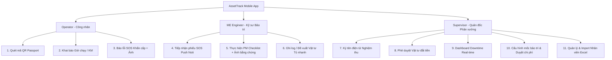

# 📱 AssetTrack — TÀI LIỆU THIẾT KẾ GIAO DIỆN NỀN TẢNG MOBILE (UI/UX DESIGN SPECIFICATION)
## Hệ thống Quản lý Lý lịch Thiết bị & Bảo trì Phòng ngừa Nhà máy (Flutter & Firebase)

Tài liệu này chuẩn hóa toàn bộ thiết kế giao diện ứng dụng di động (Flutter), hệ thống màu sắc công nghiệp, bố cục màn hình (Wireframes), quy chuẩn tương tác và luồng trải nghiệm người dùng (UX Flows) cho 3 tác nhân trong phân xưởng sản xuất dựa trên báo cáo **AssetTrack Overview**.

---

## 1. Hệ thống Thiết kế & Quy chuẩn UI/UX Công nghiệp (Industrial Design System)

### 1.1. Bảng màu Chuẩn Nhà máy (Industrial Color Palette)
Để đảm bảo độ tương phản cao, dễ nhìn trong điều kiện ánh sáng nhà máy và thao tác tốt khi đeo găng tay bảo hộ:

- **Màu chủ đạo (Brand Primary - Deep Blue)**: `#1E3A8A` / `#2563EB` — Thể hiện sự chuyên nghiệp, tin cậy của thiết bị công nghiệp.
- **Trạng thái Máy (Machine Status Badges)**:
  - 🟢 **Active (Hoạt động bình thường)**: `#10B981` (Green)
  - 🔴 **Repairing (Sự cố SOS / Đang sửa)**: `#EF4444` (Red)
  - 🟡 **Maintenance (Bảo trì định kỳ PM)**: `#F59E0B` (Amber/Yellow)
  - ⚪ **Stopped (Ngưng vận hành / Hủy)**: `#6B7280` (Gray)
- **Mức độ Nghiêm trọng (Severity Badges)**:
  - 🔴 **Critical**: `#DC2626` (Đỏ sậm - Dừng dây chuyền khẩn cấp)
  - 🟠 **High**: `#EA580C` (Cam - Ảnh hưởng năng suất)
  - 🟡 **Medium**: `#D97706` (Vàng - Lỗi nhẹ)
  - 🔵 **Low**: `#2563EB` (Xanh dương - Cảnh báo nhỏ)
- **Cảnh báo Offline (NFR-06 Banner)**: `#FEF2F2` nền đỏ nhạt + Chữ `#991B1B` đỏ đậm ("⚠️ Đang offline — Phiếu sẽ tự đồng bộ khi có mạng").

### 1.2. Quy chuẩn Tương tác Cảm ứng & Đeo găng tay (NFR-05 Compliance)
- **Kích thước Nút (Touch Target)**: Tối thiểu `48 × 48dp` cho tất cả các nút hành động quan trọng (`Gửi SOS`, `Tiếp nhận`, `Ký tên`, `Tích checklist`).
- **Typography**: `Roboto` / `Inter` font chữ đậm, cỡ chữ tối thiểu `14sp` cho nội dung và `18sp - 22sp` cho Tiêu đề/Trạng thái.

---

## 2. Điểm nhìn & Trải nghiệm theo 3 Vai trò Người dùng (User Personas)



---

## 3. Chi tiết Bố cục & Wireframe Màn hình (11 Key Screen Designs)

### 📌 MÀN HÌNH DÀNH CHO CÔNG NHÂN VẬN HÀNH (OPERATOR)

#### Màn hình A: Hộ chiếu Thiết bị (QR Machine Passport — Feature 1)
- **Đường dẫn**: `/machine-passport/:id`
- **Thành phần UI**:
  - **Header Card**: Tên máy (`MC-102`), Mã máy, Tag Trạng thái màu nổi bật (`● HOẠT ĐỘNG`).
  - **Thanh Progress Bar Mốc Bảo Trì**: Hiển thị % số giờ chạy tích lũy so với mốc bảo trì tiếp theo (Ví dụ: `463h / 500h` — Thanh tiến độ màu vàng khi còn < 10%).
  - **Khối Thông số Kỹ thuật**: Công suất, Áp suất tối đa, Năm sản xuất.
  - **Lịch sử Bảo trì gần nhất**: Card danh sách 3 lần sửa chữa/bảo dưỡng gần nhất kèm tên Kỹ sư ME.
  - **Cẩm năng Xử lý Lỗi nhanh**: Accordion hướng dẫn khắc phục nhanh các lỗi thường gặp.
  - **Nút hành động góc dưới**:
    - Nút phụ: `[Cập nhật giờ máy chạy]` (Outlined Button).
    - Nút chính nổi bật: `[🚨 BÁO LỖI SOS KHẤN CẤP 🚨]` (Big Red Elevated Button, height `56dp`).

#### Màn hình B: Popup Khai báo Giờ chạy / KM (Running Hours Logging — Feature 2)
- **Đường dẫn**: Dialog Popup góc dưới màn hình.
- **Validation**:
  - Tự động hiển thị chỉ số giờ chạy lần trước (VD: `463h`).
  - Ô nhập chỉ số mới: Chỉ chấp nhận số nguyên dương lớn hơn chỉ số trước. Tự động hiển thị câu thông báo lỗi đỏ nếu người dùng nhập số nhỏ hơn.
  - Radio chọn ca: `Đầu ca` | `Cuối ca`.
- **Nút bấm**: `[Hủy]` | `[Lưu giờ chạy]`.

#### Màn hình C: Tạo Phiếu Báo Lỗi Khẩn Cấp (Breakdown SOS Creation — Feature 3 & 4)
- **Đường dẫn**: `/sos-create`
- **Thành phần UI**:
  - **Chọn Mức độ Nghiêm trọng (Severity Segmented Control)**: 4 pills `Low`, `Medium`, `High`, `Critical` (Critical highlighted màu đỏ).
  - **Mô tả Hiện trạng Lỗi**: TextArea cỡ lớn cho phép nhập chi tiết hiện tượng (tiếng kêu, rò rỉ, dừng đột ngột...).
  - **Đính kèm Ảnh Hiện trạng**:
    - Nút bấm biểu tượng Camera để chụp ảnh trực tiếp từ thiết bị.
    - Grid danh sách ảnh thumbnail đã chụp kèm biểu tượng thùng rác để xóa bớt.
  - **Banner Cảnh báo Offline (nếu mất mạng)**: Hiển thị banner đỏ thông báo phiếu sẽ được lưu vào queue và đồng bộ khi có mạng.
  - **Nút bấm**: `[GỬI PHIẾU SOS KHẨN CẤP]` (Primary Red Button).

---

### 📌 MÀN HÌNH DÀNH CHO KỸ SƯ BẢO TRÌ (ME ENGINEER)

#### Màn hình D: Danh sách Công việc Work Order (Work Order List View — Feature 5 & 9)
- **Đường dẫn**: `/me/work-orders`
- **Tab Filter**: `Tất cả` | `Chờ tiếp nhận (Pending)` | `Đang xử lý (In Progress)` | `Hoàn thành (Completed)`.
- **Card Item phiếu công việc**:
  - Tag phân loại: Badge `🔴 SOS - CRITICAL` hoặc `🔵 PM - BẢO TRÌ MỐC 500H`.
  - Mã máy & Tên máy (`MC-102 - Máy dập thủy lực`).
  - Thời gian khởi tạo (`14 phút trước`).
  - Nút bấm tiếp nhận nhanh `[Tiếp nhận]` (Xử lý Race Condition: Nếu đã có ME khác bấm tiếp nhận trước, hiển thị Toast cảnh báo "Phiếu đã được tiếp nhận bởi kỹ sư khác").

#### Màn hình E: Thực hiện PM Checklist & Tải ảnh bằng chứng (PM Checklist Execution — Feature 7 & 8)
- **Đường dẫn**: `/me/pm-checklist/:id`
- **Thành phần UI**:
  - **Thanh Tiến độ**: Hiển thị tỷ lệ hoàn thành (VD: `Tiến độ: 2/5 mục ✓`).
  - **Danh sách hạng mục Checklist (Checklist Items)**:
    - Mỗi mục gồm checkbox + Tiêu đề công việc (*Thay dầu bôi trơn trục chính*, *Siết chặt bu-lông chân máy*...).
    - Các hạng mục bắt buộc chụp ảnh đính kèm biểu tượng `📷 Camera`. Người dùng phải upload ảnh thì checkbox mới cho phép tích chọn.
  - **Khu vực Upload Ảnh bằng chứng Bảo dưỡng**: Grid nộp ảnh cũ/mới làm đối chứng.
  - **Nút bấm hoàn thành**: `[Hoàn thành & Gửi nghiệm thu]` (Disabled màu xám khi chưa tích đủ 100% hạng mục).

#### Màn hình F: Ghi log & Đề xuất Vật tư Thay thế (Spare Parts Logging & Approval — Feature 6)
- **Đường dẫn**: `/me/spare-parts-log/:work_order_id`
- **Thành phần UI**:
  - **Danh mục Vật tư Tủ nhanh tại xưởng**: Dropdown chọn phụ tùng tiêu hao (Dầu 46#, Bu-lông M12, Gioăng cao su...) + Nhập Số lượng.
  - **Phụ tùng Giá trị cao (> Ngưỡng duyệt)**: Nếu chọn linh kiện có đơn giá vượt ngưỡng cấu hình (VD: > 2.000.000đ), hệ thống tự động gắn tag `Chờ Supervisor Phê duyệt`.
  - **Nút bấm**: `[Ghi nhận vật tư vào lý lịch máy]`.

---

### 📌 MÀN HÌNH DÀNH CHO QUẢN ĐỐC PHÂN XƯỞNG (FACTORY SUPERVISOR)

#### Màn hình G: Nghiệm thu & Ký tên Điện tử (Digital Sign-off — Feature 10)
- **Đường dẫn**: `/supervisor/sign-off/:id`
- **Thành phần UI**:
  - **Tóm tắt Công việc**: Tên máy, Kỹ sư thực hiện, Tổng thời gian dừng máy (Downtime: `2h 35m`), Danh sách vật tư đã thay.
  - **Khung Ký tên Điện tử (Digital Signature Canvas)**:
    - Vùng cảm ứng ký tên bằng tay (kích thước tối thiểu `300 × 150dp`).
    - Nút `[Xóa chữ ký]` để ký lại.
  - **Nút thao tác đôi**:
    - Nút `[✗ Từ chối]` (Màu đỏ): Mở dialog bắt buộc nhập lý do từ chối, chuyển phiếu về trạng thái `REJECTED` để Kỹ sư sửa lại.
    - Nút `[✓ Xác nhận nghiệm thu]` (Màu xanh lá): Disabled khi canvas chữ ký còn trống. Sau khi lưu, tự động đưa máy về trạng thái `Active`.

#### Màn hình H: Dashboard Giám sát Downtime & Trạng thái (Real-time Dashboard — Feature 12)
- **Đường dẫn**: `/supervisor/dashboard`
- **Bộ lọc thời gian**: `Hôm nay` | `7 ngày qua` | `30 ngày qua`.
- **Bố cục Dashboard**:
  - **Biểu đồ Tròn (Pie Chart)**: Tỷ lệ máy `Active (18)`, `Repairing (3)`, `Maintenance (2)`.
  - **Tổng Downtime Tích lũy**: Hiển thị tổng số giờ dừng máy trong ngày (VD: `6h 40m`) + Progress bar chỉ số khả dụng OEE.
  - **Top 5 Máy có Downtime cao nhất**: Bảng xếp hạng danh sách máy hỏng nhiều nhất để Quản đốc có kế hoạch thay thế thiết bị cũ.
  - **Danh sách Sự cố đang mở**: Bấm trực tiếp vào để xem chi tiết hoặc thực hiện nghiệm thu.

#### Màn hình I: Phê duyệt Đề xuất Linh kiện đắt tiền (Spare Parts Approval — Feature 11)
- **Đường dẫn**: `/supervisor/spare-parts-approval`
- **Thành phần UI**:
  - Thông tin đề xuất từ ME: Tên linh kiện, Đơn giá, Lý do đề xuất.
  - Tag Cảnh báo đỏ: `⚠️ Vượt ngưỡng duyệt 2.000.000đ`.
  - Nút bấm: `[✗ Từ chối]` (nhập lý do) | `[✓ Phê duyệt]`.

#### Màn hình J: Thiết lập Đơn vị & Ngưỡng Bảo trì Hệ thống (System Threshold Config — Feature 13)
- **Đường dẫn**: `/supervisor/config`
- **Cấu hình Mốc giờ PM**:
  - Thiết lập đơn vị theo dõi (`hours` hoặc `km`).
  - Danh sách mốc bảo trì định kỳ (`500h`, `1000h`, `2000h`...) kèm nút thêm/xóa mốc.
- **Cấu hình Ngưỡng Duyệt Chi phí Linh kiện**:
  - Input số tiền hạn mức (VD: `2.000.000 VNĐ`).

#### Màn hình K: Quản lý & Import Nhân viên Phân xưởng (Staff Management & Import — Feature 14 / US-14)
- **Đường dẫn**: `/supervisor/staff-management`
- **Tab Chuyển đổi**:
  - **Tab 1: Thêm thủ công**: Nhập Họ tên, Email, Mã NV, Chọn Role (`Operator` / `ME Engineer`).
  - **Tab 2: Import từ Excel/CSV**: Khung chọn file `.xlsx`/`.csv` + Nút tải file mẫu `.xlsx` + Khung Preview danh sách nhân viên đọc được từ file trước khi bấm `[✓ Xác nhận Import Hàng Loạt]`.

---

## 4. Luồng Chuyển đổi Trạng thái Phiếu (Work Order State Machine Flow)

```
                       [Tạo Phiếu SOS / PM]
                                │
                                ▼
                             PENDING
                                │
          ┌─────────────────────┴─────────────────────┐
          │ (Hủy phiếu)                               │ (ME Tiếp nhận - Optimistic Lock)
          ▼                                           ▼
      CANCELLED                                  IN_PROGRESS
          │                                           │
   [Máy về Active]                                    │ (ME Hoàn thành)
                                                      ▼
                                                  COMPLETED
                                                      │
                                                      ▼
                                            (Supervisor Kiểm tra)
                                                      │
                       ┌──────────────────────────────┴──────────────────────────────┐
                       │ (Từ chối - Nhập lý do)                                      │ (Ký nghiệm thu)
                       ▼                                                             ▼
                   REJECTED ───────────────────→ (ME Sửa lại)                   APPROVED
                                                                                     │
                                                                              [Máy về Active]
```

---

## 5. Quy trình Xử lý Chế độ Ngoại tuyến (Offline Mode Handling — NFR-06)

1. **Hiển thị Banner**: Ngay khi mất kết nối Internet, ứng dụng hiển thị Banner đỏ cố định trên cùng màn hình: *"⚠️ Đang offline — Dữ liệu sẽ tự động đồng bộ khi có kết nối"*.
2. **Local Queue Storage**: Toàn bộ thao tác ghi (Nhập giờ chạy, Tạo phiếu SOS khẩn cấp) khi offline được lưu tạm vào **SQLite / Local Storage Persistence**.
3. **Xử lý Ảnh Offline**: Ảnh chụp lỗi được lưu dưới dạng file local path (`path_provider`). Khi thiết bị có mạng trở lại:
   - App ưu tiên upload ảnh lên **Firebase Storage** trước để lấy Download URL.
   - Sau khi upload ảnh thành công, app mới gửi payload Work Order lên **Cloud Firestore**.
4. **Tránh trùng lặp (Idempotency)**: Sử dụng mã `client_generated_id` (UUID v4 do App tự tạo) làm Document ID trên Firestore để tránh tạo trùng lớp phiếu khi retry đồng bộ nhiều lần.
