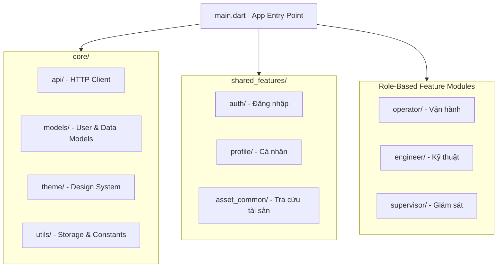
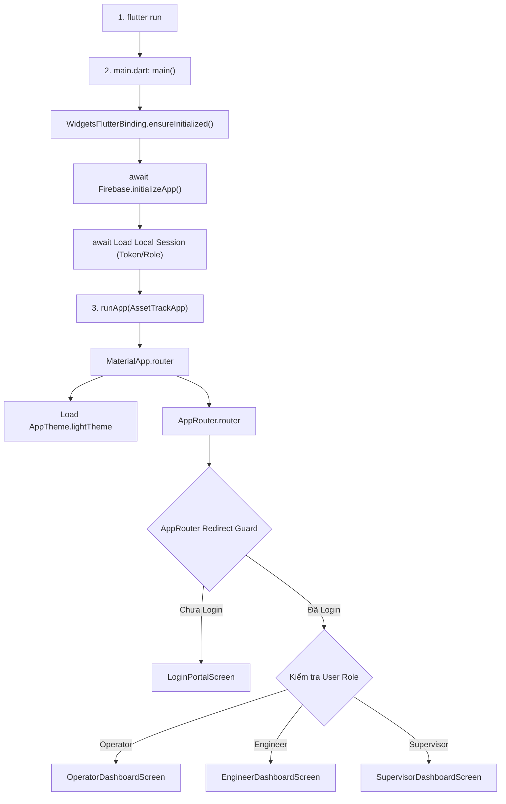

# 🏗️ Kiến Trúc Tổng Quát Ứng Dụng AssetTrack Mobile

Tài liệu này mô tả chi tiết kiến trúc phần mềm, cấu trúc thư mục, luồng hoạt động và quy chuẩn thiết kế của ứng dụng **AssetTrack Mobile** (Flutter Frontend).

---

## 📌 1. Tổng Quan Kiến Trúc (Architecture Overview)

Ứng dụng sử dụng mô hình **Feature-Driven Architecture** (Kiến trúc phân theo tính năng) kết hợp với **Role-Based Access Control (RBAC)** nhằm mục đích:
- **Tách biệt trách nhiệm (Separation of Concerns):** Phân chia rõ ràng giữa tầng hệ thống chung (`core`), các tính năng theo vai trò người dùng (`operator`, `engineer`, `supervisor`), và tính năng dùng chung (`shared_features`).
- **Khả năng mở rộng (Scalability):** Dễ dàng bổ sung các tính năng mới mà không làm ảnh hưởng đến các mô-đun hiện có.
- **Tái sử dụng code (Reusability):** Tối ưu các UI component và logic dùng chung tại `core` và `shared_features`.



---

## 📂 2. Cấu Trúc Thư Mục (Directory Structure)

Thư mục `lib/` được tổ chức như sau:

```text
lib/
├── core/                       # Tầng cơ sở hạ tầng & tiện ích dùng chung
│   ├── api/                    # Cấu hình API client & kết nối Backend (NestJS)
│   ├── models/                 # Models dữ liệu chung (UserModel, UserRole...)
│   ├── services/               # Các service toàn cục
│   ├── theme/                  # Theme hệ thống, màu sắc & typography (AppTheme)
│   └── utils/                  # Hằng số (AppConstants) & bộ nhớ cục bộ (StorageService)
│
├── shared_features/            # Các màn hình & widget dùng chung cho mọi User
│   ├── asset_common/           # Tra cứu tài sản chung (AssetLookupScreen)
│   ├── auth/                   # Luồng xác thực & chọn vai trò (LoginPortalScreen)
│   └── profile/                # Màn hình cá nhân (ProfileScreen)
│
├── operator/                   # Mô-đun dành cho Nhân viên vận hành (Operator)
│   ├── incident_report/        # Báo cáo sự cố tài sản (ReportIncidentScreen, PhotoPickerWidget)
│   ├── quick_scan/             # Quét QR code tài sản (ScanQrScreen, ScannerOverlay, ScanResultDialog)
│   └── shift_check/            # Bàn giao & kiểm tra ca (ShiftCheckScreen, ChecklistItem, ShiftInfoCard)
│
├── engineer/                   # Mô-đun dành cho Kỹ sư bảo trì (Engineer)
│   ├── spare_parts/            # Yêu cầu & quản lý phụ tùng (RequestPartScreen, PartItemRow...)
│   └── ticket_management/      # Xử lý & cập nhật Ticket (TicketListScreen, TicketDetailScreen...)
│
├── supervisor/                 # Mô-đun dành cho Giám sát viên (Supervisor)
│   ├── analytics/              # Báo cáo phân tích & KPI hệ thống (SystemAnalyticsScreen, HealthChart...)
│   └── approvals/              # Phê duyệt yêu cầu / sự cố (ApprovalListScreen, ApprovalCard...)
│
└── main.dart                   # Điểm khởi chạy ứng dụng (Entry point)
```

---

## 👥 3. Phân Quyền Theo Vai Trò Người Dùng (Role-Based Access Control - RBAC)

Hệ thống phân định 3 nhóm vai trò chính thông qua `UserRole`:

| Vai Trò (Role) | Chức Năng Chính | Mô-đun Tương Ứng |
| :--- | :--- | :--- |
| **Operator** *(Nhân viên vận hành)* | • Kiểm tra bàn giao ca<br>• Quét QR code kiểm kê nhanh<br>• Gửi báo cáo sự cố thiết bị | `lib/operator/` |
| **Engineer** *(Kỹ sư bảo trì)* | • Tiếp nhận & xử lý Ticket sự cố<br>• Cập nhật trạng thái sửa chữa<br>• Yêu cầu vật tư / phụ tùng thay thế | `lib/engineer/` |
| **Supervisor** *(Giám sát viên)* | • Phê duyệt các đề xuất / ticket<br>• Theo dõi biểu đồ KPI & sức khỏe hệ thống | `lib/supervisor/` |

---

## 🛠️ 4. Các Thành Phần Nền Tảng (Core Infrastructure)

- **`main.dart`**: Khởi tạo `WidgetsFlutterBinding`, `Firebase.initializeApp()`, `StorageService.init()`, cài đặt `AppTheme.lightTheme` và định tuyến ban đầu tới `LoginPortalScreen`.
- **`ApiClient`**: Đóng gói các phương thức giao tiếp RESTful API tới NestJS Backend.
- **`StorageService`**: Quản lý lưu trữ trạng thái local (phiên đăng nhập, cấu hình cá nhân).
- **`AppTheme`**: Định nghĩa thiết kế UI tập trung (Theme Data, hệ màu, typography).

---

## 🔄 5. Luồng Hoạt Động Ứng Dụng (Application Execution Flow)

Dưới đây là chu trình khởi chạy và điều hướng phân quyền người dùng trong ứng dụng AssetTrack Mobile:

```text
[1. Command: flutter run]
       │
       ▼
[2. main.dart -> main()] ──► WidgetsFlutterBinding.ensureInitialized() (Bắt buộc)
       │
       ├──► await Firebase.initializeApp() (Kết nối Firebase)
       │
       ├──► await Load Local Session (Đọc Token/Role từ máy nếu có)
       │
       ▼
[3. runApp(AssetTrackApp)]
       │
       ├──► MaterialApp.router
       │     ├── Load AppTheme.lightTheme (Nạp toàn bộ bảng màu M3)
       │     └── Nạp AppRouter.router
       │
       ▼
[4. AppRouter Điều hướng (Redirect Guard)]
       │
       ├── Chưa Login? ──► Mở Portal Selection / Login Screen
       │
       └── Đã Login?   ──► Đọc Role từ Session ──► Điều hướng về Dashboard đúng Role
                            ├── Operator    ➔ OperatorDashboardScreen
                            ├── Engineer    ➔ EngineerDashboardScreen
                            └── Supervisor  ➔ SupervisorDashboardScreen
```

### Sơ đồ luồng (Flowchart Diagram)



---

## 🚀 6. Quy Chuẩn Phát Triển (Development Guidelines)

1. **Mô-đun hóa (Modularity):** Các tính năng mới thuộc về từng vai trò phải được đặt trong thư mục của vai trò tương ứng (`operator`, `engineer`, `supervisor`).
2. **Cấu trúc màn hình & widget:**
   - Các màn hình chính nằm trong thư mục `screens/`.
   - Các UI component con phục vụ màn hình đó nằm trong thư mục `widgets/`.
3. **Quản lý state & kết nối API:** Thực hiện thông qua các dịch vụ chuẩn hóa đặt tại `core/api/` hoặc theo từng feature service.
