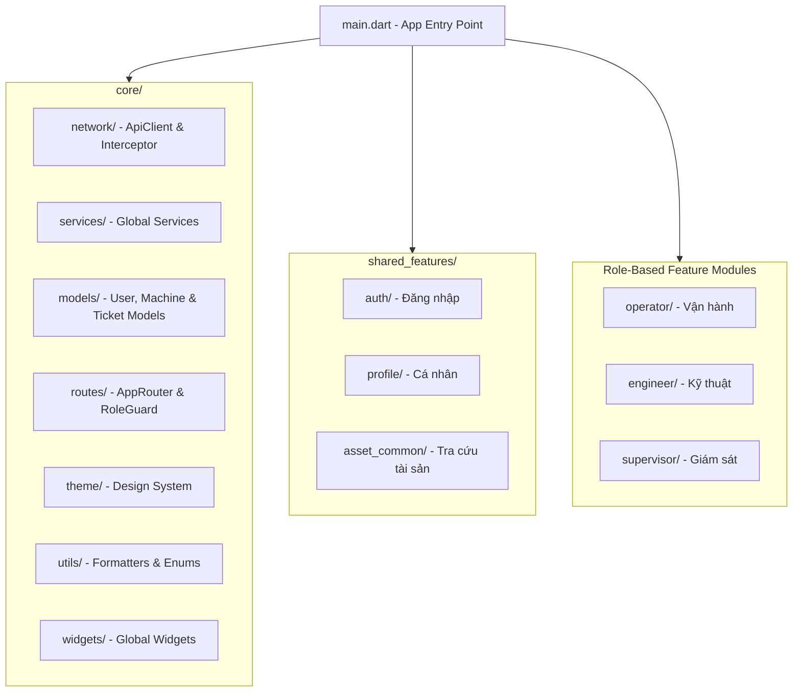

# 🏗️ Kiến Trúc Tổng Quát Ứng Dụng AssetTrack Mobile

Tài liệu này mô tả chi tiết kiến trúc phần mềm, cấu trúc thư mục, luồng hoạt động và quy chuẩn thiết kế của ứng dụng **AssetTrack Mobile** (Flutter Frontend).

---

## 📌 1. Tổng Quan Kiến Trúc (Architecture Overview)

Ứng dụng sử dụng mô hình **Feature-Driven Architecture** (Kiến trúc phân theo tính năng) kết hợp với **Role-Based Access Control (RBAC)** nhằm mục đích:

- **Tách biệt trách nhiệm (Separation of Concerns):** Phân chia rõ ràng giữa tầng hệ thống chung (`core`), các tính năng theo vai trò người dùng (`operator`, `engineer`, `supervisor`), và tính năng dùng chung (`shared_features`).
- **Khả năng mở rộng (Scalability):** Dễ dàng bổ sung các tính năng mới mà không làm ảnh hưởng đến các mô-đun hiện có.
- **Tái sử dụng code (Reusability):** Tối ưu các UI component và logic dùng chung tại `core` và `shared_features`.



---

## 📂 2. Cấu Trúc Thư Mục (Directory Structure)

Thư mục `lib/` được tổ chức chi tiết như sau:

```text
lib/
├── core/                             # 🟢 HẠ TẦNG DÙNG CHUNG TOÀN APP
│   ├── network/                      # ApiClient, Firebase Auth Interceptor
│   ├── services/                     # AuthService, MachineService, TicketService
│   ├── models/                       # UserModel, MachineModel, TicketModel
│   ├── routes/                       # AppRouter, RoleGuard
│   ├── theme/                        # AppTheme (Material 3 ColorScheme & Styles)
│   ├── utils/                        # Formatters, Enums (UserRole)
│   └── widgets/                      # Global Widgets (AppButton, AppTextField, Loading)
│
├── operator/                         # 🔵 MODULE OPERATOR (VẬN HÀNH)
│   ├── screens/
│   │   └── operator_main_screen.dart # Shell Screen (AppBar + Footer cố định)
│   ├── widgets/                      # Operator Shared Widgets (ShiftBadge...)
│   └── features/                     # Các View làm Body cho Operator Shell
│       ├── dashboard/
│       │   └── widgets/
│       │       └── operator_dashboard_view.dart
│       ├── scan/
│       │   └── widgets/
│       │       └── operator_scan_qr_view.dart
│       ├── checklist/
│       │   └── widgets/
│       │       └── operator_checklist_view.dart
│       └── history/
│           └── widgets/
│               └── operator_history_view.dart
│
├── engineer/                         # 🟡 MODULE ENGINEER (BẢO TRÌ/KỸ THUẬT)
│   ├── screens/
│   │   └── engineer_main_screen.dart # Shell Screen (AppBar + Footer cố định)
│   ├── widgets/                      # Engineer Shared Widgets
│   └── features/
│       ├── dashboard/
│       │   └── widgets/
│       │       └── engineer_dashboard_view.dart
│       ├── ticket_management/
│       │   └── widgets/
│       │       └── engineer_ticket_list_view.dart
│       ├── spare_parts/
│       │   └── widgets/
│       │       └── engineer_spare_parts_view.dart
│       └── history/
│           └── widgets/
│               └── engineer_history_view.dart
│
├── supervisor/                       # 🔴 MODULE SUPERVISOR (GIÁM SÁT/QUẢN LÝ)
│   ├── screens/
│   │   └── supervisor_main_screen.dart # Shell Screen (AppBar + NavigationRail/Footer)
│   ├── widgets/                      # Supervisor Shared Widgets
│   └── features/
│       ├── dashboard/
│       │   └── widgets/
│       │       └── supervisor_dashboard_view.dart
│       ├── approvals/
│       │   └── widgets/
│       │       └── supervisor_approval_view.dart
│       ├── analytics/
│       │   └── widgets/
│       │       └── supervisor_analytics_view.dart
│       └── machine_management/
│           └── widgets/
│               └── supervisor_machine_manage_view.dart
│
├── shared_features/                  # 🟣 MÀN HÌNH CHUNG DÙNG GIỐNG NHAU (FULL SCREEN)
│   ├── auth/                         # Cổng Login (Operator/Engineer & Supervisor)
│   ├── profile/                      # Xem/Sửa thông tin cá nhân, Đổi mật khẩu
│   └── asset_common/                 # Xem thông tin chi tiết 1 máy/tài sản
│
└── main.dart                         # Entry Point
```

---

## 👥 3. Phân Quyền Theo Vai Trò Người Dùng (Role-Based Access Control - RBAC)

Hệ thống phân định 3 nhóm vai trò chính thông qua `UserRole`:

| Vai Trò (Role)                      | Chức Năng Chính                                                                                                                                                                                                                                                                                     | Mô-đun Tương Ứng  |
| :---------------------------------- | :-------------------------------------------------------------------------------------------------------------------------------------------------------------------------------------------------------------------------------------------------------------------------------------------------- | :---------------- |
| **Operator** _(Vận hành)_           | • Màn hình chính (`operator_main_screen.dart`) chứa Navigation bar<br>• Dashboard (`operator_dashboard_view.dart`) <br>• Quét QR code (`operator_scan_qr_view.dart`)<br>• Checklist ca (`operator_checklist_view.dart`)<br>• Lịch sử ca (`operator_history_view.dart`)                              | `lib/operator/`   |
| **Engineer** _(Bảo trì/Kỹ thuật)_   | • Màn hình chính (`engineer_main_screen.dart`) chứa Navigation bar<br>• Dashboard kỹ thuật (`engineer_dashboard_view.dart`)<br>• Ticket bảo trì (`engineer_ticket_list_view.dart`)<br>• Yêu cầu phụ tùng (`engineer_spare_parts_view.dart`)<br>• Lịch sử bảo trì (`engineer_history_view.dart`)     | `lib/engineer/`   |
| **Supervisor** _(Giám sát/Quản lý)_ | • Màn hình chính (`supervisor_main_screen.dart`) chứa Navigation bar<br>• Dashboard giám sát (`supervisor_dashboard_view.dart`)<br>• Phê duyệt (`supervisor_approval_view.dart`)<br>• Analytics KPI (`supervisor_analytics_view.dart`)<br>• Quản lý máy móc (`supervisor_machine_manage_view.dart`) | `lib/supervisor/` |

---

## 🛠️ 4. Các Thành Phần Nền Tảng (Core Infrastructure)

- **`main.dart`**: Khởi tạo `WidgetsFlutterBinding`, `Firebase.initializeApp()`, `StorageService.init()`, cài đặt `AppTheme.lightTheme` và định tuyến ban đầu tới `LoginPortalScreen`.
- **`ApiClient`** (`core/network/`): Đóng gói các phương thức giao tiếp RESTful API tới NestJS Backend.
- **Services** (`core/services/`): `AuthService`, `MachineService`, `TicketService`.
- **Models** (`core/models/`): `UserModel`, `MachineModel`, `TicketModel`.
- **Routes & Security** (`core/routes/`): `AppRouter`, `RoleGuard`.
- **Global Widgets** (`core/widgets/`): `AppButton`, `AppTextField`, `LoadingWidget`.

---

## 🔄 5. Luồng Hoạt Động Ứng Dụng (Application Execution Flow)

```text
[1. Command: flutter run]
       │
       ▼
[2. main.dart -> main()] ──► WidgetsFlutterBinding.ensureInitialized() (Bắt buộc)
       │
       ├──► await Firebase.initializeApp() (Kết nối Firebase)
       │
       ├──► await Load Local Session (Đọc Token/Role từ máy nếu có)
       │
       ▼
[3. runApp(AssetTrackApp)]
       │
       ├──► MaterialApp.router
       │     ├── Load AppTheme.lightTheme (Nạp toàn bộ bảng màu M3)
       │     └── Nạp AppRouter.router
       │
       ▼
[4. AppRouter Điều hướng (Redirect Guard)]
       │
       ├── Chưa Login? ──► Mở Portal Selection / Login Screen
       │
       └── Đã Login?   ──► Đọc Role từ Session ──► Điều hướng về Dashboard đúng Role
                            ├── Operator    ➔ OperatorMainScreen (Footer BottomNav + Body 0-3)
                            ├── Engineer    ➔ EngineerMainScreen (Footer BottomNav + Body 0-3)
                            └── Supervisor  ➔ SupervisorMainScreen (Footer BottomNav + Body 0-3)
```

---

## 🚀 6. Quy Chuẩn Phát Triển (Development Guidelines)

1. **Mô-đun hóa (Modularity):** Các tính năng mới thuộc về từng vai trò phải được đặt trong thư mục của vai trò tương ứng (`operator`, `engineer`, `supervisor`).
2. **Kiến trúc Màn hình Mẹ & Body Views:**
   - Màn hình chính của từng role (`operator_main_screen.dart`, `engineer_main_screen.dart`, `supervisor_main_screen.dart`) chịu trách nhiệm quản lý khung vỏ (`Scaffold` chứa `AppBar` và `BottomNavigationBar`).
   - Các màn hình/tính năng con được đóng gói thành các `View` widgets nằm trong thư mục `features/<feature_name>/widgets/` đóng vai trò làm Body cho từng Index của thanh điều hướng.
3. **Quản lý state & kết nối API:** Thực hiện thông qua các dịch vụ chuẩn hóa đặt tại `core/` hoặc theo từng feature service.
