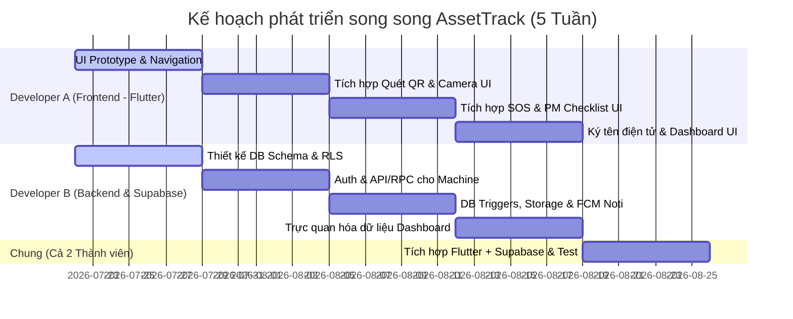

# AssetTrack - Hệ thống Quản lý Thiết bị & Bảo trì Phòng ngừa Nhà máy (Flutter + Supabase)

## 1. Tổng quan Dự án (Project Overview)
- **Tên dự án:** AssetTrack
- **Mục tiêu:** Giảm thiểu thời gian dừng máy ngoài ý muốn (Downtime) bằng cách số hóa lý lịch máy móc (Machine Passport) qua mã QR, quản lý quy trình bảo trì định kỳ (Preventive Maintenance) và xử lý sự cố khẩn cấp (Breakdown SOS) thời gian thực.
- **Mô hình nhân sự:** **2 Developers**
  - **Developer A (Frontend):** Flutter Mobile App.
  - **Developer B (Backend/Database):** Quản trị database Supabase, viết DB triggers, RLS Policies và cấu hình Storage.
- **Công nghệ cốt lõi:** **Flutter** kết hợp **Supabase (PostgreSQL BaaS)**.

---

## 2. Phân hệ Người dùng & Luồng Nghiệp vụ chính

### 2.1. Công nhân vận hành (Operator)
*Người phát hiện sự cố sớm nhất tại dây chuyền sản xuất.*
- **Quét mã QR (Machine Passport):** Quét nhôm QR trên máy để xem nhanh thông số kỹ thuật, lịch sử bảo trì, và cẩm nang khắc phục lỗi nhanh (Quick Troubleshooting).
- **Tạo phiếu SOS khẩn cấp (Work Order):** Khi xảy ra sự cố dừng chuyền, tạo yêu cầu sửa chữa trên app (chọn mức độ nghiêm trọng, đính kèm hình ảnh/mô tả lỗi).
- **Cập nhật số giờ chạy máy:** Nhập số giờ chạy (Running Hours) hoặc báo cáo trạng thái máy đầu/cuối ca.

### 2.2. Kỹ sư Cơ điện Bảo trì (ME Engineer)
*Đội ngũ kỹ thuật giữ cho máy móc hoạt động ổn định.*
- **Tiếp nhận & Sửa chữa (SOS Breakdown):** Nhận thông báo đẩy (Notification) khi có phiếu báo hỏng -> Bấm "Tiếp nhận" -> Tiến hành sửa chữa -> Cập nhật tiến độ xử lý.
- **Thực hiện bảo trì định kỳ (PM Checklist):** Khi đến hạn bảo dưỡng định kỳ (ví dụ: mỗi 500h, 1000h chạy), hệ thống tự động sinh task bảo trì. ME mở app, tick chọn từng mục checklist (thay dầu, tra mỡ...), chụp ảnh linh kiện cũ/mới để làm bằng chứng.
- **Cập nhật vật tư & số giờ chạy thực tế:** Ghi nhận các linh kiện đã thay thế vào lịch sử máy.

### 2.3. Quản đốc phân xưởng (Factory Supervisor)
*Giám sát toàn bộ hoạt động, phê duyệt và nghiệm thu.*
- **Nghiệm thu & Ký tên điện tử (Digital Sign-off):** Sau khi ME sửa xong, Quản đốc kiểm tra hiện trạng và ký tên trực tiếp bằng tay trên màn hình cảm ứng để nghiệm thu, chuyển trạng thái máy từ "Đang sửa chữa/Bảo trì" sang "Hoạt động".
- **Theo dõi Dashboard:** Xem bức tranh toàn cảnh: bao nhiêu máy đang chạy/đang hỏng, tổng thời gian dừng máy (Downtime) trong ca/ngày/tháng.
- **Phê duyệt đề xuất:** Duyệt các yêu cầu thay thế linh kiện đắt tiền hoặc các phiếu bảo trì đặc biệt.

---

## 3. Kiến trúc & Hệ sinh thái Flutter + Supabase

Việc chọn Supabase giúp nhóm 2 người đẩy nhanh tiến độ vượt bậc vì các tính năng backend đã được xây dựng sẵn và tối ưu cho Flutter:

| Thành phần | Công nghệ / Gói thư viện | Vai trò |
| :--- | :--- | :--- |
| **Mobile Client** | **Flutter SDK** | Viết ứng dụng chạy trên cả Android và iOS. |
| **State Management** | **Flutter Riverpod** | Quản lý state logic chặt chẽ, dễ tích hợp với luồng Stream của Supabase. |
| **Backend & Database** | **Supabase (PostgreSQL)** | • Cơ sở dữ liệu quan hệ lưu trữ dữ liệu thiết bị, phân hệ người dùng. • Quản lý xác thực người dùng (Auth) liên kết trực tiếp với bảng `profiles`. |
| **Bảo mật dữ liệu** | **Row-Level Security (RLS)** | Phân quyền truy cập ở cấp độ dòng (Ví dụ: Kỹ sư ME chỉ sửa được task được giao, Quản đốc mới được phép phê duyệt và ký tên). |
| **Lưu trữ file (Storage)** | **Supabase Storage** | Lưu trữ tệp hình ảnh sự cố và ảnh chữ ký nghiệm thu dưới dạng các Buckets. |
| **Quét QR Code** | **`mobile_scanner`** | Quét nhanh mã QR dán trên thân máy. |
| **Chữ ký điện tử** | **`signature`** | Vẽ và trích xuất chữ ký của Quản đốc dạng hình ảnh PNG. |
| **Chọn & Chụp ảnh** | **`image_picker`** | Chụp hình ảnh linh kiện hỏng/linh kiện thay thế. |
| **Thông báo đẩy** | **Firebase Cloud Messaging (FCM)** | Supabase Database Trigger gọi Edge Function để đẩy thông báo qua FCM khi có Work Order mới. |

---

## 4. Kế hoạch Phát triển Song song (Roadmap 5 Tuần)

---

## 5. Tài liệu liên quan
- Chi tiết cấu trúc dữ liệu và tập lệnh SQL: [database_schema.md](file:///Users/macbook/Documents/hk6/mobile/project/database_schema.md)
