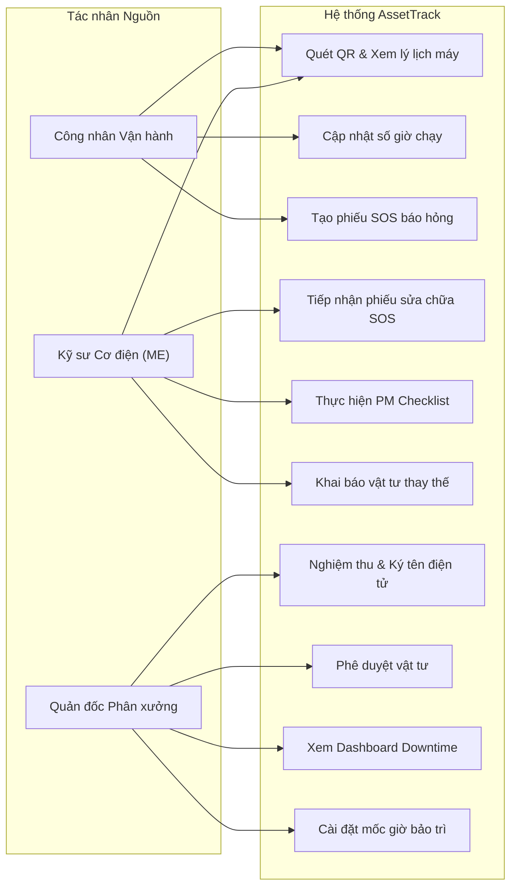
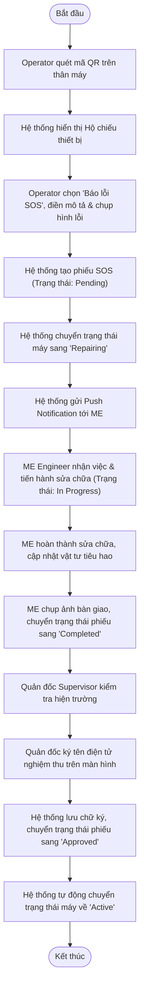
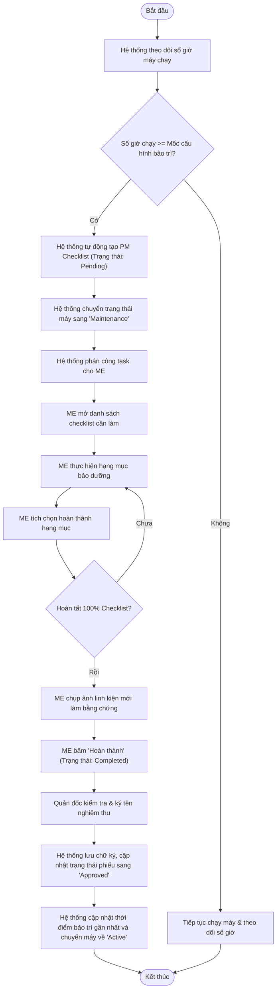
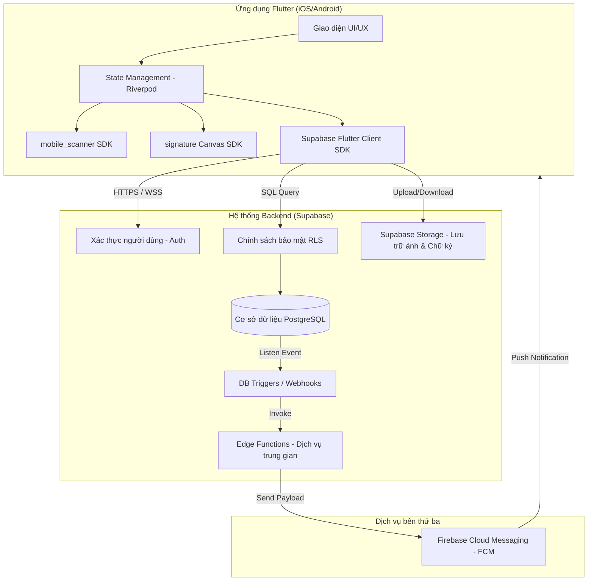
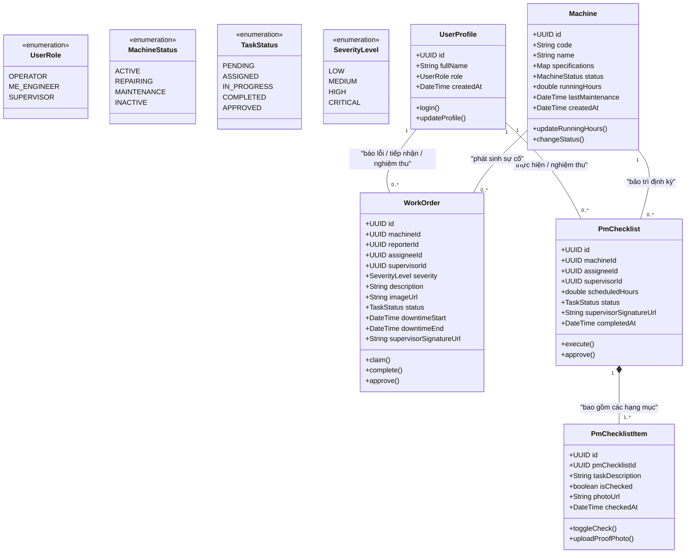
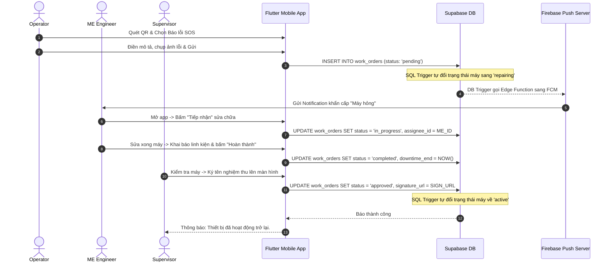

# Báo cáo Phân tích và Thiết kế Hệ thống AssetTrack

Hệ thống Quản lý Lý lịch Thiết bị & Bảo trì Phòng ngừa Nhà máy dựa trên nền tảng **Flutter & Supabase**.

---

## 1. Phân tích yêu cầu (Requirements Analysis)

### 1.1. Bất cập thực tế (Problem Statement)
Trong các dây chuyền sản xuất công nghiệp, máy móc hỏng hóc đột xuất gây ra sự ngưng trệ dây chuyền, dẫn đến thiệt hại kinh tế rất lớn. Nguyên nhân chủ yếu do:
- Công nhân vận hành quên thực hiện bảo dưỡng định kỳ (thay dầu, tra mỡ, kiểm tra áp suất...) theo số giờ chạy thực tế.
- Quy trình báo lỗi thủ công bằng giấy tờ hoặc tin nhắn chat chậm trễ, thông tin sai lệch, không lưu lại được lý lịch máy móc để phân tích.
- Việc nghiệm thu sau sửa chữa thiếu tính xác thực và cam kết trách nhiệm.

### 1.2. Phân hệ người dùng & Vai trò (User Personas)
- **Operator (Công nhân vận hành máy):** Người tiếp cận máy hàng ngày, phát hiện sự cố sớm nhất, thực hiện ghi nhận số giờ chạy máy và tạo phiếu SOS khẩn cấp.
- **ME Engineer (Kỹ sư Cơ điện):** Đội ngũ kỹ thuật thực thi sửa chữa đột xuất và thực hiện checklist bảo dưỡng định kỳ (Preventive Maintenance).
- **Supervisor (Quản đốc phân xưởng):** Người giám sát tổng quan trạng thái nhà máy, phê duyệt vật tư và nghiệm thu công việc bằng chữ ký điện tử.

### 1.3. Yêu cầu Chức năng (Functional Requirements - FR)
- **FR-1 (Định danh QR):** Định danh mỗi máy bằng mã QR riêng biệt. Quét mã hiển thị nhanh thông số và cẩm nang khắc phục sự cố.
- **FR-2 (Khai báo giờ máy chạy):** Cho phép nhập số giờ máy chạy (Running Hours) hàng ngày để làm căn cứ tính thời điểm bảo dưỡng.
- **FR-3 (Báo sự cố khẩn cấp SOS):** Operator tạo phiếu SOS khẩn cấp kèm hình ảnh sự cố và mức độ nghiêm trọng.
- **FR-4 (Thông báo đẩy):** Tự động gửi notification cho kỹ sư ME ngay khi có phiếu SOS phát sinh.
- **FR-5 (Bảo trì định kỳ PM):** Tự động sinh danh sách Checklist bảo trì khi đến hạn số giờ máy chạy. ME phải tích chọn từng mục và tải ảnh linh kiện thay thế lên làm minh chứng.
- **FR-6 (Nghiệm thu điện tử):** Quản đốc ký tên trực tiếp lên màn hình cảm ứng để phê duyệt hoàn thành công việc và đưa máy trở lại trạng thái hoạt động.
- **FR-7 (Dashboard giám sát):** Thống kê thời gian dừng máy (Downtime), số lượng máy đang chạy/đang hỏng theo ca/ngày/tháng.

### 1.4. Yêu cầu Phi Chức năng (Non-functional Requirements - NFR)
- **NFR-1 (Tính bảo mật):** Dữ liệu được bảo vệ nghiêm ngặt ở mức cơ sở dữ liệu bằng Row-Level Security (RLS) của PostgreSQL trên Supabase.
- **NFR-2 (Thời gian phản hồi):** Hệ thống thông báo đẩy (Push notification) phải đạt độ trễ dưới 3 giây.
- **NFR-3 (Độ khả dụng):** Giao diện mobile tối ưu hóa thao tác quét QR bằng camera, vẽ chữ ký mượt mà và nút chạm lớn phù hợp trong môi trường nhà máy.

---

## 2. User Stories (US)

Dưới đây là danh sách các User Stories đặc tả các tính năng cốt lõi cho cả 3 tác nhân:

| Mã US | Vai trò (As a) | Mong muốn (I want to) | Lợi ích (So that) | Tiêu chí nghiệm thu (Acceptance Criteria) |
| :--- | :--- | :--- | :--- | :--- |
| **US-01** | Operator | Quét mã QR dán trên thân máy | Xem nhanh "Hộ chiếu thiết bị" (thông số, lịch sử, cẩm nang lỗi). | • Camera quét QR trong < 1.5s. • Hiển thị đúng máy và các thông tin liên quan. |
| **US-02** | Operator | Khai báo số giờ chạy máy đầu/cuối ca | Cung cấp dữ liệu chính xác cho hệ thống tính mốc bảo dưỡng. | • Form nhập chỉ cho phép nhập số dương lớn hơn chỉ số trước đó. • Lưu log thời gian nhập. |
| **US-03** | Operator | Tạo phiếu SOS khẩn cấp kèm ảnh chụp lỗi | Báo cáo sự cố dừng chuyền cho kỹ sư ME tức thời. | • Cho phép chụp hình bằng camera gắn trực tiếp vào phiếu. • Trạng thái máy tự động chuyển sang "Repairing". |
| **US-04** | ME Engineer | Nhận thông báo sự cố và bấm tiếp nhận | Xác nhận bắt đầu sửa chữa máy hỏng. | • Nhấp notification mở trực tiếp phiếu SOS tương ứng. • Ghi nhận thời điểm ME bấm "Tiếp nhận" để tính MTTR (Mean Time to Repair). |
| **US-05** | ME Engineer | Thực hiện PM Checklist & tải ảnh linh kiện | Hoàn tất bảo dưỡng định kỳ đúng quy trình. | • ME phải tích hết các mục checklist bắt buộc mới được bấm "Hoàn thành". • Phải tải lên ít nhất 1 ảnh linh kiện thay thế/hiện trạng. |
| **US-06** | ME Engineer | Khai báo vật tư tiêu hao đã thay | Ghi nhận lịch sử phụ tùng phục vụ cho kiểm kho. | • Cho phép chọn vật tư từ danh mục có sẵn và nhập số lượng. |
| **US-07** | Supervisor | Ký tên điện tử nghiệm thu trên màn hình | Xác nhận máy đã được sửa/bảo trì đạt chuẩn để chạy lại. | • Chữ ký hiển thị sắc nét, xuất ra ảnh định dạng PNG/SVG lưu trên Storage. • Máy tự động chuyển về trạng thái "Active". |
| **US-08** | Supervisor | Phê duyệt yêu cầu thay linh kiện đắt tiền | Kiểm soát chi phí sửa chữa của phân xưởng. | • Hiển thị cảnh báo màu đỏ đối với linh kiện vượt hạn mức kinh phí. • Nhật ký phê duyệt lưu rõ tên Supervisor đã duyệt. |
| **US-09** | Supervisor | Xem Dashboard thống kê Downtime | Giám sát hiệu suất hoạt động và thời gian dừng máy của xưởng. | • Biểu đồ hiển thị trực quan tỷ lệ máy chạy/hỏng. • Thống kê tổng giờ Downtime tích lũy trong tháng. |
| **US-10** | Supervisor | Cấu hình mốc giờ bảo dưỡng định kỳ | Tự động hóa việc tạo PM Checklist theo tính chất từng máy. | • Cho phép đổi mốc giờ (ví dụ: từ 500h sang 800h chạy) cho từng model máy. |

---

## 3. Phân tích hệ thống (System Analysis)

### 3.1. Biểu đồ Use Case tổng thể

### 3.2. Biểu đồ Hoạt động (Activity Diagrams)

#### A. Quy trình Xử lý Sự cố khẩn cấp (Breakdown SOS Workflow)

#### B. Quy trình Bảo trì Định kỳ (Preventive Maintenance Workflow)

---

## 4. Thiết kế hệ thống (System Design)

### 4.1. Kiến trúc Hệ thống Tổng thể (System Architecture)
Hệ thống sử dụng kiến trúc **Serverless Backend-as-a-Service (BaaS)** dựa trên Flutter và Supabase giúp tối giản hạ tầng và đồng bộ dữ liệu thời gian thực:

### 4.2. Sơ đồ Thực thể Lớp (UML Class Diagram)

### 4.3. Biểu đồ Tuần tự tiêu biểu: Luồng SOS & Nghiệm thu

### 4.4. Cơ chế Bảo mật cấp dòng (Row-Level Security - RLS) trên Supabase
Để đảm bảo tính toàn vẹn dữ liệu, các bảng được cài đặt RLS Policies:
- **Bảng `machines`:** Mọi nhân viên đã đăng nhập được xem (`SELECT`). Chỉ `operator`, `me_engineer` và `supervisor` được phép sửa đổi (`UPDATE`) thông số/giờ chạy.
- **Bảng `work_orders`:** Công nhân (`operator`) được tạo (`INSERT`). Kỹ sư cơ điện (`me_engineer`) và Quản đốc (`supervisor`) được cập nhật (`UPDATE`) trạng thái xử lý/nghiệm thu.
- **Bảng `pm_checklists` & `pm_checklist_items`:** Chỉ cho phép `me_engineer` và `supervisor` được đọc và chỉnh sửa để tránh công nhân vận hành thay đổi thông tin bảo dưỡng.

---

## 5. Giao diện và phân công (UI/UX & Task Assignment)

### 5.1. Thiết kế Giao diện Mobile (Flutter Mockup Wireframes)

#### A. Giao diện Machine Passport & SOS (Màn hình dành cho Operator)
- **Header:** Tên thiết bị + Mã máy (e.g. *Máy dập thủy lực MC-102*).
- **Trạng thái:** Tag hiển thị màu sắc tương ứng (`Hoạt động` - Xanh, `Sự cố` - Đỏ, `Bảo trì` - Vàng).
- **Body:** 
  - Danh sách thông số kỹ thuật (Công suất, Điện áp, Năm sản xuất).
  - Lịch sử bảo dưỡng/sửa chữa gần nhất.
- **Footer:** 2 Nút hành động lớn:
  1. `Cập nhật giờ máy chạy` (Hiện Popup nhập số).
  2. `BÁO LỖI SOS KHẨN CẤP` (Nút màu đỏ lớn nhấp nháy chuyển sang Form điền lỗi + Chụp ảnh).

#### B. Giao diện thực hiện PM Checklist (Màn hình dành cho ME)
- **Header:** Tên công việc bảo trì + Số giờ chạy mốc (e.g. *Bảo trì định kỳ mốc 500h*).
- **Checklist:** Danh sách dạng checkbox tròn, dễ chạm bằng găng tay bảo hộ:
  - [ ] Thay dầu bôi trơn trục chính (Bắt buộc chụp ảnh).
  - [ ] Kiểm tra áp suất khí nén (Nhập chỉ số áp suất).
  - [ ] Siết chặt bu-lông chân máy.
- **Chụp ảnh bằng chứng:** Khung nét đứt `[ + Thêm ảnh linh kiện thay thế ]`.
- **Nút hành động:** `Hoàn thành & Gửi nghiệm thu` (Chỉ sáng lên khi tích đủ 100% checklist).

#### C. Giao diện Nghiệm thu & Ký tên (Màn hình dành cho Supervisor)
- **Thông tin tóm tắt:** Phiếu sửa chữa máy nào, ai sửa, thay thế những linh kiện gì, tổng thời gian máy dừng (Downtime).
- **Ký tên Canvas:** Một khung trống lớn màu trắng ghi chú *"Vui lòng ký tên của bạn vào đây để nghiệm thu bàn giao máy"*. Nút `Xóa chữ ký` để ký lại.
- **Nút hành động:** `Xác nhận & Chạy máy` (Màu xanh lá).

---

### 5.2. Phân công công việc (Task Assignment - Mô hình Full-stack Cộng tác)

Cả **2 thành viên** đều đóng vai trò **Full-stack Developer**, tham gia vào toàn bộ quá trình phát triển (từ thiết kế Database, viết mã Flutter, tích hợp Supabase API đến kiểm thử). Công việc được phân chia linh hoạt theo **Module tính năng (Feature-based)** để cả hai cùng nắm toàn bộ hệ thống:

| Module / Tính năng | Thành viên Chủ trì | Thành viên Phối hợp | Công việc thực hiện |
| :--- | :--- | :--- | :--- |
| **Module 1: Auth, Máy móc & QR Passport** | **Thành viên 1** | **Thành viên 2** | • *Thành viên 1:* Thiết lập cấu trúc dự án Flutter, làm UI Machine Passport và tích hợp `mobile_scanner`. • *Thành viên 2:* Khởi tạo Supabase DB, tạo bảng `machines`, `profiles` và cài đặt Auth RLS. |
| **Module 2: SOS Breakdown & Push Notification** | **Thành viên 2** | **Thành viên 1** | • *Thành viên 2:* Tạo bảng `work_orders`, viết DB Trigger & Edge Function gọi Firebase FCM đẩy thông báo. • *Thành viên 1:* Code UI Form báo SOS, tích hợp camera chụp ảnh sự cố và lắng nghe FCM notification. |
| **Module 3: PM Checklist & Bằng chứng bảo trì** | **Thành viên 1** | **Thành viên 2** | • *Thành viên 1:* Code UI checklist tương tác, tích hợp `image_picker` chụp ảnh linh kiện mới/cũ. • *Thành viên 2:* Tạo bảng `pm_checklists`, `pm_checklist_items`, cài đặt Supabase Storage Bucket `work-order-images`. |
| **Module 4: Ký nghiệm thu & Dashboard Downtime** | **Thành viên 2** | **Thành viên 1** | • *Thành viên 2:* Làm màn hình ký tên nghiệm thu (`signature` canvas), thiết lập Storage Bucket `signatures`. • *Thành viên 1:* Code màn hình Dashboard hiển thị biểu đồ thống kê Downtime (`fl_chart`) và gọi các hàm SQL Aggregate. |

---

### 5.3. Lịch trình phát triển (Roadmap 5 Tuần - Đồng phát triển)

Cả 2 thành viên cùng làm việc song song và thực hiện Code Review lẫn nhau trong tất cả các tuần:

- **Tuần 1: Khởi động hệ thống & Thiết lập Nền tảng**
  - *Cả 2 thành viên:* Thống nhất API Contract / cấu hình Supabase.
  - *Thành viên 1:* Khởi tạo Flutter Project, cài đặt Riverpod, cấu hình Theme nhà máy.
  - *Thành viên 2:* Tạo Supabase Project, viết mã DDL khởi tạo bảng, thiết lập RLS Policies & Triggers.
- **Tuần 2: Hoàn thiện Module 1 (QR Code & Machine Passport)**
  - *Thành viên 1:* Code màn hình quét QR bằng camera, hiển thị Hộ chiếu thiết bị & Form báo số giờ chạy máy.
  - *Thành viên 2:* Nhập dữ liệu máy móc mẫu vào Supabase, viết RPC Function xử lý mã QR và đồng bộ số giờ chạy.
- **Tuần 3: Hoàn thiện Module 2 (Breakdown SOS & Push Notification)**
  - *Thành viên 1:* Làm Form tạo phiếu SOS khẩn cấp, tích hợp chụp hình đính kèm lỗi và màn hình danh sách sự cố.
  - *Thành viên 2:* Viết Trigger tự động đổi trạng thái máy sang `repairing`, triển khai Edge Function gọi FCM gửi thông báo đẩy đến kỹ sư ME.
- **Tuần 4: Hoàn thiện Module 3 (PM Checklist & Chữ ký nghiệm thu)**
  - *Thành viên 1:* Thiết kế UI danh sách Checklist bảo dưỡng bắt buộc, xử lý upload ảnh linh kiện làm bằng chứng.
  - *Thành viên 2:* Làm màn hình Canvas ký tên nghiệm thu điện tử cho Quản đốc, xử lý lưu trữ file chữ ký vào Supabase Storage và đổi trạng thái máy về `active`.
- **Tuần 5: Dashboard Downtime, Tích hợp & Kiểm thử toàn diện**
  - *Thành viên 1:* Hoàn thiện màn hình Dashboard thống kê tỷ lệ máy chạy/hỏng và tổng giờ Downtime.
  - *Thành viên 2:* Viết các câu lệnh SQL truy vấn tổng hợp dữ liệu Downtime phục vụ Dashboard.
  - *Cả 2 thành viên:* Kiểm thử toàn bộ các luồng nghiệp vụ trên thiết bị thật với mã QR in giấy, sửa lỗi và đóng gói ứng dụng (APK/IPA).

---

## 6. Tổng kết (Conclusion)

### 6.1. Giá trị hệ thống mang lại
Hệ thống AssetTrack giải quyết triệt để bài toán quản lý thiết bị công nghiệp:
- **Tự động hóa bảo trì phòng ngừa:** Giúp loại bỏ hoàn toàn lỗi quên bảo dưỡng nhờ cơ chế tự động tính giờ máy chạy và sinh PM Checklist bắt buộc.
- **Rút ngắn thời gian chết (Downtime):** Nhờ cơ chế báo lỗi SOS khẩn cấp qua QR và push notification lập tức đến kỹ sư ME, giúp máy được sửa chữa nhanh nhất (tối ưu MTTR).
- **Minh bạch hóa & Cam kết trách nhiệm:** Chữ ký số của Quản đốc và ảnh chụp thực tế linh kiện thay thế giúp lưu trữ lịch sử máy móc minh bạch làm căn cứ kiểm toán thiết bị sau này.

### 6.2. Hướng phát triển trong tương lai
- Tích hợp thêm cảm biến IoT gắn vào thiết bị để tự động cập nhật số giờ chạy máy thời gian thực lên Supabase mà không cần công nhân vận hành nhập tay.
- Ứng dụng Học máy (Machine Learning) vào tập dữ liệu lịch sử hỏng hóc để dự đoán trước thời điểm linh kiện hỏng (Predictive Maintenance).
