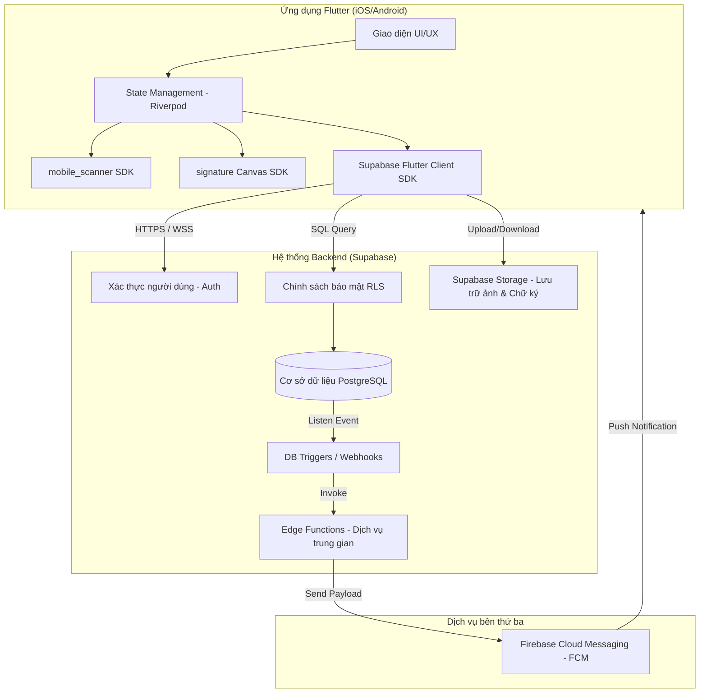
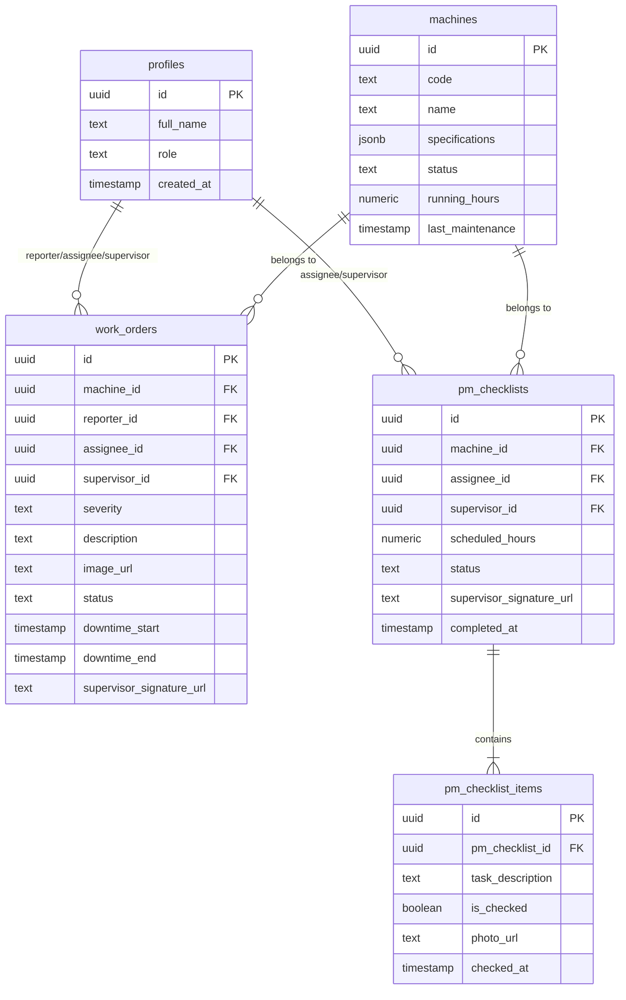
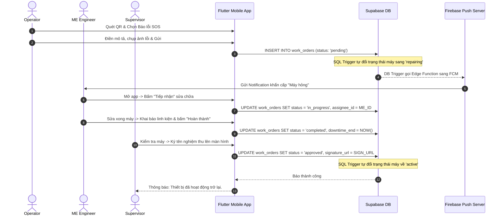

# Báo cáo Phân tích và Thiết kế Hệ thống AssetTrack

Hệ thống Quản lý Lý lịch Thiết bị & Bảo trì Phòng ngừa Nhà máy dựa trên nền tảng **Flutter & Supabase**.

---

## 1. Phân tích yêu cầu (Requirements Analysis)

### 1.1. Bất cập thực tế (Problem Statement)
Trong các dây chuyền sản xuất công nghiệp, máy móc hỏng hóc đột xuất gây ra sự ngưng trệ dây chuyền, dẫn đến thiệt hại kinh tế rất lớn. Nguyên nhân chủ yếu do:
- Công nhân vận hành quên thực hiện bảo dưỡng định kỳ (thay dầu, tra mỡ, kiểm tra áp suất...) theo số giờ chạy thực tế.
- Quy trình báo lỗi thủ công bằng giấy tờ hoặc tin nhắn chat chậm trễ, thông tin sai lệch, không lưu lại được lý lịch máy móc để phân tích.
- Việc nghiệm thu sau sửa chữa thiếu tính xác thực và cam kết trách nhiệm.

### 1.2. Phân hệ người dùng & Vai trò (User Personas)
- **Operator (Công nhân vận hành máy):** Người tiếp cận máy hàng ngày, phát hiện sự cố sớm nhất, thực hiện ghi nhận số giờ chạy máy và tạo phiếu SOS khẩn cấp.
- **ME Engineer (Kỹ sư Cơ điện):** Đội ngũ kỹ thuật thực thi sửa chữa đột xuất và thực hiện checklist bảo dưỡng định kỳ (Preventive Maintenance).
- **Supervisor (Quản đốc phân xưởng):** Người giám sát tổng quan trạng thái nhà máy, phê duyệt vật tư và nghiệm thu công việc bằng chữ ký điện tử.

### 1.3. Yêu cầu Chức năng (Functional Requirements - FR)
- **FR-1 (Định danh QR):** Định danh mỗi máy bằng mã QR riêng biệt. Quét mã hiển thị nhanh thông số và cẩm nang khắc phục sự cố.
- **FR-2 (Khai báo giờ máy chạy):** Cho phép nhập số giờ máy chạy (Running Hours) hàng ngày để làm căn cứ tính thời điểm bảo dưỡng.
- **FR-3 (Báo sự cố khẩn cấp SOS):** Operator tạo phiếu SOS khẩn cấp kèm hình ảnh sự cố và mức độ nghiêm trọng.
- **FR-4 (Thông báo đẩy):** Tự động gửi notification cho kỹ sư ME ngay khi có phiếu SOS phát sinh.
- **FR-5 (Bảo trì định kỳ PM):** Tự động sinh danh sách Checklist bảo trì khi đến hạn số giờ máy chạy. ME phải tích chọn từng mục và tải ảnh linh kiện thay thế lên làm minh chứng.
- **FR-6 (Nghiệm thu điện tử):** Quản đốc ký tên trực tiếp lên màn hình cảm ứng để phê duyệt hoàn thành công việc và đưa máy trở lại trạng thái hoạt động.
- **FR-7 (Dashboard giám sát):** Thống kê thời gian dừng máy (Downtime), số lượng máy đang chạy/đang hỏng theo ca/ngày/tháng.

### 1.4. Yêu cầu Phi Chức năng (Non-functional Requirements - NFR)
- **NFR-1 (Tính bảo mật):** Dữ liệu được bảo vệ nghiêm ngặt ở mức cơ sở dữ liệu bằng Row-Level Security (RLS) của PostgreSQL trên Supabase.
- **NFR-2 (Thời gian phản hồi):** Hệ thống thông báo đẩy (Push notification) phải đạt độ trễ dưới 3 giây.
- **NFR-3 (Độ khả dụng):** Giao diện mobile tối ưu hóa thao tác quét QR bằng camera, vẽ chữ ký mượt mà và nút chạm lớn phù hợp trong môi trường nhà máy.

---

## 2. User Stories (US)

Dưới đây là danh sách các User Stories đặc tả các tính năng cốt lõi cho cả 3 tác nhân:

| Mã US | Vai trò (As a) | Mong muốn (I want to) | Lợi ích (So that) | Tiêu chí nghiệm thu (Acceptance Criteria) |
| :--- | :--- | :--- | :--- | :--- |
| **US-01** | Operator | Quét mã QR dán trên thân máy | Xem nhanh "Hộ chiếu thiết bị" (thông số, lịch sử, cẩm nang lỗi). | • Camera quét QR trong < 1.5s.<br>• Hiển thị đúng máy và các thông tin liên quan. |
| **US-02** | Operator | Khai báo số giờ chạy máy đầu/cuối ca | Cung cấp dữ liệu chính xác cho hệ thống tính mốc bảo dưỡng. | • Form nhập chỉ cho phép nhập số dương lớn hơn chỉ số trước đó.<br>• Lưu log thời gian nhập. |
| **US-03** | Operator | Tạo phiếu SOS khẩn cấp kèm ảnh chụp lỗi | Báo cáo sự cố dừng chuyền cho kỹ sư ME tức thời. | • Cho phép chụp hình bằng camera gắn trực tiếp vào phiếu.<br>• Trạng thái máy tự động chuyển sang "Repairing". |
| **US-04** | ME Engineer | Nhận thông báo sự cố và bấm tiếp nhận | Xác nhận bắt đầu sửa chữa máy hỏng. | • Nhấp notification mở trực tiếp phiếu SOS tương ứng.<br>• Ghi nhận thời điểm ME bấm "Tiếp nhận" để tính MTTR (Mean Time to Repair). |
| **US-05** | ME Engineer | Thực hiện PM Checklist & tải ảnh linh kiện | Hoàn tất bảo dưỡng định kỳ đúng quy trình. | • ME phải tích hết các mục checklist bắt buộc mới được bấm "Hoàn thành".<br>• Phải tải lên ít nhất 1 ảnh linh kiện thay thế/hiện trạng. |
| **US-06** | ME Engineer | Khai báo vật tư tiêu hao đã thay | Ghi nhận lịch sử phụ tùng phục vụ cho kiểm kho. | • Cho phép chọn vật tư từ danh mục có sẵn và nhập số lượng. |
| **US-07** | Supervisor | Ký tên điện tử nghiệm thu trên màn hình | Xác nhận máy đã được sửa/bảo trì đạt chuẩn để chạy lại. | • Chữ ký hiển thị sắc nét, xuất ra ảnh định dạng PNG/SVG lưu trên Storage.<br>• Máy tự động chuyển về trạng thái "Active". |
| **US-08** | Supervisor | Phê duyệt yêu cầu thay linh kiện đắt tiền | Kiểm soát chi phí sửa chữa của phân xưởng. | • Hiển thị cảnh báo màu đỏ đối với linh kiện vượt hạn mức kinh phí.<br>• Nhật ký phê duyệt lưu rõ tên Supervisor đã duyệt. |
| **US-09** | Supervisor | Xem Dashboard thống kê Downtime | Giám sát hiệu suất hoạt động và thời gian dừng máy của xưởng. | • Biểu đồ hiển thị trực quan tỷ lệ máy chạy/hỏng.<br>• Thống kê tổng giờ Downtime tích lũy trong tháng. |
| **US-10** | Supervisor | Cấu hình mốc giờ bảo dưỡng định kỳ | Tự động hóa việc tạo PM Checklist theo tính chất từng máy. | • Cho phép đổi mốc giờ (ví dụ: từ 500h sang 800h chạy) cho từng model máy. |

---

## 3. Phân tích hệ thống (System Analysis)

### 3.1. Biểu đồ Use Case tổng thể

```mermaid
leftToRightDirection
actor Operator as "Công nhân Vận hành"
actor ME as "Kỹ sư Cơ điện"
actor Supervisor as "Quản đốc Phân xưởng"

rectangle "Hệ thống AssetTrack" {
    usecase UC_ScanQR as "Quét QR & Xem lý lịch máy"
    usecase UC_LogHours as "Cập nhật số giờ chạy"
    usecase UC_CreateSOS as "Tạo phiếu SOS báo hỏng"
    usecase UC_ClaimSOS as "Tiếp nhận phiếu sửa chữa SOS"
    usecase UC_ExecutePM as "Thực hiện PM Checklist"
    usecase UC_LogParts as "Khai báo vật tư thay thế"
    usecase UC_SignOff as "Nghiệm thu & Ký tên điện tử"
    usecase UC_ApproveParts as "Phê duyệt vật tư"
    usecase UC_ViewDashboard as "Xem Dashboard Downtime"
    usecase UC_ConfigPM as "Cài đặt mốc giờ bảo trì"
}

Operator --> UC_ScanQR
Operator --> UC_LogHours
Operator --> UC_CreateSOS

ME --> UC_ScanQR
ME --> UC_ClaimSOS
ME --> UC_ExecutePM
ME --> UC_LogParts

Supervisor --> UC_SignOff
Supervisor --> UC_ApproveParts
Supervisor --> UC_ViewDashboard
Supervisor --> UC_ConfigPM
```

### 3.2. Biểu đồ Hoạt động (Activity Diagrams)

#### A. Quy trình Xử lý Sự cố khẩn cấp (Breakdown SOS Workflow)
```mermaid
skinparam ArchimateJustification center
start
:Operator quét mã QR trên thân máy;
:Hệ thống hiển thị Hộ chiếu thiết bị;
:Operator chọn "Báo lỗi SOS", điền mô tả & chụp hình lỗi;
:Hệ thống tạo phiếu SOS (Trạng thái: Pending);
:Hệ thống chuyển trạng thái máy sang "Repairing";
:Hệ thống gửi Push Notification tới ME;
:ME Engineer nhận việc & tiến hành sửa chữa (Trạng thái: In Progress);
:ME hoàn thành sửa chữa, cập nhật vật tư tiêu hao;
:ME chụp ảnh bàn giao, chuyển trạng thái phiếu sang "Completed";
:Quản đốc (Supervisor) kiểm tra hiện trường;
:Quản đốc ký tên điện tử nghiệm thu trên màn hình;
:Hệ thống lưu chữ ký, chuyển trạng thái phiếu sang "Approved";
:Hệ thống tự động chuyển trạng thái máy về "Active";
stop
```

#### B. Quy trình Bảo trì Định kỳ (Preventive Maintenance Workflow)
```mermaid
start
:Hệ thống theo dõi số giờ máy chạy;
if (Số giờ chạy >= Mốc cấu hình bảo trì?) then (yes)
  :Hệ thống tự động tạo PM Checklist (Trạng thái: Pending);
  :Hệ thống chuyển trạng thái máy sang "Maintenance";
  :Hệ thống phân công task cho ME;
  :ME mở danh sách checklist cần làm;
  repeat
    :ME thực hiện hạng mục bảo dưỡng;
    :ME tích chọn hoàn thành hạng mục;
  backward:Cần hoàn thành tất cả hạng mục;
  until (Hoàn tất 100% Checklist?)
  :ME chụp ảnh linh kiện mới làm bằng chứng;
  :ME bấm "Hoàn thành" (Trạng thái: Completed);
  :Quản đốc kiểm tra & ký tên nghiệm thu;
  :Hệ thống lưu chữ ký, cập nhật trạng thái phiếu sang "Approved";
  :Hệ thống cập nhật thời điểm bảo trì gần nhất và chuyển máy về "Active";
else (no)
  :Tiếp tục chạy máy & theo dõi số giờ;
endif
stop
```

---

## 4. Thiết kế hệ thống (System Design)

### 4.1. Kiến trúc Hệ thống Tổng thể (System Architecture)
Hệ thống sử dụng kiến trúc **Serverless Backend-as-a-Service (BaaS)** dựa trên Flutter và Supabase giúp tối giản hạ tầng và đồng bộ dữ liệu thời gian thực:



### 4.2. Sơ đồ Quan hệ Thực thể (ERD)



### 4.3. Biểu đồ Tuần tự tiêu biểu: Luồng SOS & Nghiệm thu



### 4.4. Cơ chế Bảo mật cấp dòng (Row-Level Security - RLS) trên Supabase
Để đảm bảo tính toàn vẹn dữ liệu, các bảng được cài đặt RLS Policies:
- **Bảng `machines`:** Mọi nhân viên đã đăng nhập được xem (`SELECT`). Chỉ `operator`, `me_engineer` và `supervisor` được phép sửa đổi (`UPDATE`) thông số/giờ chạy.
- **Bảng `work_orders`:** Công nhân (`operator`) được tạo (`INSERT`). Kỹ sư cơ điện (`me_engineer`) và Quản đốc (`supervisor`) được cập nhật (`UPDATE`) trạng thái xử lý/nghiệm thu.
- **Bảng `pm_checklists` & `pm_checklist_items`:** Chỉ cho phép `me_engineer` và `supervisor` được đọc và chỉnh sửa để tránh công nhân vận hành thay đổi thông tin bảo dưỡng.

---

## 5. Giao diện và phân công (UI/UX & Task Assignment)

### 5.1. Thiết kế Giao diện Mobile (Flutter Mockup Wireframes)

#### A. Giao diện Machine Passport & SOS (Màn hình dành cho Operator)
- **Header:** Tên thiết bị + Mã máy (e.g. *Máy dập thủy lực MC-102*).
- **Trạng thái:** Tag hiển thị màu sắc tương ứng (`Hoạt động` - Xanh, `Sự cố` - Đỏ, `Bảo trì` - Vàng).
- **Body:** 
  - Danh sách thông số kỹ thuật (Công suất, Điện áp, Năm sản xuất).
  - Lịch sử bảo dưỡng/sửa chữa gần nhất.
- **Footer:** 2 Nút hành động lớn:
  1. `Cập nhật giờ máy chạy` (Hiện Popup nhập số).
  2. `BÁO LỖI SOS KHẨN CẤP` (Nút màu đỏ lớn nhấp nháy chuyển sang Form điền lỗi + Chụp ảnh).

#### B. Giao diện thực hiện PM Checklist (Màn hình dành cho ME)
- **Header:** Tên công việc bảo trì + Số giờ chạy mốc (e.g. *Bảo trì định kỳ mốc 500h*).
- **Checklist:** Danh sách dạng checkbox tròn, dễ chạm bằng găng tay bảo hộ:
  - [ ] Thay dầu bôi trơn trục chính (Bắt buộc chụp ảnh).
  - [ ] Kiểm tra áp suất khí nén (Nhập chỉ số áp suất).
  - [ ] Siết chặt bu-lông chân máy.
- **Chụp ảnh bằng chứng:** Khung nét đứt `[ + Thêm ảnh linh kiện thay thế ]`.
- **Nút hành động:** `Hoàn thành & Gửi nghiệm thu` (Chỉ sáng lên khi tích đủ 100% checklist).

#### C. Giao diện Nghiệm thu & Ký tên (Màn hình dành cho Supervisor)
- **Thông tin tóm tắt:** Phiếu sửa chữa máy nào, ai sửa, thay thế những linh kiện gì, tổng thời gian máy dừng (Downtime).
- **Ký tên Canvas:** Một khung trống lớn màu trắng ghi chú *"Vui lòng ký tên của bạn vào đây để nghiệm thu bàn giao máy"*. Nút `Xóa chữ ký` để ký lại.
- **Nút hành động:** `Xác nhận & Chạy máy` (Màu xanh lá).

---

### 5.2. Phân công công việc (Task Assignment)

| Vai trò | Thành viên phụ trách | Nhiệm vụ chi tiết |
| :--- | :--- | :--- |
| **Developer A (Frontend - Flutter)** | **Thành viên 1** | • Thiết lập cấu trúc dự án Flutter, cấu hình Router, State Management (Riverpod).<br>• Tích hợp thư viện quét QR `mobile_scanner` và canvas chữ ký `signature`.<br>• Code toàn bộ UI/UX các màn hình: Machine Passport, Form SOS, PM Checklist, Canvas ký nghiệm thu và Dashboard.<br>• Tích hợp gọi API kết nối dữ liệu từ Supabase Client SDK. |
| **Developer B (Backend/Database)** | **Thành viên 2** | • Thiết kế cơ sở dữ liệu trên Supabase PostgreSQL.<br>• Thiết lập RLS Policies bảo mật dữ liệu ở mức DB.<br>• Viết các Trigger tự động cập nhật trạng thái máy khi Work Order đổi trạng thái, Trigger tự động đồng bộ auth user sang profile.<br>• Thiết lập Storage Buckets để chứa hình ảnh và cấu hình quyền hạn upload.<br>• Cài đặt Cloud Messaging (FCM) kết nối với database trigger để đẩy thông báo. |

---

### 5.3. Lịch trình phát triển (Roadmap 5 Tuần)

- **Tuần 1: Khởi động & Cơ sở dữ liệu**
  - *Dev A:* Khởi tạo Flutter project, thiết lập theme nhà máy (Industrial Theme - màu tối, điểm nhấn cam/vàng neon), cấu hình điều hướng.
  - *Dev B:* Tạo Project Supabase, chạy mã DDL tạo bảng, tạo trigger đồng bộ User Profile, bật RLS.
- **Tuần 2: Quét QR & Machine Passport (Operator)**
  - *Dev A:* Làm màn hình quét QR camera, màn hình Machine Passport xem chi tiết thiết bị, lịch sử sửa chữa.
  - *Dev B:* Nhập dữ liệu thiết bị mẫu, tạo API/RPC lấy thông tin máy qua ID giải mã từ mã QR.
- **Tuần 3: SOS Breakdown & Push Notification**
  - *Dev A:* Làm Form báo lỗi SOS, tích hợp camera chụp ảnh đính kèm lỗi, tích hợp Push Notification.
  - *Dev B:* Tạo bảng Work Orders, viết trigger khi tạo phiếu SOS thì chuyển trạng thái máy sang `repairing`, viết Edge Function kết nối FCM để gửi push notification tới ME.
- **Tuần 4: PM Checklist & Nghiệm thu chữ ký số**
  - *Dev A:* Làm giao diện checklist bảo dưỡng định kỳ, tích hợp canvas vẽ chữ ký, upload ảnh chữ ký.
  - *Dev B:* Tạo bảng PM Checklist, cấu hình Supabase Storage để lưu ảnh sự cố và ảnh chữ ký.
- **Tuần 5: Dashboard & Tích hợp & Kiểm thử**
  - *Dev A:* Thiết kế Dashboard thống kê Downtime (sử dụng gói vẽ biểu đồ `fl_chart`), tích hợp toàn bộ các tính năng.
  - *Dev B:* Viết các hàm SQL Aggregate để tính toán thời gian dừng máy trung bình và tỷ lệ hỏng hóc phục vụ Dashboard.
  - *Cả hai:* Chạy thử nghiệm thực tế với mã QR in giấy, sửa lỗi và đóng gói ứng dụng (APK/IPA).

---

## 6. Tổng kết (Conclusion)

### 6.1. Giá trị hệ thống mang lại
Hệ thống AssetTrack giải quyết triệt để bài toán quản lý thiết bị công nghiệp:
- **Tự động hóa bảo trì phòng ngừa:** Giúp loại bỏ hoàn toàn lỗi quên bảo dưỡng nhờ cơ chế tự động tính giờ máy chạy và sinh PM Checklist bắt buộc.
- **Rút ngắn thời gian chết (Downtime):** Nhờ cơ chế báo lỗi SOS khẩn cấp qua QR và push notification lập tức đến kỹ sư ME, giúp máy được sửa chữa nhanh nhất (tối ưu MTTR).
- **Minh bạch hóa & Cam kết trách nhiệm:** Chữ ký số của Quản đốc và ảnh chụp thực tế linh kiện thay thế giúp lưu trữ lịch sử máy móc minh bạch làm căn cứ kiểm toán thiết bị sau này.

### 6.2. Hướng phát triển trong tương lai
- Tích hợp thêm cảm biến IoT gắn vào thiết bị để tự động cập nhật số giờ chạy máy thời gian thực lên Supabase mà không cần công nhân vận hành nhập tay.
- Ứng dụng Học máy (Machine Learning) vào tập dữ liệu lịch sử hỏng hóc để dự đoán trước thời điểm linh kiện hỏng (Predictive Maintenance).
