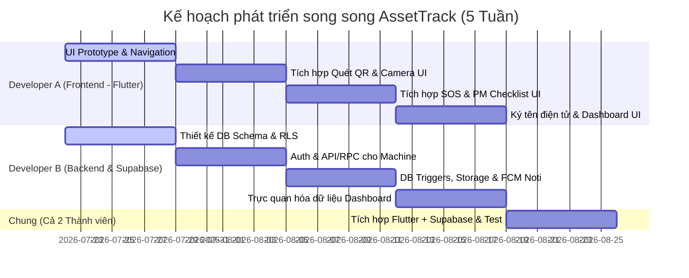

# AssetTrack - Hệ thống Quản lý Thiết bị & Bảo trì Phòng ngừa Nhà máy (Flutter + Supabase)

## 1. Tổng quan Dự án (Project Overview)
- **Tên dự án:** AssetTrack
- **Mục tiêu:** Giảm thiểu thời gian dừng máy ngoài ý muốn (Downtime) bằng cách số hóa lý lịch máy móc (Machine Passport) qua mã QR, quản lý quy trình bảo trì định kỳ (Preventive Maintenance) và xử lý sự cố khẩn cấp (Breakdown SOS) thời gian thực.
- **Mô hình nhân sự:** **2 Developers**
  - **Developer A (Frontend):** Flutter Mobile App.
  - **Developer B (Backend/Database):** Quản trị database Supabase, viết DB triggers, RLS Policies và cấu hình Storage.
- **Công nghệ cốt lõi:** **Flutter** kết hợp **Supabase (PostgreSQL BaaS)**.

---

## 2. Danh sách 12 Tính năng cốt lõi (Phân chia theo Tác nhân)

### Tác nhân 1: Công nhân vận hành (Operator)
1. **Tính năng 1: Quét mã QR - Hộ chiếu Thiết bị (QR Machine Passport)**
   * Công nhân quét mã QR dán trên thân máy để mở nhanh trang thông số kỹ thuật, lịch sử sửa chữa gần nhất và tài liệu xử lý sự cố nhanh (Quick Troubleshooting).
2. **Tính năng 2: Khai báo số giờ chạy máy (Running Hours Logging)**
   * Nhập chỉ số đồng hồ giờ chạy thực tế của máy vào thời điểm đầu ca và cuối ca làm việc để đồng bộ dữ liệu tính toán thời gian bảo dưỡng định kỳ.
3. **Tính năng 3: Báo lỗi khẩn cấp SOS (Breakdown SOS Creation)**
   * Tạo phiếu yêu cầu sửa chữa khẩn cấp khi máy hỏng đột xuất, cho phép chọn mức độ nghiêm trọng (Thấp, Trung bình, Cao, Nghiêm trọng) và mô tả ngắn gọn lỗi.
4. **Tính năng 4: Đính kèm hình ảnh sự cố (Failure Photo Attachment)**
   * Chụp ảnh hoặc quay video ngắn hiện trạng máy gặp lỗi trực tiếp từ camera điện thoại để đính kèm vào phiếu yêu cầu sửa chữa SOS giúp kỹ sư ME nắm bắt nhanh tình hình.

### Tác nhân 2: Kỹ sư Cơ điện Bảo trì (ME Engineer)
5. **Tính năng 5: Tiếp nhận phiếu sửa chữa SOS (SOS Work Order Claiming)**
   * Nhận thông báo đẩy (Push Notification) tức thời khi có máy báo lỗi -> Xem chi tiết phiếu -> Nhấn "Tiếp nhận" để thông báo cho hệ thống biết mình đang xử lý.
6. **Tính năng 6: Khai báo linh kiện & Vật tư thay thế (Spare Parts Logging)**
   * Ghi nhận danh sách các linh kiện, phụ tùng tiêu hao đã sử dụng trong quá trình sửa chữa hoặc bảo dưỡng để tự động cập nhật lịch sử thiết bị và hỗ trợ kiểm kho vật tư.
7. **Tính năng 7: Thực hiện Checklist bảo trì định kỳ (PM Checklist Execution)**
   * Khi đến mốc bảo dưỡng (ví dụ: 500h chạy), hệ thống giao task bảo trì. ME mở danh sách checklist bắt buộc (tra dầu, siết ốc, vệ sinh đầu lọc...) và tích chọn hoàn thành từng mục.
8. **Tính năng 8: Tải ảnh bằng chứng bảo dưỡng (Maintenance Proof Upload)**
   * Chụp ảnh tình trạng linh kiện trước/sau khi thay thế hoặc ảnh hiện trạng máy sau khi hoàn thành bảo trì để làm bằng chứng trực quan lưu lại lịch sử máy.

### Tác nhân 3: Quản đốc phân xưởng (Factory Supervisor)
9. **Tính năng 9: Nghiệm thu & Ký tên điện tử (Digital Sign-off)**
   * Sau khi ME sửa chữa/bảo dưỡng xong, Quản đốc kiểm tra máy và ký tên trực tiếp bằng tay trên màn hình cảm ứng để nghiệm thu, chính thức đưa máy trở lại trạng thái "Hoạt động".
10. **Tính năng 10: Phê duyệt đề xuất linh kiện đắt tiền (Spare Parts Approval)**
    * Tiếp nhận các đề xuất thay thế phụ tùng đắt tiền từ ME Engineer, xem xét thông tin và bấm Phê duyệt/Từ chối trực tiếp trên ứng dụng.
11. **Tính năng 11: Dashboard giám sát Downtime & Trạng thái phân xưởng (Real-time Dashboard)**
    * Biểu đồ tổng quan hiển thị trực quan số máy đang chạy/đang hỏng, tỷ lệ hoàn thành bảo dưỡng, và tổng thời gian dừng máy (Downtime) trong ca/ngày/tháng.
12. **Tính năng 12: Thiết lập cấu hình mốc bảo dưỡng định kỳ (PM Threshold Settings)**
    * Cho phép quản đốc cài đặt hoặc điều chỉnh mốc số giờ chạy máy để tự động kích hoạt tạo phiếu bảo trì (ví dụ: đặt mốc 500 giờ, 1000 giờ) riêng biệt cho từng loại máy móc.

---

## 3. Kiến trúc & Hệ sinh thái Flutter + Supabase

Việc chọn Supabase giúp nhóm 2 người đẩy nhanh tiến độ vượt bậc vì các tính năng backend đã được xây dựng sẵn và tối ưu cho Flutter:

| Thành phần | Công nghệ / Gói thư viện | Vai trò |
| :--- | :--- | :--- |
| **Mobile Client** | **Flutter SDK** | Viết ứng dụng chạy trên cả Android và iOS. |
| **State Management** | **Flutter Riverpod** | Quản lý state logic chặt chẽ, dễ tích hợp với luồng Stream của Supabase. |
| **Backend & Database** | **Supabase (PostgreSQL)** | • Cơ sở dữ liệu quan hệ lưu trữ dữ liệu thiết bị, phân hệ người dùng. • Quản lý xác thực người dùng (Auth) liên kết trực tiếp với bảng `profiles`. |
| **Bảo mật dữ liệu** | **Row-Level Security (RLS)** | Phân quyền truy cập ở cấp độ dòng (Ví dụ: Kỹ sư ME chỉ sửa được task được giao, Quản đốc mới được phép phê duyệt và ký tên). |
| **Lưu trữ file (Storage)** | **Supabase Storage** | Lưu trữ tệp hình ảnh sự cố và ảnh chữ ký nghiệm thu dưới dạng các Buckets. |
| **Quét QR Code** | **`mobile_scanner`** | Quét nhanh mã QR dán trên thân máy. |
| **Chữ ký điện tử** | **`signature`** | Vẽ và trích xuất chữ ký của Quản đốc dạng hình ảnh PNG. |
| **Chọn & Chụp ảnh** | **`image_picker`** | Chụp hình ảnh linh kiện hỏng/linh kiện thay thế. |
| **Thông báo đẩy** | **Firebase Cloud Messaging (FCM)** | Supabase Database Trigger gọi Edge Function để đẩy thông báo qua FCM khi có Work Order mới. |

---

## 4. Kế hoạch Phát triển Song song (Roadmap 5 Tuần)

