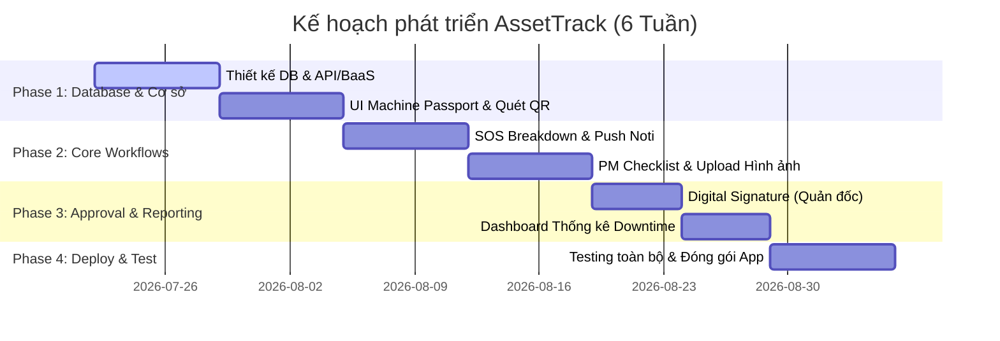

# AssetTrack - Hệ thống Quản lý Thiết bị & Bảo trì Phòng ngừa Nhà máy

## 1. Tổng quan Dự án (Project Overview)
- **Tên dự án:** AssetTrack
- **Mục tiêu:** Giảm thiểu thời gian dừng máy ngoài ý muốn (Downtime) bằng cách số hóa lý lịch máy móc (Machine Passport) qua mã QR, quản lý quy trình bảo trì định kỳ (Preventive Maintenance) và xử lý sự cố khẩn cấp (Breakdown SOS) thời gian thực.
- **Mô hình nhân sự:** **1 Developer (Solo Project)** -> Cần ưu tiên các giải pháp công nghệ nhanh, tích hợp sẵn, dễ triển khai để rút ngắn thời gian thiết lập hạ tầng.

---

## 2. Phân hệ Người dùng & Luồng Nghiệp vụ chính

### 2.1. Công nhân vận hành (Operator)
*Người phát hiện sự cố sớm nhất tại dây chuyền sản xuất.*
- **Quét mã QR (Machine Passport):** Quét nhôm QR trên máy để xem nhanh thông số kỹ thuật, lịch sử bảo trì, và cẩm nang khắc phục lỗi nhanh (Quick Troubleshooting).
- **Tạo phiếu SOS khẩn cấp (Work Order):** Khi xảy ra sự cố dừng chuyền, tạo yêu cầu sửa chữa trên app (chọn mức độ nghiêm trọng, đính kèm hình ảnh/mô tả lỗi).
- **Cập nhật số giờ chạy máy:** Nhập số giờ chạy (Running Hours) hoặc báo cáo trạng thái máy đầu/cuối ca.

### 2.2. Kỹ sư Cơ điện Bảo trì (ME Engineer)
*Đội ngũ kỹ thuật giữ cho máy móc hoạt động ổn định.*
- **Tiếp nhận & Sửa chữa (SOS Breakdown):** Nhận thông báo đẩy (Notification) khi có phiếu báo hỏng -> Bấm "Tiếp nhận" -> Tiến hành sửa chữa -> Cập nhật tiến độ xử lý.
- **Thực hiện bảo trì định kỳ (PM Checklist):** Khi đến hạn bảo dưỡng định kỳ (ví dụ: mỗi 500h, 1000h chạy), hệ thống tự động sinh task bảo trì. ME mở app, tick chọn từng mục checklist (thay dầu, tra mỡ...), chụp ảnh linh kiện cũ/mới để làm bằng chứng.
- **Cập nhật vật tư & số giờ chạy thực tế:** Ghi nhận các linh kiện đã thay thế vào lịch sử máy.

### 2.3. Quản đốc phân xưởng (Factory Supervisor)
*Giám sát toàn bộ hoạt động, phê duyệt và nghiệm thu.*
- **Nghiệm thu & Ký tên điện tử (Digital Sign-off):** Sau khi ME sửa xong, Quản đốc kiểm tra hiện trạng và ký tên trực tiếp bằng tay trên màn hình cảm ứng để nghiệm thu, chuyển trạng thái máy từ "Đang sửa chữa/Bảo trì" sang "Hoạt động".
- **Theo dõi Dashboard:** Xem bức tranh toàn cảnh: bao nhiêu máy đang chạy/đang hỏng, tổng thời gian dừng máy (Downtime) trong ca/ngày/tháng.
- **Phê duyệt đề xuất:** Duyệt các yêu cầu thay thế linh kiện đắt tiền hoặc các phiếu bảo trì đặc biệt.

---

## 3. Kiến trúc & Công nghệ Đề xuất (Tối ưu cho Solo Dev)

Do phát triển một mình, bạn nên sử dụng mô hình **Serverless / Backend-as-a-Service (BaaS)** để tập trung hoàn toàn vào Product Logic:

| Thành phần | Công nghệ đề xuất | Lý do lựa chọn |
| :--- | :--- | :--- |
| **Mobile App** | **React Native (Expo)** hoặc **Flutter** | • Phát triển chéo sân cho cả Android & iOS. • Expo hỗ trợ sẵn các thư viện quét QR (Camera), chọn ảnh linh kiện, và ký tên điện tử (`react-native-signature-canvas`). |
| **Backend & DB** | **Supabase** hoặc **Firebase** | • Tích hợp sẵn Database (PostgreSQL/Firestore), Xác thực người dùng (Auth), Storage lưu trữ ảnh linh kiện & ảnh chữ ký. • Có sẵn Realtime Database để đẩy thông báo/cập nhật trạng thái máy tức thời. |
| **Notification** | **Firebase Cloud Messaging (FCM)** | • Gửi thông báo khẩn cấp từ máy công nhân đến máy kỹ sư bảo trì tức thời. |
| **QR Code** | **Mã QR dạng URI** | • Mã hóa đường dẫn chứa ID của máy (e.g. `assettrack://machine/{machine_id}`) để khi quét sẽ tự động điều hướng trực tiếp đến trang Machine Passport tương ứng. |

---

## 4. Kế hoạch Triển khai Rút gọn (Roadmap cho 1 người)

### Chi tiết các bước:
1. **Tuần 1-2 (Thiết kế DB & QR Passport):** Xây dựng cấu trúc bảng cho Thiết bị, Phiếu sửa chữa, Người dùng. Tạo trang thông tin máy cơ bản hỗ trợ quét QR bằng camera điện thoại.
2. **Tuần 3-4 (Luồng SOS & PM Checklist):** Hiện thực hóa luồng công nhân báo hỏng đẩy thông báo tới kỹ sư ME. Xây dựng form checklist bảo dưỡng có nút chụp ảnh.
3. **Tuần 5 (Ký tên & Dashboard):** Tích hợp canvas ký tên trực quan trên điện thoại. Xây dựng màn hình Dashboard đơn giản thống kê số giờ máy chạy & tỷ lệ máy hỏng.
4. **Tuần 6 (Đóng gói & Kiểm thử):** Thử nghiệm thực tế với QR giấy tự in, chụp ảnh tải lên storage, ký nhận bàn giao và sửa các lỗi phát sinh.
