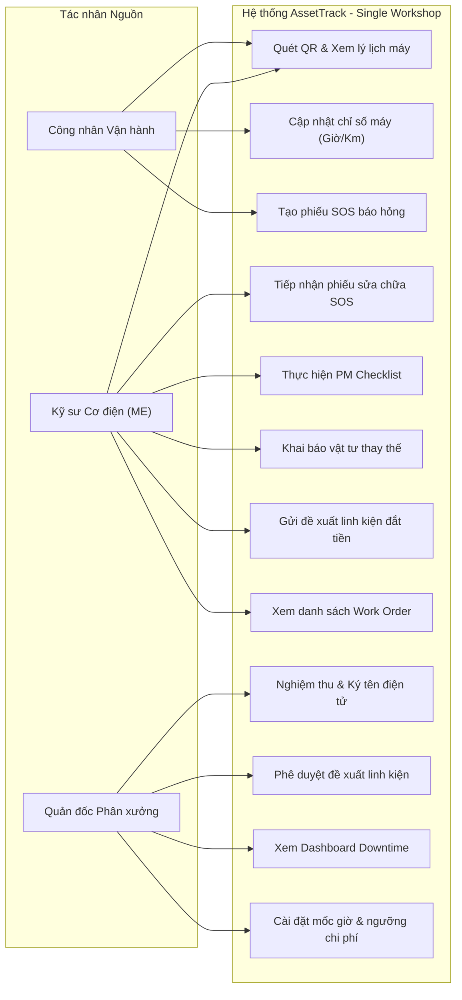
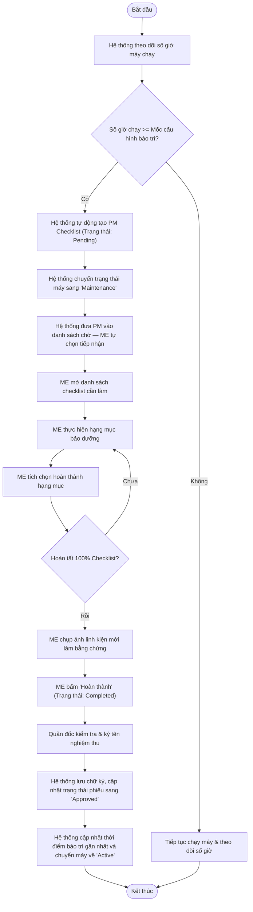
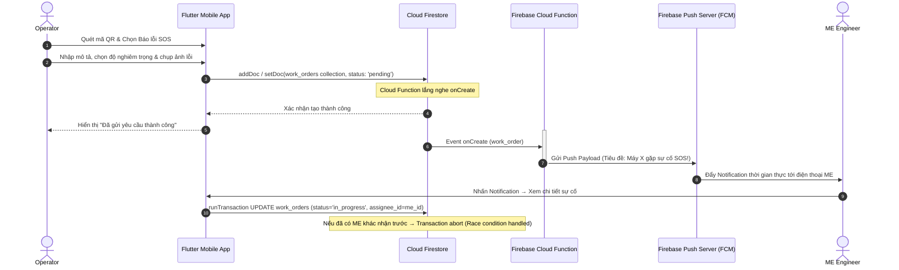
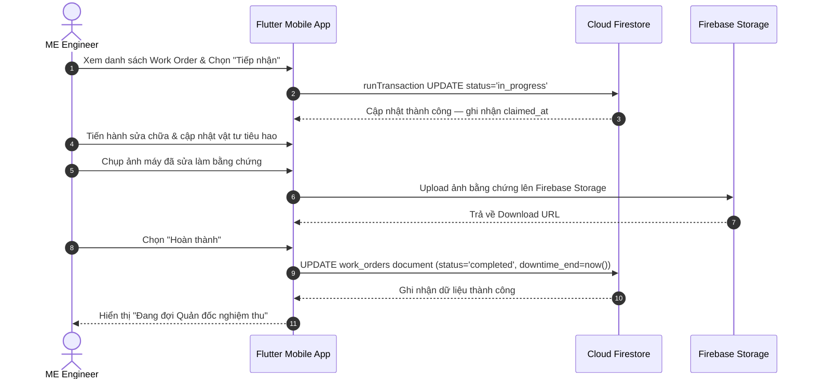
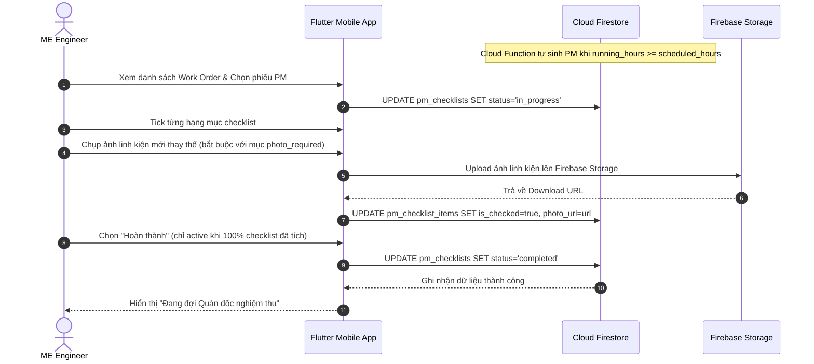
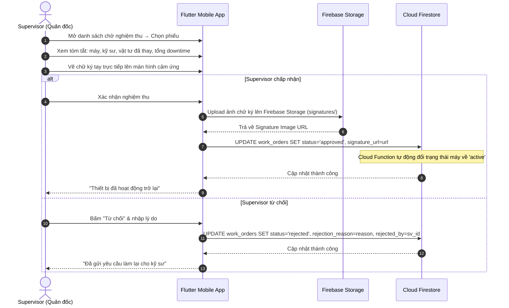
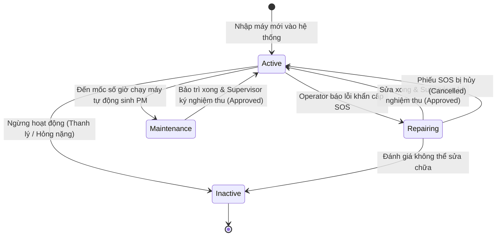
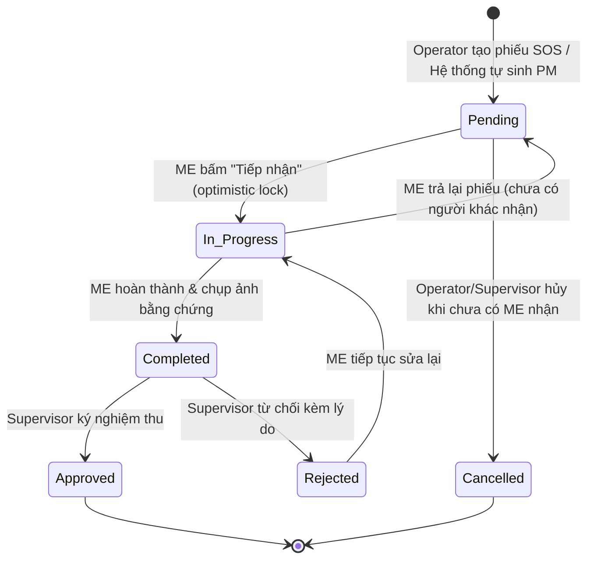
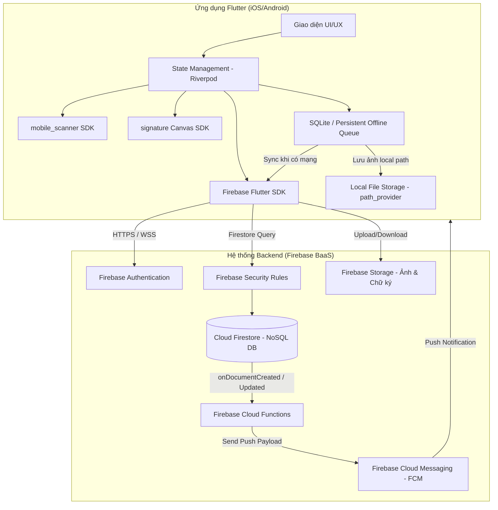
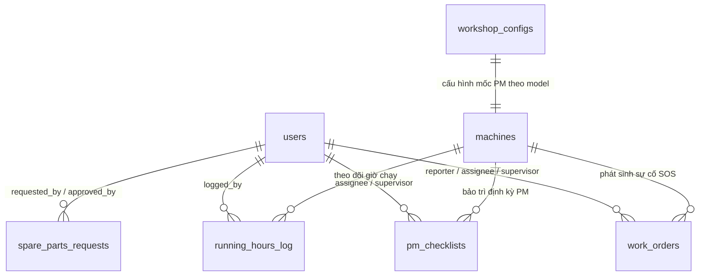

# Tài liệu Phân tích và Thiết kế Kỹ thuật Hệ thống AssetTrack (Technical SAD)

Tài liệu này tập trung chuyên sâu vào các sơ đồ mô hình hóa phần mềm theo chuẩn **Systems Analysis and Design (SAD)** cho dự án AssetTrack, bao gồm đặc tả Yêu cầu, Use Case, Biểu đồ Hoạt động (Activity Diagrams), Biểu đồ Tuần tự (Sequence Diagrams), Biểu đồ Chuyển trạng thái (State Transition Diagrams), Biểu đồ Thực thể Lớp (UML Class Diagram) và Kiến trúc Hệ thống.

---

## 1. Yêu cầu Hệ thống (System Requirements)

### 1.1. Yêu cầu Chức năng (Functional Requirements - FR)
* **FR-1 (Quản lý Lý lịch Máy móc):** Hệ thống phải định danh từng máy bằng mã QR duy nhất và hiển thị lịch sử sửa chữa/bảo trì khi quét.
* **FR-2 (Báo cáo Sự cố khẩn cấp SOS):** Operator phải tạo được yêu cầu sửa chữa tức thời khi máy gặp sự cố (gồm mô tả, mức độ nghiêm trọng và ảnh chụp lỗi).
* **FR-3 (Thông báo thời gian thực):** Hệ thống phải tự động gửi thông báo đẩy đến kỹ sư ME khi có phiếu SOS phát sinh.
* **FR-4 (Thực thi PM Checklist):** Hệ thống phải tự động sinh nhiệm vụ bảo trì định kỳ dựa trên số giờ chạy máy và bắt buộc kỹ sư ME tích chọn checklist kèm ảnh minh chứng.
* **FR-5 (Nghiệm thu Chữ ký số):** Quản đốc phân xưởng phải ký tên điện tử trực tiếp trên app để nghiệm thu phiếu sửa chữa/bảo trì trước khi đưa máy hoạt động lại.
* **FR-6 (Giám sát & Thống kê):** Quản đốc phải xem được thời gian dừng máy (Downtime) và trạng thái phân xưởng thời gian thực thông qua dashboard.
* **FR-7 (Ghi Log Vật tư & Tủ vật tư nhanh SME):** Đối với nhà xưởng vừa & nhỏ (SME), Kỹ sư ME tự lấy linh kiện từ *Tủ vật tư nhanh* tại phân xưởng để thay thế và dùng app ghi log phụ tùng (`Spare Parts Logging`), giúp lưu lý lịch sửa chữa của máy và trừ lùi tồn tủ để Quản đốc chủ động nhập bổ sung.
* **FR-8 (Cấu hình Ngưỡng Hệ thống Phân xưởng):** Supervisor cài đặt các mốc số giờ/km bảo trì định kỳ cho các model máy và ngưỡng duyệt giá trị chi phí linh kiện của phân xưởng.

### 1.2. Yêu cầu Phi Chức năng (Non-functional Requirements - NFR)
* **NFR-1 (Bảo mật & Phân quyền):** Ràng buộc truy cập dữ liệu bằng **Firebase Security Rules** và phân quyền người dùng qua **Firebase Auth (Custom Claims / Role)** theo 3 vai trò (`Operator`, `ME Engineer`, `Supervisor`) trong phân xưởng.
* **NFR-2 (Thời gian thực):** Thông báo đẩy về sự cố SOS phải được gửi đi trong vòng **< 3 giây** kể từ khi Operator gửi yêu cầu.
* **NFR-3 (Hiệu năng quét mã):** Camera nhận diện và decode mã QR trong **< 1.5 giây** trong điều kiện ánh sáng nhà máy bình thường.
* **NFR-4 (Dung lượng ảnh):** Mỗi ảnh đính kèm không vượt quá **5MB**; app tự nén trước khi upload.
* **NFR-5 (Tính khả dụng UI):** Giao diện tối ưu cho màn hình cảm ứng ≥ 5 inch; các nút hành động quan trọng có kích thước tối thiểu **48×48dp**.
* **NFR-6 (Offline & Tự đồng bộ):** Thao tác ghi khi mất mạng lưu vào **SQLite / Firestore Offline Queue**; khi có mạng app tự upload theo thứ tự. Ảnh offline lưu vào app storage dưới dạng file, SQLite chỉ lưu đường dẫn. App đọc lại queue khi khởi động. SOS tạo offline sẽ không gửi notification ngay — chỉ gửi sau khi đồng bộ lên Firebase.

---

## 2. Phân tích Use Case (Use Case Analysis)

### 2.1. Biểu đồ Use Case tổng thể (Use Case Diagram)



### 2.2. Đặc tả Use Case tiêu biểu (Use Case Specification)

| Thành phần đặc tả | Mô tả chi tiết |
| :--- | :--- |
| **Tên Use Case** | Tạo phiếu SOS và Nghiệm thu sửa chữa (SOS Breakdown & Sign-off Flow) |
| **Tác nhân** | Operator (Người tạo), ME Engineer (Người sửa), Supervisor (Người nghiệm thu) |
| **Tiền điều kiện** | Máy móc đã được dán mã QR; Người dùng đã đăng nhập vào hệ thống với đúng vai trò. |
| **Luồng sự kiện chính** | 1. **Operator** quét mã QR trên máy, chọn "Báo lỗi khẩn cấp SOS".<br>2. **Operator** điền mô tả sự cố, chụp ảnh hiện trạng lỗi và bấm gửi.<br>3. Hệ thống lưu Work Order ở trạng thái `pending` và đổi trạng thái máy sang `repairing`.<br>4. Hệ thống kích hoạt Trigger gửi thông báo push notification đến các **ME Engineer**.<br>5. **ME Engineer** bấm tiếp nhận phiếu — DB thực hiện `UPDATE ... WHERE status='pending'`; nếu 2 ME bấm cùng lúc, chỉ 1 người thắng (race condition handled), người còn lại thấy thông báo "Phiếu đã được tiếp nhận" (trạng thái chuyển sang `in_progress`).<br>6. **ME Engineer** sửa máy xong, khai báo vật tư đã thay thế, chụp ảnh máy đã sửa, bấm hoàn thành (`completed`).<br>7. **Supervisor** kiểm tra máy, mở app và thực hiện ký tên điện tử lên màn hình cảm ứng để phê duyệt (`approved`).<br>8. Trạng thái máy tự động cập nhật về `active` (Hoạt động). |
| **Hậu điều kiện** | Phiếu sửa chữa được lưu trữ vĩnh viễn kèm ảnh chữ ký của Quản đốc; Máy móc trở lại sản xuất. |

---

## 3. Biểu đồ Hoạt động (Activity Diagrams)

### 3.1. Quy trình Xử lý Sự cố khẩn cấp (Breakdown SOS Workflow)


### 3.2. Quy trình Bảo trì Định kỳ (Preventive Maintenance Workflow)


---

## 4. Biểu đồ Tuần tự (Sequence Diagrams)

### 4.1. Luồng Báo hỏng SOS và Đẩy Thông báo



### 4.2. Luồng Tiếp nhận & Sửa chữa SOS (ME Engineer)



### 4.3. Luồng Thực thi PM Checklist (ME Engineer)



### 4.4. Luồng Nghiệm thu và Ký tên điện tử (Digital Sign-off)



---

## 5. Biểu đồ Chuyển trạng thái (State Transition Diagrams)

### 5.1. Trạng thái Thiết bị (Machine States)



### 5.2. Trạng thái Phiếu công việc (Work Order / PM Checklist States)



---

## 6. Sơ đồ Thực thể Lớp (UML Class Diagram)


---

## 7. Kiến trúc Hệ thống Tổng thể (System Architecture)




## 8. Mô hình Cơ sở Dữ liệu NoSQL Cloud Firestore (Cloud Firestore Data Model)

Tài liệu này chi tiết hóa cấu trúc lưu trữ NoSQL trên **Cloud Firestore** cho ứng dụng AssetTrack. Kiến trúc được thiết kế tối ưu cho **phân xưởng duy nhất (Single Workshop Scope)**, áp dụng các kỹ thuật phi chuẩn hóa (Denormalization) và Embedded Arrays để giúp ứng dụng Flutter truy vấn nhanh, hỗ trợ đầy đủ chế độ Offline Persistence và tiết kiệm chi phí read/write operations trên Firebase.

---

### 8.1. Sơ đồ Cấu trúc Firestore Collections (NoSQL Schema Overview)



---

### 8.2. Chi tiết Đặc tả Các Collections (Collections & Document Specifications)

#### 1. Collection `users` — Hồ sơ người dùng & Phân quyền
Document ID = `uid` (Khớp với `uid` từ Firebase Authentication).

| Thuộc tính | Kiểu dữ liệu | Mô tả & Ràng buộc |
| :--- | :--- | :--- |
| `uid` | `string` | ID người dùng từ Firebase Auth (Document ID) |
| `full_name` | `string` | Họ và tên đầy đủ |
| `email` | `string` | Địa chỉ email đăng nhập |
| `role` | `string` | Vai trò trong xưởng: `'operator'` \| `'me_engineer'` \| `'supervisor'` |
| `employee_code` | `string` | Mã nhân viên (VD: OP-01, ME-02, SV-01) |
| `created_at` | `timestamp` | Thời điểm khởi tạo tài khoản |

---

#### 2. Collection `machines` — Hộ chiếu & Lý lịch máy móc
Document ID = `machine_id` (Tự sinh hoặc dùng `code` dạng `MC-101`).

| Thuộc tính | Kiểu dữ liệu | Mô tả & Ràng buộc |
| :--- | :--- | :--- |
| `machine_id` | `string` | ID thiết bị (Document ID) |
| `code` | `string` | Mã máy in trên tem QR duy nhất (VD: `MC-102`) |
| `name` | `string` | Tên máy (VD: Máy dập thủy lực 150T / Xe nâng Toyota) |
| `model` | `string` | Model máy (liên kết cấu hình PM theo model) |
| `specifications` | `map` | Thông số kỹ thuật `{ power: "150 kW", max_pressure: "250 bar" }` |
| `status` | `string` | Trạng thái máy: `'active'` \| `'repairing'` \| `'maintenance'` \| `'inactive'` |
| `tracking_type` | `string` | Đơn vị theo dõi bảo trì: `'hours'` (Giờ chạy) \| `'km'` (Số km) |
| `meter_unit` | `string` | Nhãn đơn vị hiển thị trên UI: `'giờ'` \| `'km'` |
| `current_meter_value` | `number` | Chỉ số giờ chạy hoặc số km tích lũy hiện tại |
| `pm_config` | `map` | Cấu hình mốc bảo trì linh hoạt theo máy:<br>`{ initial_thresholds: [500, 1000], recurring_interval: 500, unit: "hours" }` |
| `quick_troubleshooting` | `array<map>` | Danh sách các mẹo xử lý lỗi nhanh cho công nhân:<br>`[{ issue: "Máy rung mạnh", solution: "Siết bu-lông chân máy" }]` |
| `last_maintenance_at` | `timestamp` \| `null` | Thời điểm bảo trì định kỳ gần nhất |
| `created_at` | `timestamp` | Thời điểm tạo máy |

---

#### 3. Collection `workshop_configs` — Cấu hình ngưỡng phân xưởng
Document ID = `machine_model` (Mỗi model máy có 1 cấu hình ngưỡng mặc định).

| Thuộc tính | Kiểu dữ liệu | Mô tả & Ràng buộc |
| :--- | :--- | :--- |
| `machine_model` | `string` | Model máy áp dụng (Document ID, VD: "Máy dập thủy lực") |
| `tracking_type` | `string` | Đơn vị mặc định: `'hours'` \| `'km'` |
| `pm_initial_thresholds` | `array<number>` | Các mốc bảo trì chạy rà ban đầu (VD: `[500, 1000]`) |
| `pm_recurring_interval` | `number` | Chu kỳ bảo trì định kỳ lặp lại về sau (VD: `500`) |
| `cost_approval_threshold` | `number` | Ngưỡng chi phí linh kiện cần duyệt (VNĐ, mặc định: `2000000`) |
| `updated_by` | `string` | `uid` Quản đốc cập nhật gần nhất |
| `updated_at` | `timestamp` | Thời điểm cập nhật cấu hình |

---

#### 4. Collection `work_orders` — Phiếu báo sự cố khẩn cấp (SOS Breakdown)
Document ID = `work_order_id` (Tự sinh hoặc dùng `client_generated_id`).

| Thuộc tính | Kiểu dữ liệu | Mô tả & Ràng buộc |
| :--- | :--- | :--- |
| `work_order_id` | `string` | ID phiếu công việc (Document ID) |
| `client_generated_id` | `string` | UUID do app mobile tạo offline (Unique, chống trùng khi sync) |
| `machine_id` | `string` | ID máy phát sinh sự cố |
| `machine_code` | `string` | Mã máy (Denormalized để hiển thị nhanh danh sách) |
| `machine_name` | `string` | Tên máy (Denormalized) |
| `reporter_id` | `string` | `uid` Operator báo lỗi |
| `reporter_name` | `string` | Tên Operator báo lỗi (Denormalized) |
| `assignee_id` | `string` \| `null` | `uid` Kỹ sư ME tiếp nhận |
| `assignee_name` | `string` \| `null` | Tên Kỹ sư ME tiếp nhận (Denormalized) |
| `supervisor_id` | `string` \| `null` | `uid` Quản đốc nghiệm thu |
| `severity` | `string` | Mức độ nghiêm trọng: `'low'` \| `'medium'` \| `'high'` \| `'critical'` |
| `description` | `string` | Mô tả chi tiết hiện trạng lỗi |
| `image_urls` | `array<string>` | Mảng URL ảnh sự cố lưu trên Firebase Storage |
| `status` | `string` | Trạng thái: `'pending'` \| `'in_progress'` \| `'completed'` \| `'approved'` \| `'rejected'` \| `'cancelled'` |
| `downtime_start` | `timestamp` | Thời điểm máy dừng chạy |
| `downtime_end` | `timestamp` \| `null` | Thời điểm máy chạy lại |
| `claimed_at` | `timestamp` \| `null` | Thời điểm ME bấm tiếp nhận |
| `supervisor_signature_url` | `string` \| `null` | URL ảnh chữ ký tay nghiệm thu (PNG) |
| `rejection_reason` | `string` \| `null` | Lý do Quản đốc từ chối nghiệm thu |
| `rejected_by` | `string` \| `null` | `uid` Quản đốc từ chối |
| `cancelled_at` | `timestamp` \| `null` | Thời điểm hủy phiếu |
| `cancellation_reason` | `string` \| `null` | Lý do hủy phiếu |
| `cancelled_by` | `string` \| `null` | `uid` người hủy phiếu |
| `spare_part_logs` | `array<map>` | Danh sách vật tư tiêu hao đã tự lấy nhúng trực tiếp:<br>`[{ part_name: "Dầu 46#", quantity: 5, unit: "lít", logged_by: "uid", logged_at: timestamp }]` |
| `created_at` | `timestamp` | Thời điểm tạo phiếu SOS |

---

#### 5. Collection `pm_checklists` — Phiếu bảo trì định kỳ (PM)
Document ID = `pm_checklist_id`.

| Thuộc tính | Kiểu dữ liệu | Mô tả & Ràng buộc |
| :--- | :--- | :--- |
| `pm_checklist_id` | `string` | ID phiếu bảo trì PM (Document ID) |
| `machine_id` | `string` | ID máy cần bảo trì |
| `machine_code` | `string` | Mã máy (Denormalized) |
| `machine_name` | `string` | Tên máy (Denormalized) |
| `assignee_id` | `string` \| `null` | `uid` Kỹ sư ME thực hiện |
| `assignee_name` | `string` \| `null` | Tên ME thực hiện (Denormalized) |
| `supervisor_id` | `string` \| `null` | `uid` Quản đốc nghiệm thu |
| `scheduled_hours` | `number` | Mốc giờ kích hoạt bảo trì (VD: `500`) |
| `status` | `string` | Trạng thái: `'pending'` \| `'in_progress'` \| `'completed'` \| `'approved'` \| `'rejected'` \| `'cancelled'` |
| `supervisor_signature_url` | `string` \| `null` | URL ảnh chữ ký nghiệm thu |
| `rejection_reason` | `string` \| `null` | Lý do từ chối nghiệm thu |
| `rejected_by` | `string` \| `null` | `uid` Quản đốc từ chối |
| `items` | `array<map>` | Mảng danh mục các mục cần kiểm tra nhúng trực tiếp:<br>`[{ item_id: "1", task_description: "Thay dầu", is_checked: true, photo_required: true, photo_url: "url", checked_at: timestamp }]` |
| `spare_part_logs` | `array<map>` | Mảng log vật tư đã dùng thay thế |
| `completed_at` | `timestamp` \| `null` | Thời điểm ME bấm hoàn thành |
| `created_at` | `timestamp` | Thời điểm tự động sinh PM |

---

#### 6. Collection `spare_parts_requests` — Đề xuất linh kiện đắt tiền
Document ID = `request_id`.

| Thuộc tính | Kiểu dữ liệu | Mô tả & Ràng buộc |
| :--- | :--- | :--- |
| `request_id` | `string` | ID đề xuất linh kiện (Document ID) |
| `parent_type` | `string` | Thuộc phiếu nào: `'work_order'` \| `'pm_checklist'` |
| `parent_id` | `string` | ID của `work_order` hoặc `pm_checklist` tương ứng |
| `machine_code` | `string` | Mã máy cần thay linh kiện |
| `requested_by` | `string` | `uid` ME gửi đề xuất |
| `requested_by_name` | `string` | Tên ME gửi đề xuất (Denormalized) |
| `part_name` | `string` | Tên linh kiện đắt tiền cần mua/thay |
| `quantity` | `number` | Số lượng đề xuất (CHECK > 0) |
| `unit_price` | `number` | Đơn giá linh kiện (VNĐ) |
| `total_price` | `number` | Tổng giá trị đề xuất (`quantity` × `unit_price`) |
| `reason` | `string` | Lý do đề xuất thay thế |
| `status` | `string` | Trạng thái: `'pending_approval'` \| `'approved'` \| `'rejected'` |
| `approved_by` | `string` \| `null` | `uid` Quản đốc phê duyệt |
| `rejection_reason` | `string` \| `null` | Lý do từ chối phê duyệt |
| `created_at` | `timestamp` | Thời điểm gửi đề xuất |

---

#### 7. Collection `running_hours_log` (hoặc `usage_logs`) — Lịch sử nhập chỉ số vận hành
Document ID = `log_id`.

| Thuộc tính | Kiểu dữ liệu | Mô tả & Ràng buộc |
| :--- | :--- | :--- |
| `log_id` | `string` | ID bản ghi nhập chỉ số (Document ID) |
| `client_generated_id` | `string` | UUID tạo từ mobile chống trùng khi retry sync |
| `machine_id` | `string` | ID máy được nhập chỉ số |
| `machine_code` | `string` | Mã máy (Denormalized) |
| `meter_value` | `number` | Chỉ số vận hành (Số giờ chạy hoặc Số km) |
| `unit` | `string` | Đơn vị đo: `'hours'` \| `'km'` |
| `shift` | `string` | Ca làm việc: `'start'` (đầu ca) \| `'end'` (cuối ca) |
| `logged_by` | `string` | `uid` Operator nhập |
| `logged_by_name` | `string` | Tên Operator (Denormalized) |
| `logged_at` | `timestamp` | Thời điểm ghi nhận |

---

### 8.3. Mã Quy tắc Bảo mật Firebase Security Rules (`firestore.rules`)

```javascript
rules_version = '2';
service cloud.firestore {
  match /databases/{database}/documents {

    // Helper functions
    function isAuthenticated() {
      return request.auth != null;
    }
    
    function getUserData() {
      return get(/databases/$(database)/documents/users/$(request.auth.uid)).data;
    }
    
    function isSupervisor() {
      return isAuthenticated() && getUserData().role == 'supervisor';
    }
    
    function isEngineer() {
      return isAuthenticated() && (getUserData().role == 'me_engineer' || getUserData().role == 'supervisor');
    }

    // Users Collection
    match /users/{userId} {
      allow read: if isAuthenticated();
      allow write: if isSupervisor(); // Chỉ Supervisor được thêm/sửa tài khoản
    }

    // Machines Collection
    match /machines/{machineId} {
      allow read: if isAuthenticated();
      allow write: if isSupervisor() || isEngineer();
    }

    // Workshop Configs Collection
    match /workshop_configs/{configId} {
      allow read: if isAuthenticated();
      allow write: if isSupervisor(); // Chỉ Supervisor được sửa cấu hình ngưỡng
    }

    // Work Orders Collection
    match /work_orders/{orderId} {
      allow read: if isAuthenticated();
      allow create: if isAuthenticated();
      allow update: if isAuthenticated();
      allow delete: if isSupervisor();
    }

    // PM Checklists Collection
    match /pm_checklists/{pmId} {
      allow read: if isAuthenticated();
      allow create: if isSupervisor() || isEngineer();
      allow update: if isEngineer();
    }

    // Spare Parts Requests Collection
    match /spare_parts_requests/{requestId} {
      allow read: if isAuthenticated();
      allow create: if isEngineer();
      allow update: if isSupervisor(); // Chỉ Supervisor được Approve/Reject
    }

    // Running Hours Log Collection
    match /running_hours_log/{logId} {
      allow read: if isAuthenticated();
      allow create: if isAuthenticated();
    }
  }
}
```

---

### 8.4. Cấu hình Indexing Khuyến nghị (Firestore Composite Indexes)

Để các màn hình Mobile truy vấn nhanh với số lượng lớn bản ghi, cần tạo các Composite Indexes sau trên Firebase Console:

1. **`work_orders`**: `status` (Ascending) + `severity` (Descending) + `created_at` (Descending) — Phục vụ màn hình danh sách phiếu cho Kỹ sư ME.
2. **`running_hours_log`**: `machine_id` (Ascending) + `logged_at` (Descending) — Phục vụ lấy chỉ số giờ chạy lần nhập gần nhất của máy.
3. **`spare_parts_requests`**: `status` (Ascending) + `created_at` (Descending) — Phục vụ Quản đốc xem danh sách đề xuất cần duyệt.

