# Tài liệu Phân tích và Thiết kế Kỹ thuật Hệ thống AssetTrack (Technical SAD)

Tài liệu này tập trung chuyên sâu vào các sơ đồ mô hình hóa phần mềm theo chuẩn **Systems Analysis and Design (SAD)** cho dự án AssetTrack, bao gồm đặc tả Yêu cầu, Use Case, Biểu đồ Hoạt động (Activity Diagrams), Biểu đồ Tuần tự (Sequence Diagrams), Biểu đồ Chuyển trạng thái (State Transition Diagrams), Biểu đồ Thực thể Lớp (UML Class Diagram) và Kiến trúc Hệ thống.

---

## 1. Yêu cầu Hệ thống (System Requirements)

### 1.1. Yêu cầu Chức năng (Functional Requirements - FR)
* **FR-1 (Quản lý Lý lịch Máy móc):** Hệ thống phải định danh từng máy bằng mã QR duy nhất và hiển thị lịch sử sửa chữa/bảo trì khi quét.
* **FR-2 (Báo cáo Sự cố khẩn cấp SOS):** Operator phải tạo được yêu cầu sửa chữa tức thời khi máy gặp sự cố (gồm mô tả, mức độ nghiêm trọng và ảnh chụp lỗi).
* **FR-3 (Thông báo thời gian thực):** Hệ thống phải tự động gửi thông báo đẩy đến kỹ sư ME khi có phiếu SOS phát sinh.
* **FR-4 (Thực thi PM Checklist):** Hệ thống phải tự động sinh nhiệm vụ bảo trì định kỳ dựa trên số giờ chạy máy và bắt buộc kỹ sư ME tích chọn checklist kèm ảnh minh chứng.
* **FR-5 (Nghiệm thu Chữ ký số):** Quản đốc phân xưởng phải ký tên điện tử trực tiếp trên app để nghiệm thu phiếu sửa chữa/bảo trì trước khi đưa máy hoạt động lại.
* **FR-6 (Giám sát & Thống kê):** Quản đốc phải xem được thời gian dừng máy (Downtime) và trạng thái phân xưởng thời gian thực thông qua dashboard.

### 1.2. Yêu cầu Phi Chức năng (Non-functional Requirements - NFR)
* **NFR-1 (Bảo mật & Phân quyền):** Ràng buộc truy cập dữ liệu bằng Row-Level Security (RLS) trên Supabase; mỗi role chỉ đọc/ghi trong phạm vi quyền hạn. Mỗi Supervisor chỉ thấy dữ liệu thuộc `workshop_id` mà họ phụ trách.
* **NFR-2 (Thời gian thực):** Thông báo đẩy về sự cố SOS phải được gửi đi trong vòng **< 3 giây** kể từ khi Operator gửi yêu cầu.
* **NFR-3 (Hiệu năng quét mã):** Camera nhận diện và decode mã QR trong **< 1.5 giây** trong điều kiện ánh sáng nhà máy bình thường.
* **NFR-4 (Dung lượng ảnh):** Mỗi ảnh đính kèm không vượt quá **5MB**; app tự nén trước khi upload.
* **NFR-5 (Tính khả dụng UI):** Giao diện tối ưu cho màn hình cảm ứng ≥ 5 inch; các nút hành động quan trọng có kích thước tối thiểu **48×48dp**.
* **NFR-6 (Offline & Tự đồng bộ):** Thao tác ghi khi mất mạng lưu vào SQLite local queue; khi có mạng app tự upload theo thứ tự. Ảnh offline lưu vào app storage dưới dạng file, SQLite chỉ lưu đường dẫn. App đọc lại queue khi khởi động. SOS tạo offline sẽ không gửi notification ngay — chỉ gửi sau khi đồng bộ xong.

---

## 2. Phân tích Use Case (Use Case Analysis)

### 2.1. Biểu đồ Use Case tổng thể (Use Case Diagram)

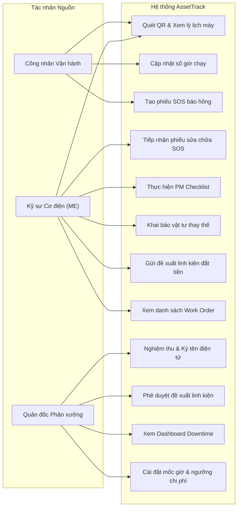

### 2.2. Đặc tả Use Case tiêu biểu (Use Case Specification)

| Thành phần đặc tả | Mô tả chi tiết |
| :--- | :--- |
| **Tên Use Case** | Tạo phiếu SOS và Nghiệm thu sửa chữa (SOS Breakdown & Sign-off Flow) |
| **Tác nhân** | Operator (Người tạo), ME Engineer (Người sửa), Supervisor (Người nghiệm thu) |
| **Tiền điều kiện** | Máy móc đã được dán mã QR; Người dùng đã đăng nhập vào hệ thống với đúng vai trò. |
| **Luồng sự kiện chính** | 1. **Operator** quét mã QR trên máy, chọn "Báo lỗi khẩn cấp SOS". 2. **Operator** điền mô tả sự cố, chụp ảnh hiện trạng lỗi và bấm gửi. 3. Hệ thống lưu Work Order ở trạng thái `pending` và đổi trạng thái máy sang `repairing`. 4. Hệ thống kích hoạt Trigger gửi thông báo push notification đến các **ME Engineer**. 5. **ME Engineer** bấm tiếp nhận phiếu — DB thực hiện `UPDATE ... WHERE status='pending'`; nếu 2 ME bấm cùng lúc, chỉ 1 người thắng (race condition handled), người còn lại thấy thông báo "Phiếu đã được tiếp nhận" (trạng thái chuyển sang `in_progress`). 6. **ME Engineer** sửa máy xong, khai báo vật tư đã thay thế, chụp ảnh máy đã sửa, bấm hoàn thành (`completed`). 7. **Supervisor** kiểm tra máy, mở app và thực hiện ký tên điện tử lên màn hình cảm ứng để phê duyệt (`approved`). 8. Trạng thái máy tự động cập nhật về `active` (Hoạt động). |
| **Hậu điều kiện** | Phiếu sửa chữa được lưu trữ vĩnh viễn kèm ảnh chữ ký của Quản đốc; Máy móc trở lại sản xuất. |

---

## 3. Biểu đồ Hoạt động (Activity Diagrams)

### 3.1. Quy trình Xử lý Sự cố khẩn cấp (Breakdown SOS Workflow)
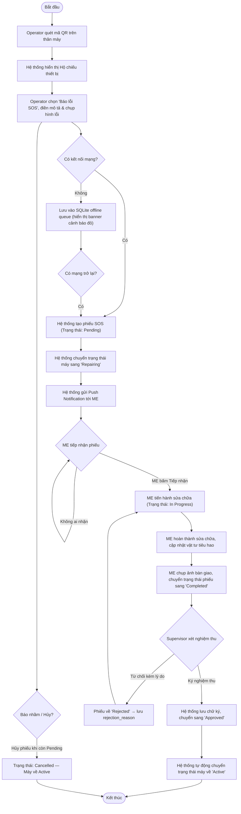

### 3.2. Quy trình Bảo trì Định kỳ (Preventive Maintenance Workflow)

---

## 4. Biểu đồ Tuần tự (Sequence Diagrams)

### 4.1. Luồng Báo hỏng SOS và Đẩy Thông báo

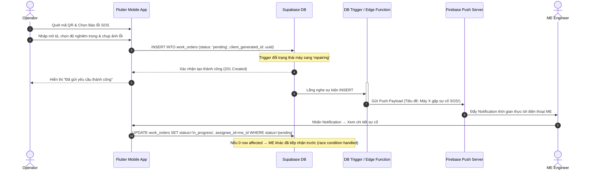

### 4.2. Luồng Tiếp nhận & Sửa chữa SOS (ME Engineer)

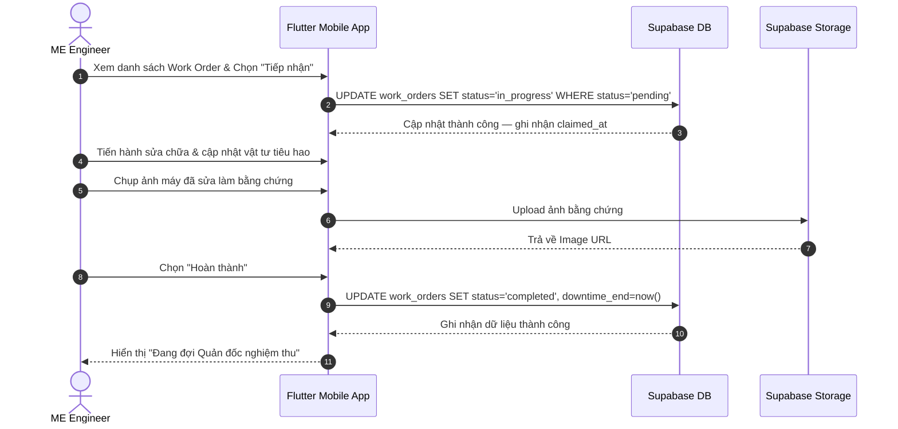

### 4.3. Luồng Thực thi PM Checklist (ME Engineer)

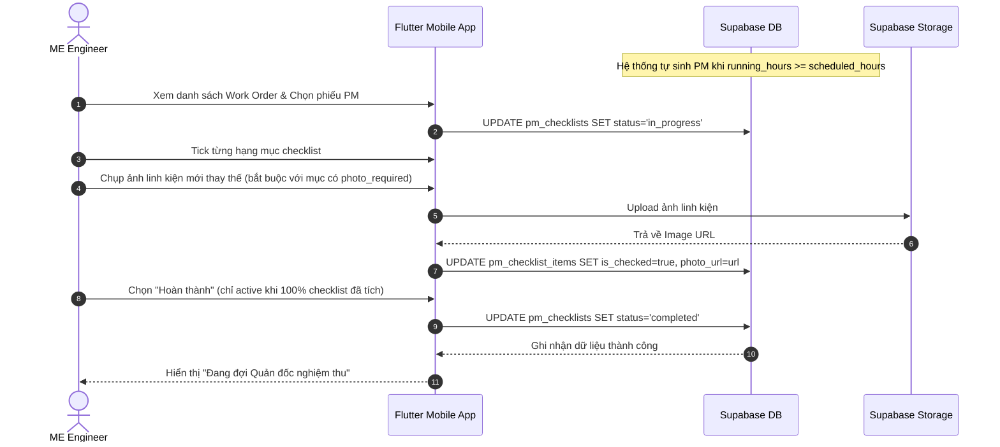

### 4.4. Luồng Nghiệm thu và Ký tên điện tử (Digital Sign-off)

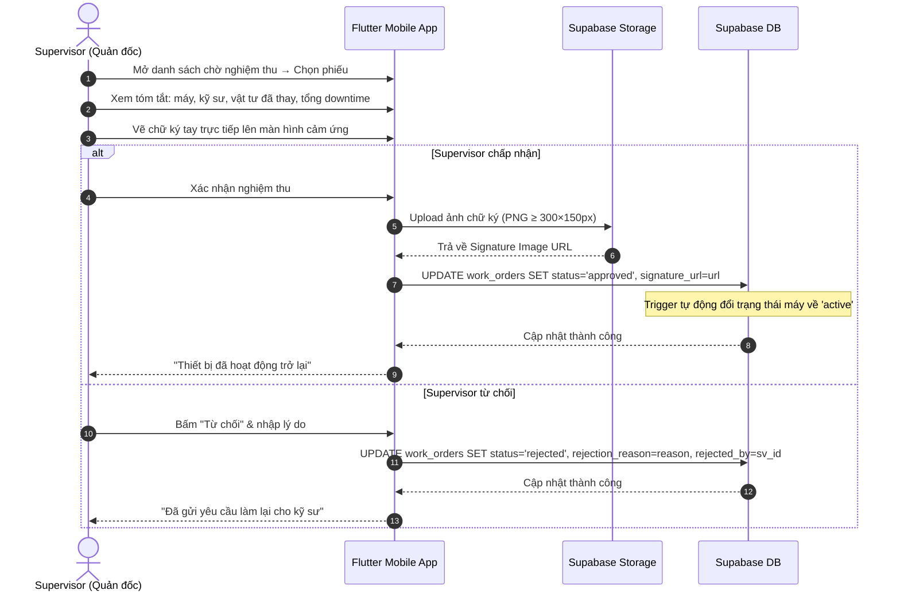

---

## 5. Biểu đồ Chuyển trạng thái (State Transition Diagrams)

### 5.1. Trạng thái Thiết bị (Machine States)

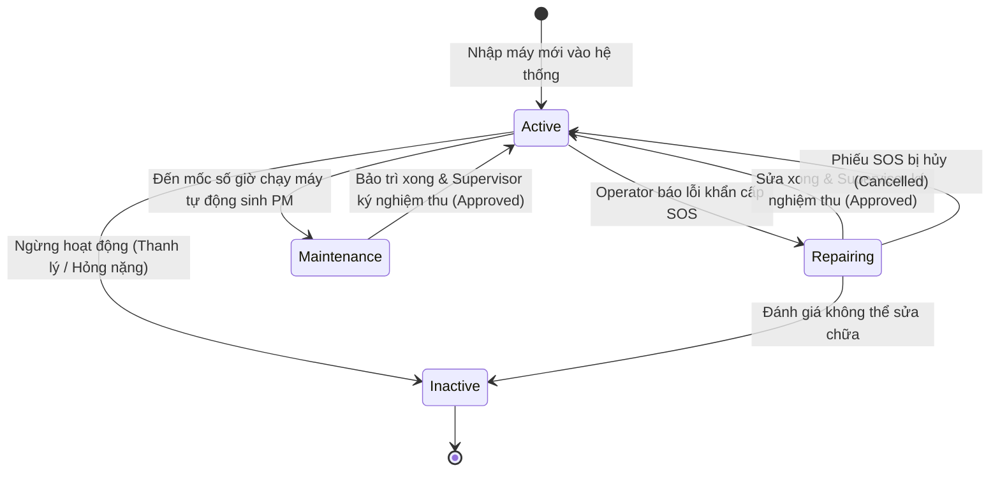

### 5.2. Trạng thái Phiếu công việc (Work Order / PM Checklist States)

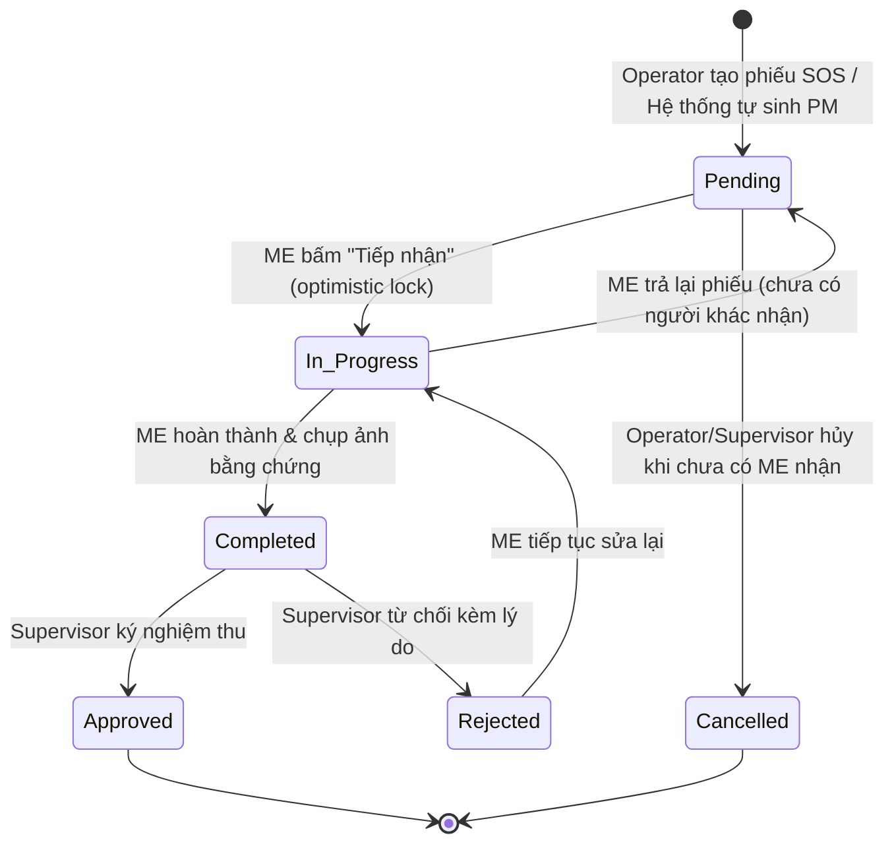

---

## 6. Sơ đồ Thực thể Lớp (UML Class Diagram)

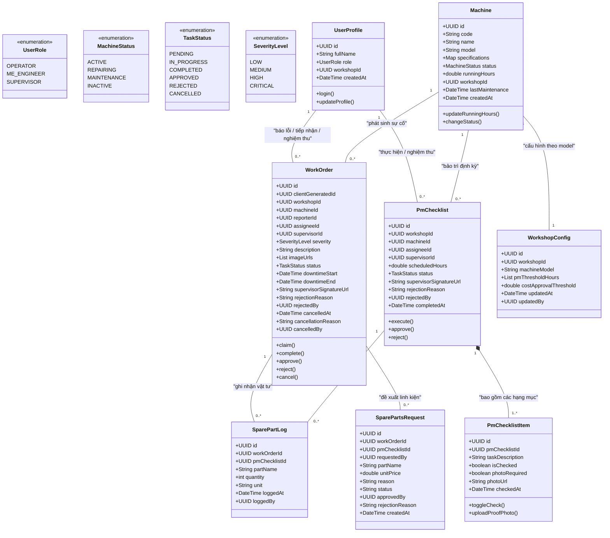

---

## 7. Kiến trúc Hệ thống Tổng thể (System Architecture)

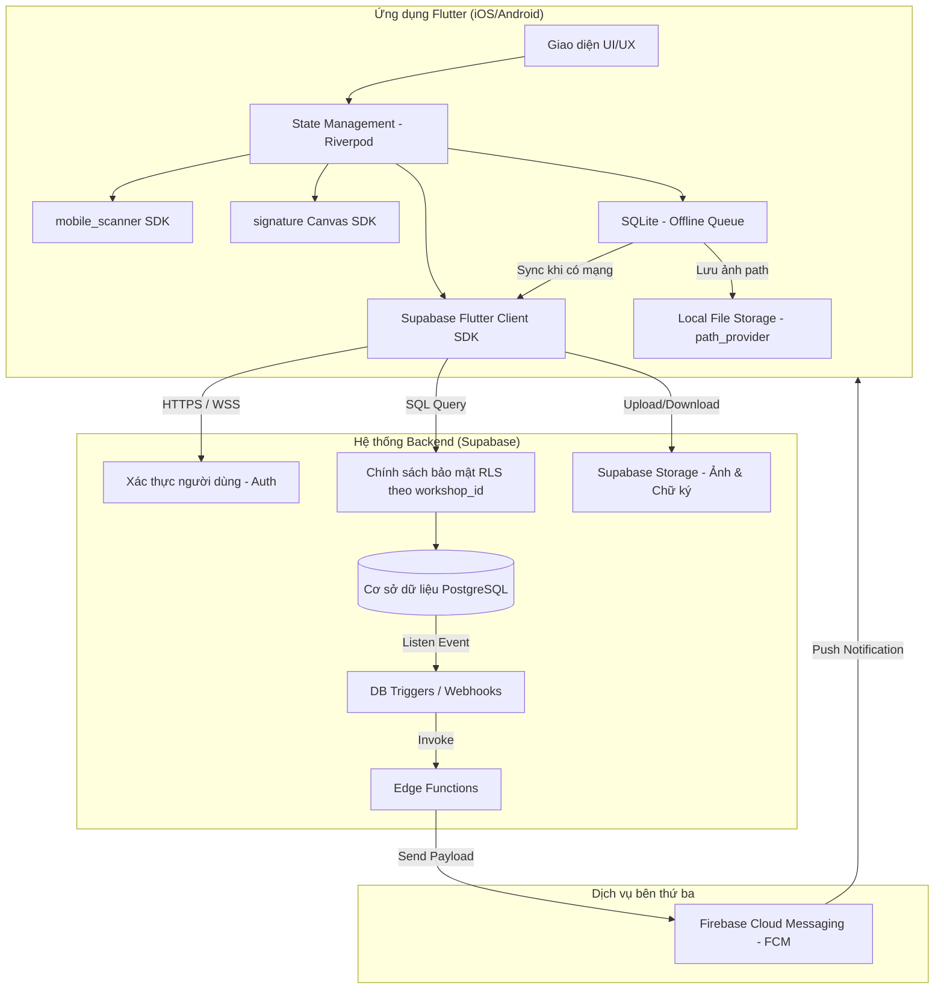

---

## 8. Thiết kế Cơ sở Dữ liệu Quan hệ (Relational Database Design)

### 8.1. Mô hình Thực thể Quan hệ (ERD)

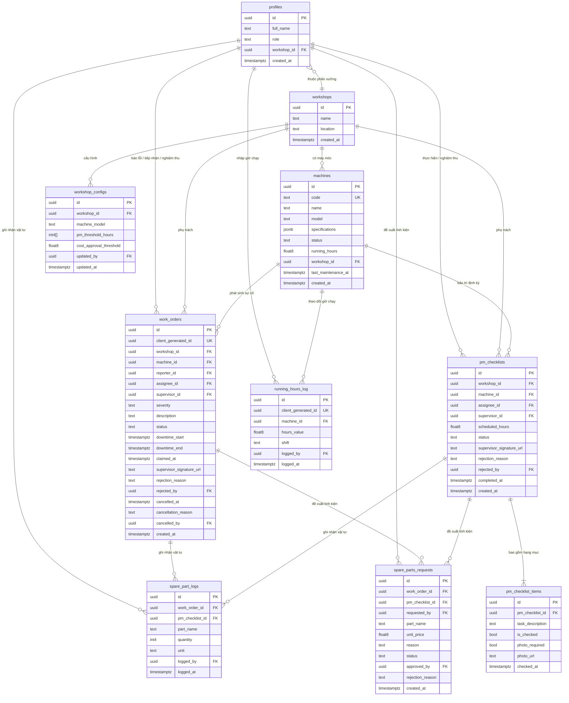

---

### 8.2. Mô tả Chi tiết Từng Bảng

#### Bảng `profiles` — Hồ sơ người dùng
| Thuộc tính | Kiểu dữ liệu | Ràng buộc | Mô tả |
| :--- | :--- | :--- | :--- |
| `id` | `uuid` | PK, default `auth.uid()` | ID người dùng, liên kết với Supabase Auth |
| `full_name` | `text` | NOT NULL | Họ tên đầy đủ |
| `role` | `text` | NOT NULL, CHECK IN ('operator','me_engineer','supervisor') | Vai trò trong hệ thống |
| `workshop_id` | `uuid` | FK → workshops.id | Phân xưởng phụ trách |
| `created_at` | `timestamptz` | default now() | Thời điểm tạo |

---

#### Bảng `workshops` — Phân xưởng
| Thuộc tính | Kiểu dữ liệu | Ràng buộc | Mô tả |
| :--- | :--- | :--- | :--- |
| `id` | `uuid` | PK, default gen_random_uuid() | ID phân xưởng |
| `name` | `text` | NOT NULL | Tên phân xưởng |
| `location` | `text` | | Vị trí / địa chỉ |
| `created_at` | `timestamptz` | default now() | Thời điểm tạo |

---

#### Bảng `machines` — Máy móc
| Thuộc tính | Kiểu dữ liệu | Ràng buộc | Mô tả |
| :--- | :--- | :--- | :--- |
| `id` | `uuid` | PK | ID máy |
| `code` | `text` | UNIQUE, NOT NULL | Mã máy in trên QR (e.g. MC-102) |
| `name` | `text` | NOT NULL | Tên máy |
| `model` | `text` | NOT NULL | Model máy (liên kết với workshop_configs.machine_model) |
| `specifications` | `jsonb` | | Thông số kỹ thuật (công suất, áp suất...) |
| `status` | `text` | NOT NULL, CHECK IN ('active','repairing','maintenance','inactive') | Trạng thái hiện tại |
| `running_hours` | `float8` | default 0 | Tổng số giờ chạy tích lũy |
| `workshop_id` | `uuid` | FK → workshops.id | Thuộc phân xưởng nào |
| `last_maintenance_at` | `timestamptz` | | Thời điểm bảo trì gần nhất |
| `created_at` | `timestamptz` | default now() | |

---

#### Bảng `workshop_configs` — Cấu hình ngưỡng phân xưởng
| Thuộc tính | Kiểu dữ liệu | Ràng buộc | Mô tả |
| :--- | :--- | :--- | :--- |
| `id` | `uuid` | PK | |
| `workshop_id` | `uuid` | FK → workshops.id | Phân xưởng áp dụng |
| `machine_model` | `text` | NOT NULL | Model máy (e.g. "Máy dập thủy lực") |
| `pm_threshold_hours` | `int4[]` | NOT NULL | Danh sách mốc giờ PM (e.g. {500,1000,2000}) |
| `cost_approval_threshold` | `float8` | default 2000000 | Ngưỡng giá trị linh kiện cần duyệt (VNĐ) |
| `updated_by` | `uuid` | FK → profiles.id | Supervisor cuối cùng chỉnh sửa |
| `updated_at` | `timestamptz` | default now() | |

---

#### Bảng `work_orders` — Phiếu sửa chữa SOS
| Thuộc tính | Kiểu dữ liệu | Ràng buộc | Mô tả |
| :--- | :--- | :--- | :--- |
| `id` | `uuid` | PK | |
| `client_generated_id` | `uuid` | UNIQUE, NOT NULL | UUID do app tạo offline, tránh tạo trùng khi retry |
| `workshop_id` | `uuid` | FK → workshops.id | Phân xưởng quản lý (phục vụ RLS trực tiếp theo NFR-01) |
| `machine_id` | `uuid` | FK → machines.id | Máy bị sự cố |
| `reporter_id` | `uuid` | FK → profiles.id | Operator tạo phiếu |
| `assignee_id` | `uuid` | FK → profiles.id, nullable | ME tiếp nhận |
| `supervisor_id` | `uuid` | FK → profiles.id, nullable | Supervisor nghiệm thu |
| `severity` | `text` | NOT NULL, CHECK IN ('low','medium','high','critical') | Mức độ nghiêm trọng |
| `description` | `text` | NOT NULL | Mô tả sự cố |
| `image_urls` | `text[]` | default '{}' | Mảng URL ảnh hiện trạng lỗi (tối đa 5 ảnh, enforce ở app layer) |
| `status` | `text` | NOT NULL, CHECK IN ('pending','in_progress','completed','approved','rejected','cancelled') | Trạng thái phiếu |
| `downtime_start` | `timestamptz` | | Thời điểm máy bắt đầu dừng |
| `downtime_end` | `timestamptz` | | Thời điểm máy chạy lại |
| `claimed_at` | `timestamptz` | | Thời điểm ME tiếp nhận (tính MTTR) |
| `supervisor_signature_url` | `text` | | URL ảnh chữ ký PNG |
| `rejection_reason` | `text` | | Lý do từ chối nghiệm thu |
| `rejected_by` | `uuid` | FK → profiles.id, nullable | Supervisor từ chối |
| `cancelled_at` | `timestamptz` | | Thời điểm hủy phiếu |
| `cancellation_reason` | `text` | | Lý do hủy |
| `cancelled_by` | `uuid` | FK → profiles.id, nullable | Người hủy phiếu (Operator / Supervisor) |
| `created_at` | `timestamptz` | default now() | |

---

#### Bảng `pm_checklists` — Phiếu bảo trì định kỳ
| Thuộc tính | Kiểu dữ liệu | Ràng buộc | Mô tả |
| :--- | :--- | :--- | :--- |
| `id` | `uuid` | PK | |
| `workshop_id` | `uuid` | FK → workshops.id | Phân xưởng quản lý (phục vụ RLS trực tiếp theo NFR-01) |
| `machine_id` | `uuid` | FK → machines.id | Máy cần bảo trì |
| `assignee_id` | `uuid` | FK → profiles.id, nullable | ME thực hiện |
| `supervisor_id` | `uuid` | FK → profiles.id, nullable | Supervisor nghiệm thu |
| `scheduled_hours` | `float8` | NOT NULL | Mốc giờ kích hoạt bảo trì (e.g. 500) |
| `status` | `text` | NOT NULL, CHECK IN ('pending','in_progress','completed','approved','rejected','cancelled') | |
| `supervisor_signature_url` | `text` | | URL chữ ký nghiệm thu |
| `rejection_reason` | `text` | | Lý do từ chối |
| `rejected_by` | `uuid` | FK → profiles.id, nullable | Supervisor từ chối |
| `completed_at` | `timestamptz` | | |
| `created_at` | `timestamptz` | default now() | |

---

#### Bảng `pm_checklist_items` — Hạng mục checklist bảo trì
| Thuộc tính | Kiểu dữ liệu | Ràng buộc | Mô tả |
| :--- | :--- | :--- | :--- |
| `id` | `uuid` | PK | |
| `pm_checklist_id` | `uuid` | FK → pm_checklists.id, ON DELETE CASCADE | Thuộc phiếu PM nào |
| `task_description` | `text` | NOT NULL | Mô tả hạng mục (e.g. "Thay dầu bôi trơn") |
| `is_checked` | `bool` | default false | Đã hoàn thành chưa |
| `photo_required` | `bool` | default false | Bắt buộc chụp ảnh minh chứng |
| `photo_url` | `text` | | URL ảnh linh kiện đã thay |
| `checked_at` | `timestamptz` | | Thời điểm tích hoàn thành |

---

#### Bảng `spare_part_logs` — Log vật tư đã sử dụng
| Thuộc tính | Kiểu dữ liệu | Ràng buộc | Mô tả |
| :--- | :--- | :--- | :--- |
| `id` | `uuid` | PK | |
| `work_order_id` | `uuid` | FK → work_orders.id, nullable | Thuộc phiếu SOS nào |
| `pm_checklist_id` | `uuid` | FK → pm_checklists.id, nullable | Thuộc phiếu PM nào |
| `part_name` | `text` | NOT NULL | Tên vật tư / linh kiện |
| `quantity` | `int4` | NOT NULL, CHECK > 0 | Số lượng |
| `unit` | `text` | NOT NULL | Đơn vị (cái, lít, kg...) |
| `logged_by` | `uuid` | FK → profiles.id | ME ghi nhận |
| `logged_at` | `timestamptz` | default now() | |

> **Ghi chú:** `work_order_id` và `pm_checklist_id` chỉ một trong hai được điền, cái còn lại là NULL. CHECK (`work_order_id` IS NOT NULL OR `pm_checklist_id` IS NOT NULL).

---

#### Bảng `spare_parts_requests` — Đề xuất linh kiện đắt tiền
| Thuộc tính | Kiểu dữ liệu | Ràng buộc | Mô tả |
| :--- | :--- | :--- | :--- |
| `id` | `uuid` | PK | |
| `work_order_id` | `uuid` | FK → work_orders.id, nullable | Thuộc phiếu SOS nào (nếu có) |
| `pm_checklist_id` | `uuid` | FK → pm_checklists.id, nullable | Thuộc phiếu PM nào (nếu có) |
| `requested_by` | `uuid` | FK → profiles.id | ME gửi đề xuất |
| `part_name` | `text` | NOT NULL | Tên linh kiện |
| `unit_price` | `float8` | NOT NULL, CHECK > 0 | Đơn giá (VNĐ) |
| `reason` | `text` | NOT NULL | Lý do cần thay thế |
| `status` | `text` | NOT NULL, CHECK IN ('pending_approval','approved','rejected') | |
| `approved_by` | `uuid` | FK → profiles.id, nullable | Supervisor phê duyệt |
| `rejection_reason` | `text` | | Lý do từ chối |
| `created_at` | `timestamptz` | default now() | |

> **Ghi chú:** `work_order_id` và `pm_checklist_id` chỉ một trong hai được điền. CHECK (`work_order_id` IS NOT NULL OR `pm_checklist_id` IS NOT NULL).

---

#### Bảng `running_hours_log` — Lịch sử nhập giờ chạy máy
| Thuộc tính | Kiểu dữ liệu | Ràng buộc | Mô tả |
| :--- | :--- | :--- | :--- |
| `id` | `uuid` | PK | |
| `client_generated_id` | `uuid` | UNIQUE, NOT NULL | UUID do app tạo offline (chống tạo trùng log khi retry sync) |
| `machine_id` | `uuid` | FK → machines.id | Máy được nhập giờ |
| `hours_value` | `float8` | NOT NULL, CHECK > 0 | Chỉ số giờ tại thời điểm nhập |
| `shift` | `text` | CHECK IN ('start','end') | Đầu ca hay cuối ca |
| `logged_by` | `uuid` | FK → profiles.id | Operator nhập |
| `logged_at` | `timestamptz` | default now() | |

> **Ghi chú:** Mỗi lần nhập, `hours_value` phải lớn hơn lần nhập gần nhất của cùng máy. Kiểm tra bằng DB Trigger hoặc RPC Function trước khi INSERT.

---

### 8.3. Tóm tắt Quan hệ Giữa Các Bảng

| Bảng con | Khóa ngoại | Bảng cha | Loại quan hệ |
| :--- | :--- | :--- | :--- |
| `profiles` | `workshop_id` | `workshops` | N-1 (nhiều người thuộc 1 phân xưởng) |
| `machines` | `workshop_id` | `workshops` | N-1 |
| `workshop_configs` | `workshop_id` | `workshops` | N-1 |
| `work_orders` | `workshop_id` | `workshops` | N-1 (hỗ trợ RLS theo NFR-01) |
| `work_orders` | `machine_id` | `machines` | N-1 |
| `work_orders` | `reporter_id`, `assignee_id`, `supervisor_id`, `rejected_by`, `cancelled_by` | `profiles` | N-1 |
| `pm_checklists` | `workshop_id` | `workshops` | N-1 (hỗ trợ RLS theo NFR-01) |
| `pm_checklists` | `machine_id` | `machines` | N-1 |
| `pm_checklists` | `assignee_id`, `supervisor_id`, `rejected_by` | `profiles` | N-1 |
| `pm_checklist_items` | `pm_checklist_id` | `pm_checklists` | N-1 (CASCADE DELETE) |
| `spare_part_logs` | `work_order_id` | `work_orders` | N-1 (nullable) |
| `spare_part_logs` | `pm_checklist_id` | `pm_checklists` | N-1 (nullable) |
| `spare_part_logs` | `logged_by` | `profiles` | N-1 |
| `spare_parts_requests` | `work_order_id` | `work_orders` | N-1 (nullable) |
| `spare_parts_requests` | `pm_checklist_id` | `pm_checklists` | N-1 (nullable) |
| `spare_parts_requests` | `requested_by`, `approved_by` | `profiles` | N-1 |
| `running_hours_log` | `machine_id` | `machines` | N-1 |
| `running_hours_log` | `logged_by` | `profiles` | N-1 |
