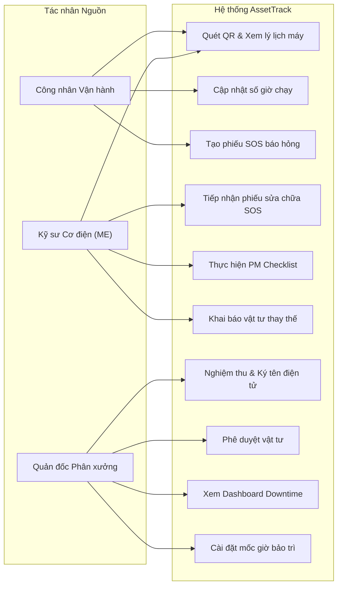
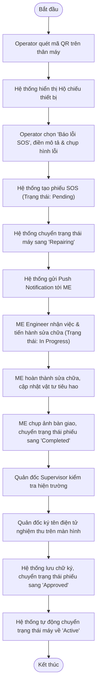
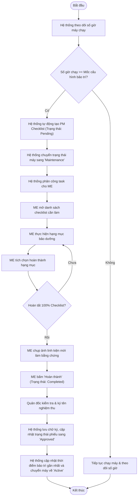
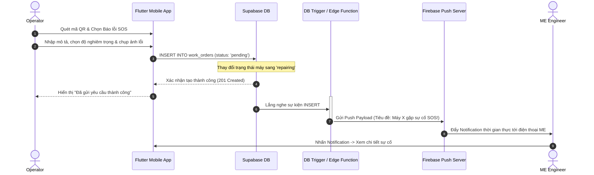
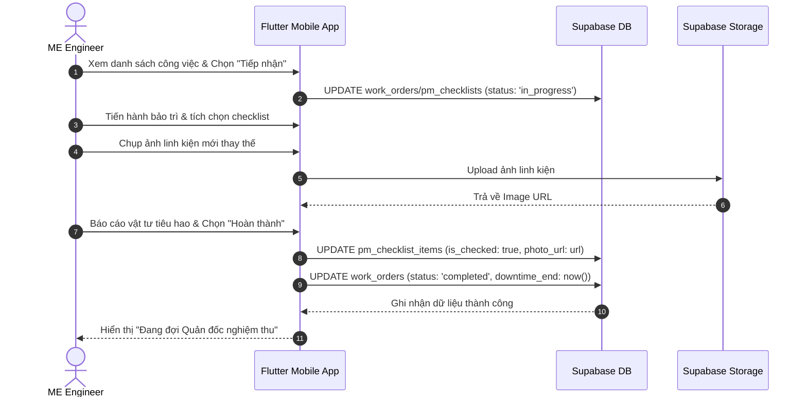
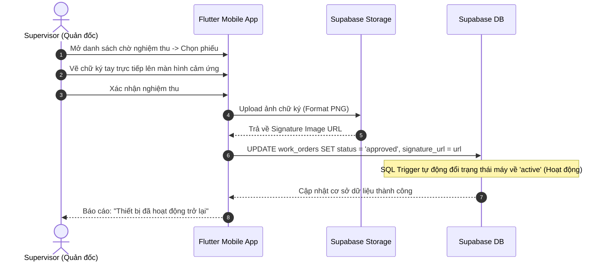
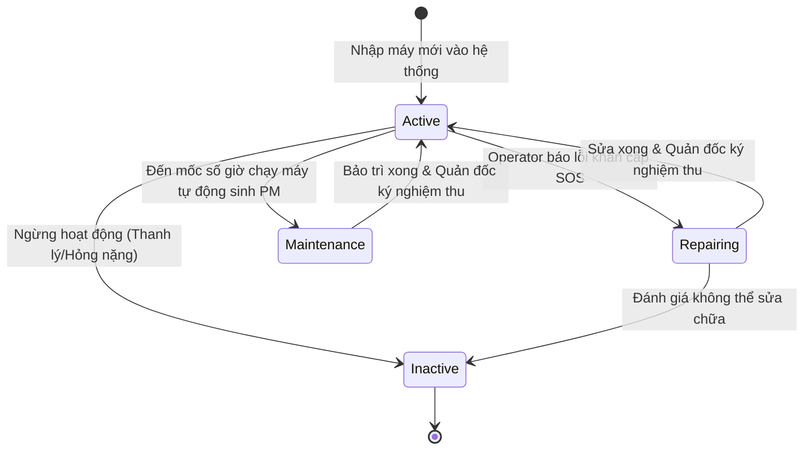
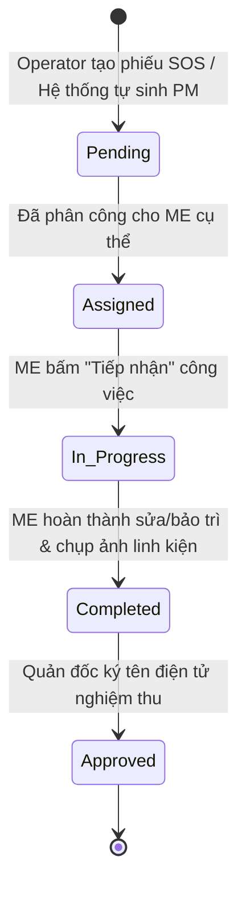
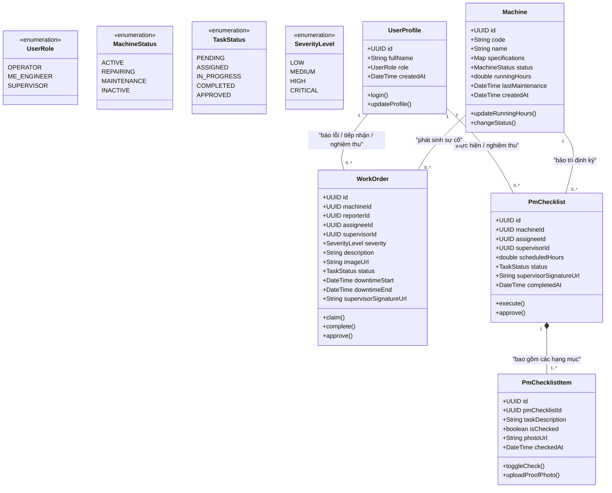
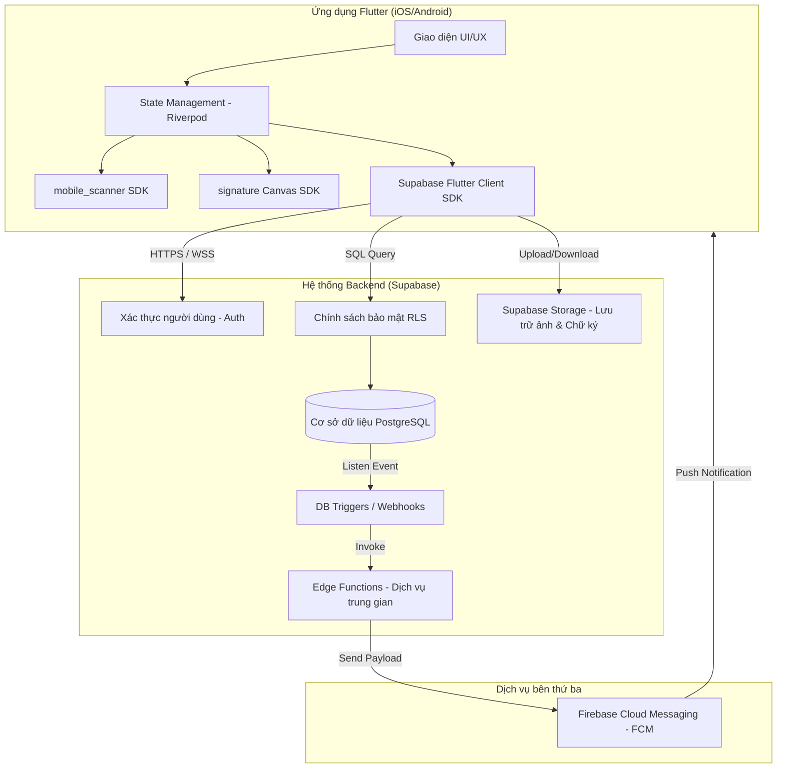

# Tài liệu Phân tích và Thiết kế Kỹ thuật Hệ thống AssetTrack (Technical SAD)

Tài liệu này tập trung chuyên sâu vào các sơ đồ mô hình hóa phần mềm theo chuẩn **Systems Analysis and Design (SAD)** cho dự án AssetTrack, bao gồm đặc tả Yêu cầu, Use Case, Biểu đồ Hoạt động (Activity Diagrams), Biểu đồ Tuần tự (Sequence Diagrams), Biểu đồ Chuyển trạng thái (State Transition Diagrams), Biểu đồ Thực thể Lớp (UML Class Diagram) và Kiến trúc Hệ thống.

---

## 1. Yêu cầu Hệ thống (System Requirements)

### 1.1. Yêu cầu Chức năng (Functional Requirements - FR)
* **FR-1 (Quản lý Lý lịch Máy móc):** Hệ thống phải định danh từng máy bằng mã QR duy nhất và hiển thị lịch sử sửa chữa/bảo trì khi quét.
* **FR-2 (Báo cáo Sự cố khẩn cấp SOS):** Operator phải tạo được yêu cầu sửa chữa tức thời khi máy gặp sự cố (gồm mô tả, mức độ nghiêm trọng và ảnh chụp lỗi).
* **FR-3 (Thông báo thời gian thực):** Hệ thống phải tự động gửi thông báo đẩy đến kỹ sư ME khi có phiếu SOS phát sinh.
* **FR-4 (Thực thi PM Checklist):** Hệ thống phải tự động sinh nhiệm vụ bảo trì định kỳ dựa trên số giờ chạy máy và bắt buộc kỹ sư ME tích chọn checklist kèm ảnh minh chứng.
* **FR-5 (Nghiệm thu Chữ ký số):** Quản đốc phân xưởng phải ký tên điện tử trực tiếp trên app để nghiệm thu phiếu sửa chữa/bảo trì trước khi đưa máy hoạt động lại.
* **FR-6 (Giám sát & Thống kê):** Quản đốc phải xem được thời gian dừng máy (Downtime) và trạng thái phân xưởng thời gian thực thông qua dashboard.

### 1.2. Yêu cầu Phi Chức năng (Non-functional Requirements - NFR)
* **NFR-1 (Bảo mật & Phân quyền):** Ràng buộc truy cập dữ liệu bằng Row-Level Security (RLS) trên Supabase; tài khoản phải được xác thực.
* **NFR-2 (Thời gian thực):** Thông báo đẩy về sự cố SOS phải được gửi đi trong vòng dưới 3 giây kể từ khi công nhân gửi yêu cầu.
* **NFR-3 (Tính khả dụng):** Giao diện quét mã QR và ký tên phải được tối ưu hóa cho màn hình cảm ứng di động (Mobile-friendly).

---

## 2. Phân tích Use Case (Use Case Analysis)

### 2.1. Biểu đồ Use Case tổng thể (Use Case Diagram)

### 2.2. Đặc tả Use Case tiêu biểu (Use Case Specification)

| Thành phần đặc tả | Mô tả chi tiết |
| :--- | :--- |
| **Tên Use Case** | Tạo phiếu SOS và Nghiệm thu sửa chữa (SOS Breakdown & Sign-off Flow) |
| **Tác nhân** | Operator (Người tạo), ME Engineer (Người sửa), Supervisor (Người nghiệm thu) |
| **Tiền điều kiện** | Máy móc đã được dán mã QR; Người dùng đã đăng nhập vào hệ thống với đúng vai trò. |
| **Luồng sự kiện chính** | 1. **Operator** quét mã QR trên máy, chọn "Báo lỗi khẩn cấp SOS". 2. **Operator** điền mô tả sự cố, chụp ảnh hiện trạng lỗi và bấm gửi. 3. Hệ thống lưu Work Order ở trạng thái `pending` và đổi trạng thái máy sang `repairing`. 4. Hệ thống kích hoạt Trigger gửi thông báo push notification đến các **ME Engineer**. 5. **ME Engineer** bấm tiếp nhận phiếu (trạng thái chuyển sang `in_progress`). 6. **ME Engineer** sửa máy xong, khai báo vật tư đã thay thế, chụp ảnh máy đã sửa, bấm hoàn thành (`completed`). 7. **Supervisor** kiểm tra máy, mở app và thực hiện ký tên điện tử lên màn hình cảm ứng để phê duyệt (`approved`). 8. Trạng thái máy tự động cập nhật về `active` (Hoạt động). |
| **Hậu điều kiện** | Phiếu sửa chữa được lưu trữ vĩnh viễn kèm ảnh chữ ký của Quản đốc; Máy móc trở lại sản xuất. |

---

## 3. Biểu đồ Hoạt động (Activity Diagrams)

### 3.1. Quy trình Xử lý Sự cố khẩn cấp (Breakdown SOS Workflow)

### 3.2. Quy trình Bảo trì Định kỳ (Preventive Maintenance Workflow)

---

## 4. Biểu đồ Tuần tự (Sequence Diagrams)

### 4.1. Luồng Báo hỏng SOS và Đẩy Thông báo

### 4.2. Luồng Sửa chữa & Thực thi PM Checklist

### 4.3. Luồng Nghiệm thu và Ký tên điện tử (Digital Sign-off)

---

## 5. Biểu đồ Chuyển trạng thái (State Transition Diagrams)

### 5.1. Trạng thái Thiết bị (Machine States)

### 5.2. Trạng thái Phiếu công việc (Work Order / PM Checklist States)

---

## 6. Sơ đồ Thực thể Lớp (UML Class Diagram)

---

## 7. Kiến trúc Hệ thống Tổng thể (System Architecture)

